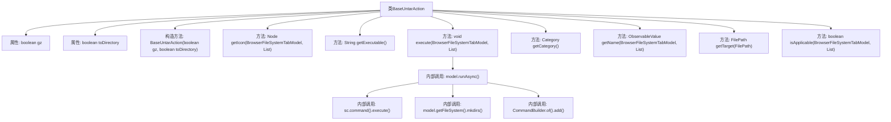
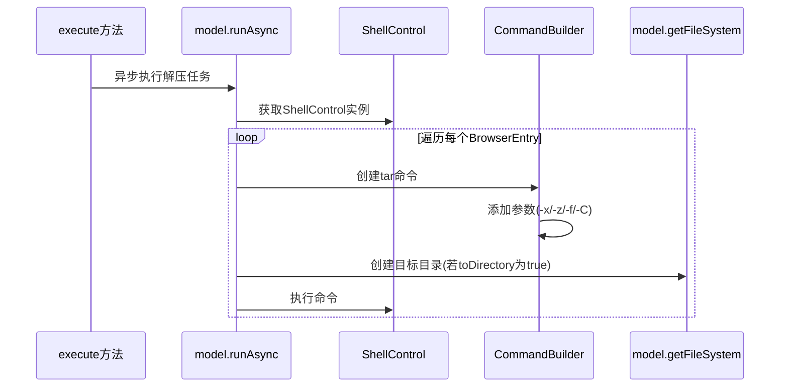

# 基础信息

|      |      |
|------|------|
| 名称 | BaseUntarAction |
| 编码语言 | .java |
| 代码路径 | xpipe/ext/base/src/main/java/io/xpipe/ext/base/browser/compress/BaseUntarAction.java |
| 包名 | io.xpipe.ext.base.browser.compress |
| 依赖项 | ['io.xpipe.app.browser.action.BrowserApplicationPathAction', 'io.xpipe.app.browser.action.BrowserLeafAction', 'io.xpipe.app.browser.file.BrowserEntry', 'io.xpipe.app.browser.file.BrowserFileSystemTabModel', 'io.xpipe.app.browser.icon.BrowserIconFileType', 'io.xpipe.app.browser.icon.BrowserIcons', 'io.xpipe.app.core.AppI18n', 'io.xpipe.core.process.CommandBuilder', 'io.xpipe.core.process.ShellControl', 'io.xpipe.core.store.FilePath', 'javafx.beans.value.ObservableValue', 'javafx.scene.Node', 'java.util.List'] |
| 概述说明 | BaseUntarAction类实现解压tar文件功能，支持gz压缩和目录解压选项。 |

# 说明

BaseUntarAction是一个实现BrowserApplicationPathAction和BrowserLeafAction接口的类，用于解压tar或tar.gz文件。构造函数接收gz和toDirectory参数，分别表示是否处理gz压缩文件和是否解压到目录。getIcon方法返回zip类型图标，getExecutable返回tar命令。execute方法异步执行解压操作，根据参数构建tar命令并调用ShellControl执行。getCategory返回CUSTOM分类。getName根据解压目标返回相应名称。isApplicable方法检查文件扩展名是否符合要求。getTarget方法处理目标路径，移除压缩后缀。

# 类列表 Class Summary

| 名称   | 类型  | 说明 |
|-------|------|-------------|
| BaseUntarAction | class | BaseUntarAction类实现解压tar文件功能，支持gz压缩和指定目录解压。 |


## 类 BaseUntarAction

|      |      |
|------|------|
| 访问范围 | public |
| 类型 | class |
| 名称 | BaseUntarAction |
| 说明 | BaseUntarAction类实现解压tar文件功能，支持gz压缩和指定目录解压。 |


### UML类图

```mermaid
classDiagram
    class BaseUntarAction {
        -boolean gz
        -boolean toDirectory
        +BaseUntarAction(boolean gz, boolean toDirectory)
        +getIcon(BrowserFileSystemTabModel model, List~BrowserEntry~ entries) Node
        +getExecutable() String
        +execute(BrowserFileSystemTabModel model, List~BrowserEntry~ entries) void
        +getCategory() Category
        +getName(BrowserFileSystemTabModel model, List~BrowserEntry~ entries) ObservableValue~String~
        -getTarget(FilePath name) FilePath
        +isApplicable(BrowserFileSystemTabModel model, List~BrowserEntry~ entries) boolean
    }

    <<Interface>> BrowserApplicationPathAction
    <<Interface>> BrowserLeafAction

    BrowserApplicationPathAction <|-- BaseUntarAction
    BrowserLeafAction <|-- BaseUntarAction

    class BrowserFileSystemTabModel {
        // 模型类，用于管理文件系统标签页
    }
    class BrowserEntry {
        // 浏览器条目类，表示文件系统中的条目
    }
    class FilePath {
        // 文件路径类
    }
    class ShellControl {
        // Shell控制类
    }
    class CommandBuilder {
        // 命令构建器类
    }

    BaseUntarAction --> BrowserFileSystemTabModel : 使用
    BaseUntarAction --> BrowserEntry : 使用
    BaseUntarAction --> FilePath : 使用
    BaseUntarAction --> ShellControl : 依赖
    BaseUntarAction --> CommandBuilder : 依赖
```

该类图展示了BaseUntarAction类及其相关依赖关系。BaseUntarAction实现了BrowserApplicationPathAction和BrowserLeafAction接口，主要功能是处理tar文件的解压操作。它包含控制解压行为的布尔标志(gz和toDirectory)，提供了获取图标、可执行文件名、执行解压操作、获取类别和名称等方法。该类与BrowserFileSystemTabModel、BrowserEntry、FilePath等类交互，通过ShellControl执行命令，并使用CommandBuilder构建解压命令。整个设计体现了文件解压功能的核心逻辑和依赖关系。


### 内部方法调用关系图





这段代码实现了一个基于tar命令的文件解压功能，支持处理.tar和.tar.gz格式的压缩包。流程图展示了类的结构关系，包含属性、构造方法和主要功能方法。时序图详细描述了异步解压的执行过程：通过ShellControl执行tar命令，根据参数动态构建命令字符串，并可选地创建目标目录。该类通过isApplicable方法自动检测文件扩展名，支持目录解压和原地解压两种模式，并通过getName方法提供本地化的操作名称显示。

### 字段列表 Field List

| 名称  | 类型  | 说明 |
|-------|-------|------|
| toDirectory | boolean | 私有布尔变量toDirectory |
| gz | boolean | 私有布尔型变量gz |

### 方法列表 Method List

| 名称  | 类型  | 说明 |
|-------|-------|------|
| getName | ObservableValue<String> | 重写方法，根据条目数量返回解压目录名或解压位置提示。 |
| getTarget | FilePath | 方法移除文件扩展名.tar、.tar.gz和.tgz。 |
| execute | void | 异步解压文件到目标目录，支持gz压缩格式。 |
| isApplicable | boolean | 检查文件路径是否以.tar.gz、.tgz或.tar结尾。 |
| getCategory | Category | 重写getCategory方法，返回CUSTOM类别。 |
| getExecutable | String | 重写方法返回字符串"tar"。 |
| getIcon | Node | 重写方法，返回ZIP文件类型的浏览器图标区域。 |


