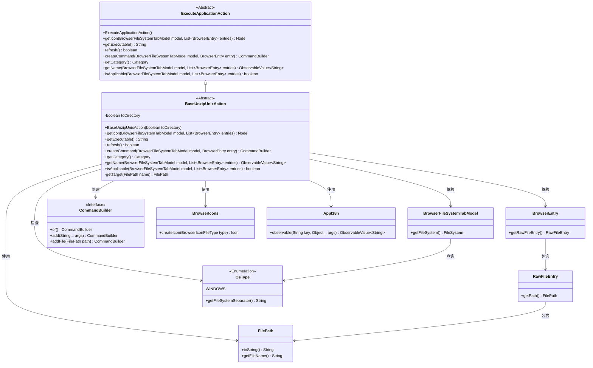
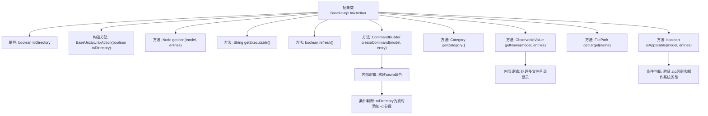

# 基础信息

|      |      |
|------|------|
| 名称 | BaseUnzipUnixAction |
| 编码语言 | .java |
| 代码路径 | xpipe/ext/base/src/main/java/io/xpipe/ext/base/browser/compress/BaseUnzipUnixAction.java |
| 包名 | io.xpipe.ext.base.browser.compress |
| 依赖项 | ['io.xpipe.app.browser.file.BrowserEntry', 'io.xpipe.app.browser.file.BrowserFileSystemTabModel', 'io.xpipe.app.browser.icon.BrowserIconFileType', 'io.xpipe.app.browser.icon.BrowserIcons', 'io.xpipe.app.core.AppI18n', 'io.xpipe.core.process.CommandBuilder', 'io.xpipe.core.process.OsType', 'io.xpipe.core.store.FilePath', 'io.xpipe.ext.base.browser.ExecuteApplicationAction', 'javafx.beans.value.ObservableValue', 'javafx.scene.Node', 'java.util.List'] |
| 概述说明 | 抽象类BaseUnzipUnixAction实现Unix解压功能，支持目录解压和单文件解压，仅适用于非Windows系统。 |

# 说明

BaseUnzipUnixAction是一个抽象类，继承自ExecuteApplicationAction，用于在Unix系统中解压ZIP文件。它包含一个布尔参数toDirectory，决定是否解压到指定目录。类中定义了获取图标、可执行命令（unzip）、创建解压命令（支持-o覆盖和-d指定目录）、名称显示（根据解压位置显示不同文本）等方法。仅适用于非Windows系统且文件扩展名为.zip的条目。解压目标路径通过移除.zip后缀生成。

# 类列表 Class Summary

| 名称   | 类型  | 说明 |
|-------|------|-------------|
| BaseUnzipUnixAction | class | 抽象类BaseUnzipUnixAction实现Unix解压功能，支持目录解压和单文件解压，仅适用于非Windows系统。 |

## 类 BaseUnzipUnixAction

|      |      |
|------|------|
| 访问范围 | public abstract |
| 类型 | class |
| 名称 | BaseUnzipUnixAction |
| 说明 | 抽象类BaseUnzipUnixAction实现Unix解压功能，支持目录解压和单文件解压，仅适用于非Windows系统。 |

### UML类图

该类图展示了BaseUnzipUnixAction作为ExecuteApplicationAction的抽象子类，实现了Unix系统下的ZIP文件解压功能。核心包含toDirectory标志位控制解压行为，通过CommandBuilder构造unzip命令，依赖BrowserFileSystemTabModel和BrowserEntry获取文件信息，使用FilePath处理路径转换，并检查操作系统类型确保仅适用于非Windows环境。图标生成依赖BrowserIcons，国际化文本通过AppI18n处理，整体设计体现了清晰的职责分离和扩展性。

### 内部方法调用关系图

这段代码流程图展示了BaseUnzipUnixAction抽象类的完整结构，该类继承自ExecuteApplicationAction，主要用于处理Unix系统下的ZIP文件解压操作。核心功能包括构建unzip命令行参数、验证文件适用性、生成操作名称和图标等。流程图特别突出了命令构建过程中的条件分支（toDirectory判断）和两个关键验证逻辑：检查文件是否为ZIP格式以及操作系统是否为非Windows系统。类通过多个重写方法实现了从图标显示到命令生成的全流程控制，体现了清晰的职责划分和条件处理逻辑。

### 字段列表 Field List

| 名称  | 类型  | 说明 |
|-------|-------|------|
| toDirectory | boolean | 私有布尔变量toDirectory |

### 方法列表 Method List

| 名称  | 类型  | 说明 |
|-------|-------|------|
| getIcon | Node | 重写方法，返回ZIP文件类型的浏览器图标区域。 |
| createCommand | CommandBuilder | 创建解压命令，支持指定目标目录。 |
| refresh | boolean | 重写refresh方法，始终返回true。 |
| getTarget | FilePath | 私有方法`getTarget`接收`FilePath`参数，移除其`.zip`后缀后返回新路径。 |
| getName | ObservableValue<String> | 重写方法，根据条目数量返回解压目录名或解压当前位置的观察值。 |
| getCategory | Category | 重写getCategory方法，返回CUSTOM类型。 |
| getExecutable | String | 重写方法返回解压命令"unzip"。 |
| isApplicable | boolean | 检查条目是否全为zip文件且系统非Windows。 |

