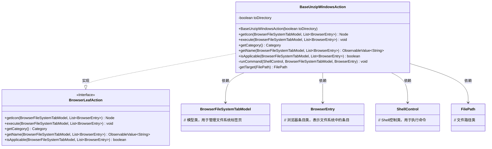
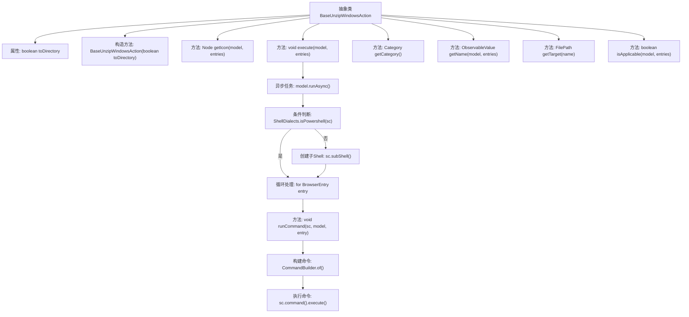

# 基础信息

|      |      |
|------|------|
| 名称 | BaseUnzipWindowsAction |
| 编码语言 | .java |
| 代码路径 | xpipe/ext/base/src/main/java/io/xpipe/ext/base/browser/compress/BaseUnzipWindowsAction.java |
| 包名 | io.xpipe.ext.base.browser.compress |
| 依赖项 | ['io.xpipe.app.browser.action.BrowserLeafAction', 'io.xpipe.app.browser.file.BrowserEntry', 'io.xpipe.app.browser.file.BrowserFileSystemTabModel', 'io.xpipe.app.browser.icon.BrowserIconFileType', 'io.xpipe.app.browser.icon.BrowserIcons', 'io.xpipe.app.core.AppI18n', 'io.xpipe.core.process.CommandBuilder', 'io.xpipe.core.process.OsType', 'io.xpipe.core.process.ShellControl', 'io.xpipe.core.process.ShellDialects', 'io.xpipe.core.store.FilePath', 'javafx.beans.value.ObservableValue', 'javafx.scene.Node', 'java.util.List'] |
| 概述说明 | 抽象类实现Windows解压ZIP文件操作，支持解压到目录或当前路径，仅适用于Windows系统。 |

# 说明

这是一个抽象类BaseUnzipWindowsAction，实现了BrowserLeafAction接口，用于在Windows系统中解压ZIP文件。它包含一个布尔参数toDirectory控制解压行为，提供图标获取、异步执行解压操作、名称显示和适用性检查功能。执行时使用PowerShell的Expand-Archive命令，支持解压到指定目录或当前目录。仅当选中ZIP文件且系统为Windows时可用。

# 类列表 Class Summary

| 名称   | 类型  | 说明 |
|-------|------|-------------|
| BaseUnzipWindowsAction | class | 抽象类实现Windows解压ZIP文件操作，支持解压到目录或当前位置，使用PowerShell命令。 |

## 类 BaseUnzipWindowsAction

|      |      |
|------|------|
| 访问范围 | public abstract |
| 类型 | class |
| 名称 | BaseUnzipWindowsAction |
| 说明 | 抽象类实现Windows解压ZIP文件操作，支持解压到目录或当前位置，使用PowerShell命令。 |

### UML类图

类图描述：
BaseUnzipWindowsAction是一个抽象类，实现了BrowserLeafAction接口，用于在Windows系统上解压ZIP文件。它包含核心的解压逻辑，通过ShellControl执行PowerShell命令，支持解压到目录或当前位置。类中维护了toDirectory状态，通过getTarget方法处理目标路径，并提供了图标、名称、适用性检查等接口实现。该类与BrowserFileSystemTabModel、BrowserEntry、ShellControl和FilePath等多个辅助类存在依赖关系，共同完成解压功能。

### 内部方法调用关系图

这段代码实现了一个Windows平台下的ZIP文件解压抽象操作类。流程图展示了从类结构到核心解压逻辑的完整调用链：通过构造方法初始化解压模式(toDirectory)，提供图标获取、名称生成、适用性检查等方法。核心execute方法异步执行解压操作，根据Shell类型(PowerShell或子Shell)循环处理每个ZIP条目，通过CommandBuilder构建Expand-Archive命令并执行。解压目标路径处理、多文件批量解压和Windows平台校验等边缘情况都被妥善处理。

### 字段列表 Field List

| 名称  | 类型  | 说明 |
|-------|-------|------|
| toDirectory | boolean | 私有布尔变量toDirectory |

### 方法列表 Method List

| 名称  | 类型  | 说明 |
|-------|-------|------|
| getCategory | Category | 重写getCategory方法，返回CUSTOM类型。 |
| runCommand | void | Java方法：使用PowerShell解压文件到指定目录或当前路径。 |
| getIcon | Node | 重写getIcon方法，返回zip类型图标的区域对象。 |
| execute | void | 重写execute方法，异步执行命令，适配PowerShell或其他Shell环境。 |
| getName | ObservableValue<String> | 重写方法，根据条目数量返回解压目录名或当前位置。 |
| getTarget | FilePath | 私有方法：移除文件路径中的.zip后缀并返回新路径。 |
| isApplicable | boolean | 检查条目均为zip文件且系统为Windows。 |

