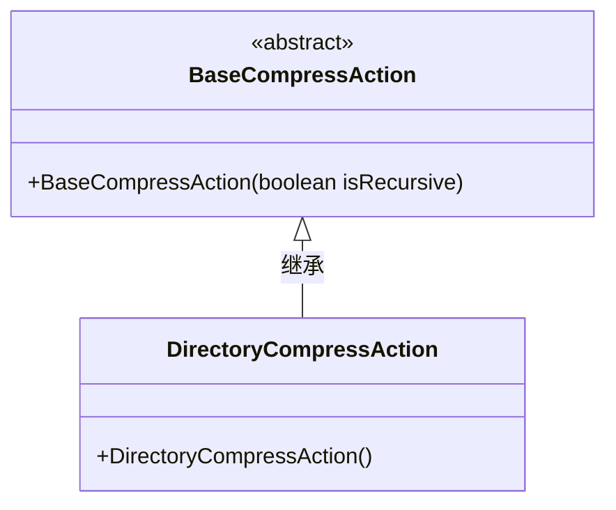
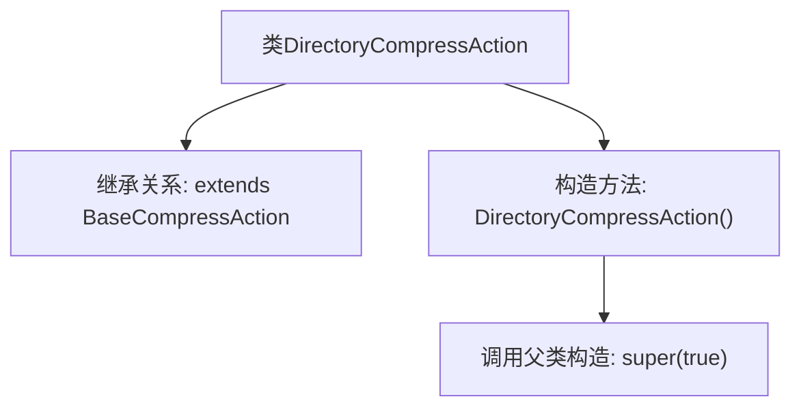

# 基础信息

|      |      |
|------|------|
| 名称 | DirectoryCompressAction |
| 编码语言 | .java |
| 代码路径 | xpipe/ext/base/src/main/java/io/xpipe/ext/base/browser/compress/DirectoryCompressAction.java |
| 包名 | io.xpipe.ext.base.browser.compress |
| 依赖项 | [] |
| 概述说明 | 目录压缩操作类，继承基础压缩类，构造时设置压缩标志为真。 |

# 说明

这是一个名为DirectoryCompressAction的Java类，继承自BaseCompressAction基类。该类包含一个无参构造函数，在构造函数中调用了父类的构造方法并传入true参数。这个类的主要功能是处理目录压缩操作，通过继承基类复用压缩功能。

# 类列表 Class Summary

| 名称   | 类型  | 说明 |
|-------|------|-------------|
| DirectoryCompressAction | class | 目录压缩操作类，继承基础压缩类，构造时启用压缩功能。 |

## 类 DirectoryCompressAction

|      |      |
|------|------|
| 访问范围 | public |
| 类型 | class |
| 名称 | DirectoryCompressAction |
| 说明 | 目录压缩操作类，继承基础压缩类，构造时启用压缩功能。 |

### UML类图

这段类图展示了DirectoryCompressAction继承自抽象类BaseCompressAction的层级关系。BaseCompressAction作为父类包含一个带布尔参数的构造方法，标记为抽象类；DirectoryCompressAction作为子类通过无参构造器隐式调用父类构造器并固定传递true值，表明默认启用递归压缩模式。该设计实现了压缩行为的可扩展性，子类可通过构造器参数控制父类的递归处理逻辑。

### 内部方法调用关系图

这段流程图描述了DirectoryCompressAction类的结构及其与父类BaseCompressAction的继承关系。该类通过无参构造函数初始化，并在构造过程中调用父类的带布尔参数的构造方法（super(true)）。整个流程展示了从类声明到构造方法执行的层级关系，体现了Java继承机制中子类对父类构造函数的显式调用逻辑。

### 字段列表 Field List

| 名称  | 类型  | 说明 |
|-------|-------|------|

### 方法列表 Method List

| 名称  | 类型  | 说明 |
|-------|-------|------|

