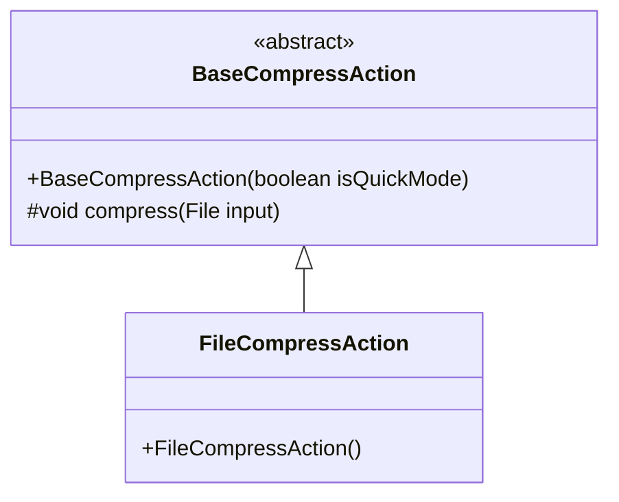
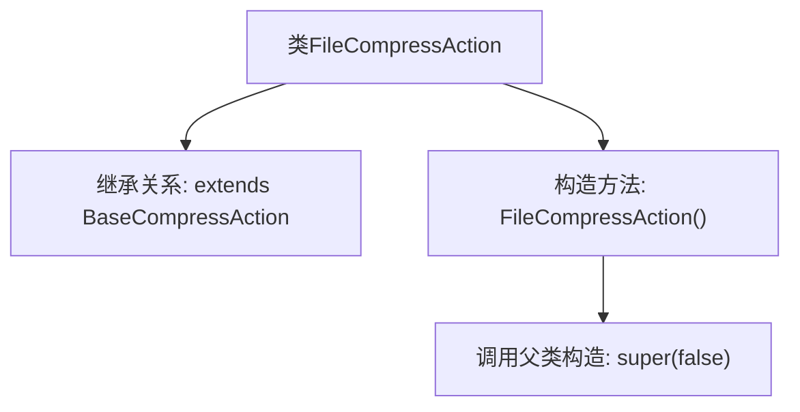

# 基础信息

|      |      |
|------|------|
| 名称 | FileCompressAction |
| 编码语言 | .java |
| 代码路径 | xpipe/ext/base/src/main/java/io/xpipe/ext/base/browser/compress/FileCompressAction.java |
| 包名 | io.xpipe.ext.base.browser.compress |
| 依赖项 | [] |
| 概述说明 | 文件压缩动作类，继承基础压缩类，构造时禁用父类参数。 |

# 说明

这段内容描述了一个名为FileCompressAction的Java类，该类继承自BaseCompressAction基类。该类的构造函数通过调用父类构造函数并传入false参数进行初始化。这表明FileCompressAction是一个专门用于文件压缩操作的类，其构造函数可能控制着某些压缩行为或特性的默认设置。整个类结构简洁，专注于实现文件压缩功能。

# 类列表 Class Summary

| 名称   | 类型  | 说明 |
|-------|------|-------------|
| FileCompressAction | class | 文件压缩操作类，继承基础压缩类，构造时禁用父类功能。 |

## 类 FileCompressAction

|      |      |
|------|------|
| 访问范围 | public |
| 类型 | class |
| 名称 | FileCompressAction |
| 说明 | 文件压缩操作类，继承基础压缩类，构造时禁用父类功能。 |

### UML类图

这段类图展示了FileCompressAction继承自抽象基类BaseCompressAction的层级关系。BaseCompressAction作为抽象基类，包含一个受保护的compress方法和构造方法，而FileCompressAction作为具体实现类，通过调用父类构造器super(false)来初始化。图中清晰体现了面向对象的继承特性，子类扩展父类功能的同时保持了父类的约束条件。

### 内部方法调用关系图

这段流程图展示了FileCompressAction类的核心结构，该类继承自BaseCompressAction父类。图中清晰呈现了继承关系和构造方法的调用链，特别突出了子类构造方法中通过super(false)显式调用父类构造器的关键步骤。整个流程体现了Java继承体系下构造方法的初始化顺序，子类构造器必须首先调用父类构造器的语法特性。

### 字段列表 Field List

| 名称  | 类型  | 说明 |
|-------|-------|------|

### 方法列表 Method List

| 名称  | 类型  | 说明 |
|-------|-------|------|

