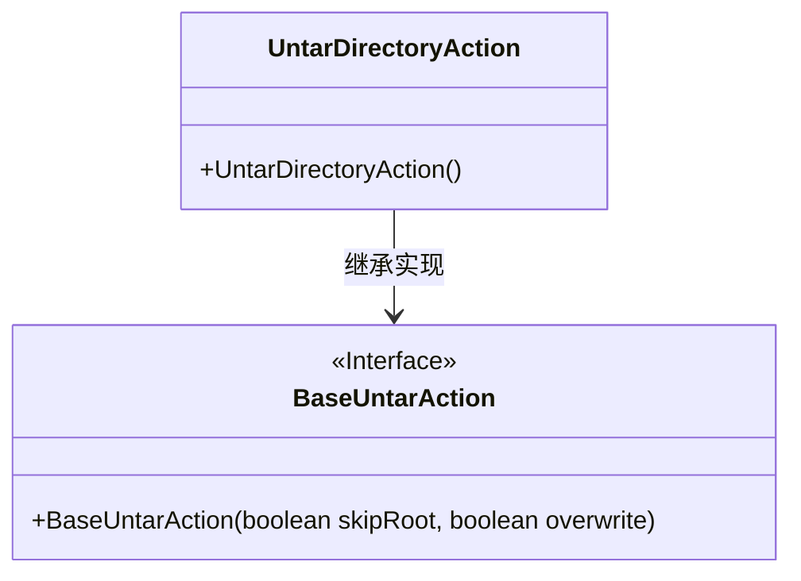
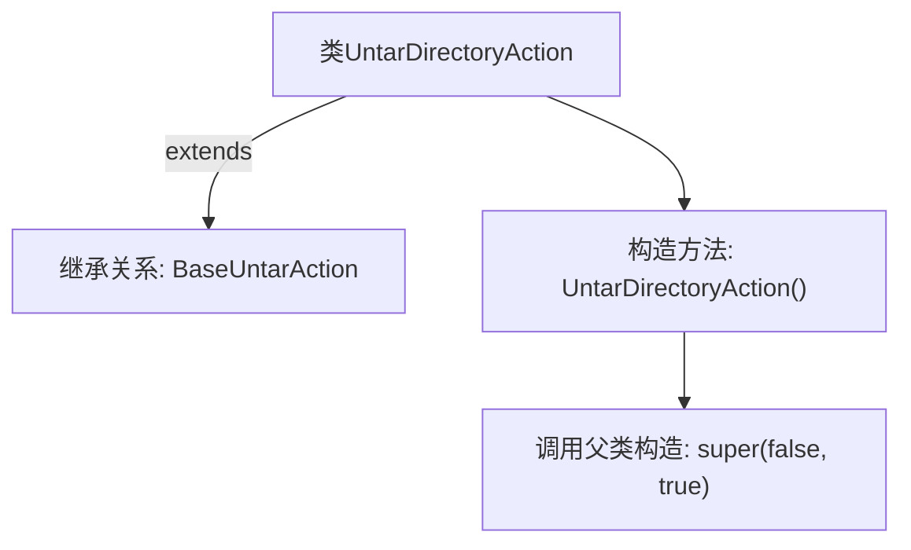

# 基础信息

|      |      |
|------|------|
| 名称 | UntarDirectoryAction |
| 编码语言 | .java |
| 代码路径 | xpipe/ext/base/src/main/java/io/xpipe/ext/base/browser/compress/UntarDirectoryAction.java |
| 包名 | io.xpipe.ext.base.browser.compress |
| 依赖项 | [] |
| 概述说明 | UntarDirectoryAction类继承BaseUntarAction，构造方法调用父类super(false, true)。 |

# 说明

这是一个名为UntarDirectoryAction的Java类，继承自BaseUntarAction基类。该类通过构造函数调用父类的构造函数，并传递两个布尔参数：第一个参数设为false，第二个参数设为true。这个类的作用可能是处理目录解压操作，通过特定的参数配置来控制解压行为。整个类定义简洁，主要功能依赖于父类的实现。

# 类列表 Class Summary

| 名称   | 类型  | 说明 |
|-------|------|-------------|
| UntarDirectoryAction | class | UntarDirectoryAction类继承BaseUntarAction，构造时调用父类方法。 |

## 类 UntarDirectoryAction

|      |      |
|------|------|
| 访问范围 | public |
| 类型 | class |
| 名称 | UntarDirectoryAction |
| 说明 | UntarDirectoryAction类继承BaseUntarAction，构造时调用父类方法。 |

### UML类图

这段类图展示了UntarDirectoryAction与BaseUntarAction的继承关系。UntarDirectoryAction是一个具体实现类，它继承了BaseUntarAction接口的功能。BaseUntarAction作为接口，定义了带两个布尔参数的构造函数（skipRoot和overwrite），而UntarDirectoryAction通过无参构造函数调用父类构造方法，默认传入false和true参数。这种设计模式体现了子类对父类功能的扩展，同时保持了接口约定的构造规范。

### 内部方法调用关系图

该流程图展示了UntarDirectoryAction类的结构，它是一个继承自BaseUntarAction的子类。核心逻辑是通过构造方法调用父类的构造方法super(false, true)，表明这是一个处理目录的解压操作。图中清晰呈现了类继承关系和构造方法的调用链，其中父类构造参数false和true可能分别控制着解压过程中的某些特性（如覆盖文件或保留权限）。

### 字段列表 Field List

| 名称  | 类型  | 说明 |
|-------|-------|------|

### 方法列表 Method List

| 名称  | 类型  | 说明 |
|-------|-------|------|

