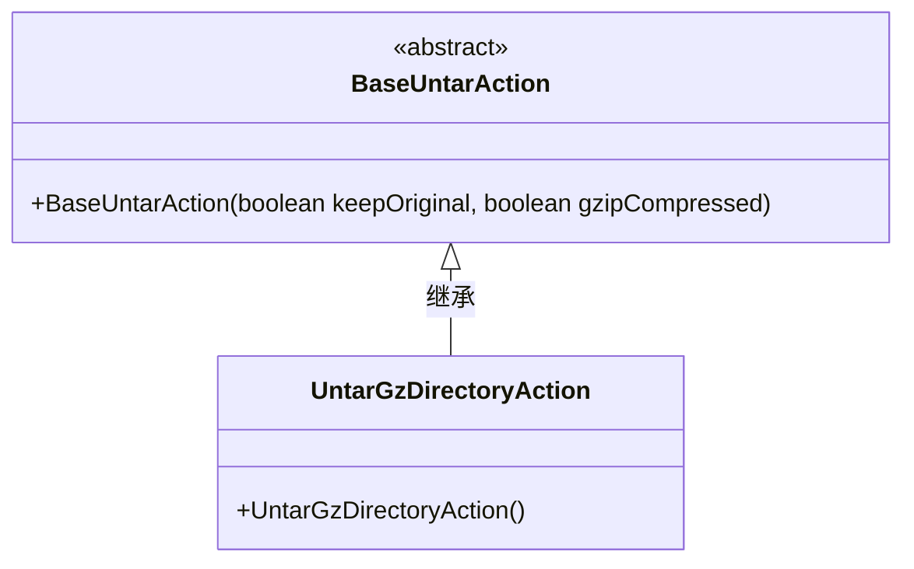
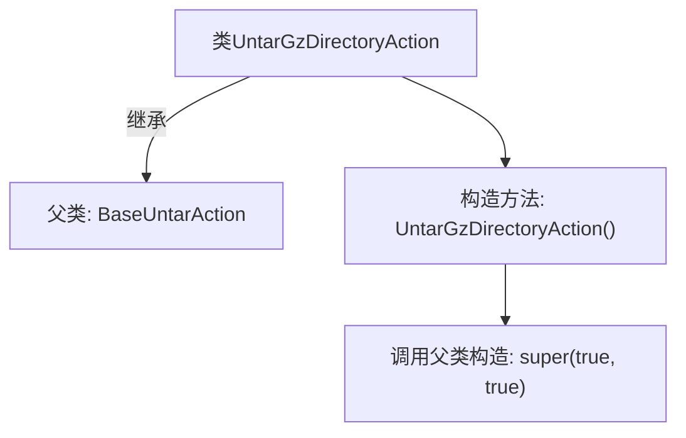

# 基础信息

|      |      |
|------|------|
| 名称 | UntarGzDirectoryAction |
| 编码语言 | .java |
| 代码路径 | xpipe/ext/base/src/main/java/io/xpipe/ext/base/browser/compress/UntarGzDirectoryAction.java |
| 包名 | io.xpipe.ext.base.browser.compress |
| 依赖项 | [] |
| 概述说明 | 解压GZ目录的类，继承基础解压类，构造时启用压缩和目录支持。 |

# 说明

该内容描述了一个名为UntarGzDirectoryAction的Java类，该类继承自BaseUntarAction。在构造函数中，通过调用父类构造函数并传入两个布尔值参数true和true来初始化该类。这表明该类可能用于处理tar.gz格式的目录解压操作，且具备某些特定的功能或配置。

# 类列表 Class Summary

| 名称   | 类型  | 说明 |
|-------|------|-------------|
| UntarGzDirectoryAction | class | 解压GZ目录的Java类，继承基础解压类。 |

## 类 UntarGzDirectoryAction

|      |      |
|------|------|
| 访问范围 | public |
| 类型 | class |
| 名称 | UntarGzDirectoryAction |
| 说明 | 解压GZ目录的Java类，继承基础解压类。 |

### UML类图

这段类图展示了UntarGzDirectoryAction继承自抽象基类BaseUntarAction的层级关系。BaseUntarAction是一个抽象类，具有带两个布尔参数的构造函数，分别控制是否保留原始文件和是否启用gzip压缩。UntarGzDirectoryAction作为具体实现类，通过无参构造函数隐式调用父类构造方法，默认设置两个参数都为true，表明该操作默认会保留原始文件并使用gzip压缩。这种设计模式体现了对解压功能的可配置性封装。

### 内部方法调用关系图

这段流程图描述了UntarGzDirectoryAction类的结构及其与父类BaseUntarAction的继承关系。该类通过构造方法UntarGzDirectoryAction()初始化，并在其中调用父类构造方法super(true, true)传递两个布尔参数。图形清晰展示了类层次结构和构造时的初始化流程，体现了子类对父类功能的扩展方式。

### 字段列表 Field List

| 名称  | 类型  | 说明 |
|-------|-------|------|

### 方法列表 Method List

| 名称  | 类型  | 说明 |
|-------|-------|------|

