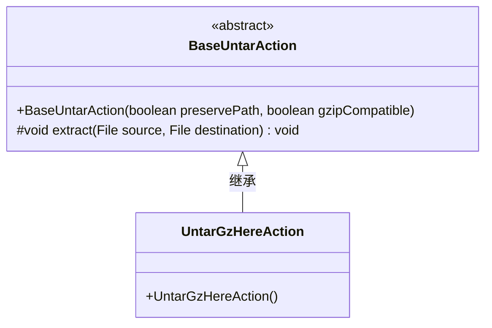
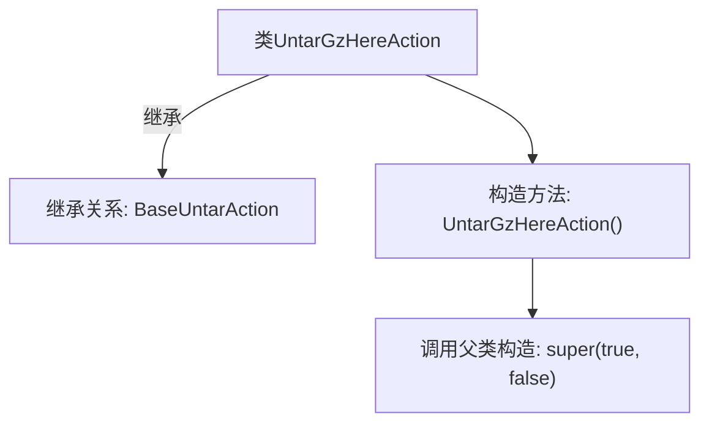

# 基础信息

|      |      |
|------|------|
| 名称 | UntarGzHereAction |
| 编码语言 | .java |
| 代码路径 | xpipe/ext/base/src/main/java/io/xpipe/ext/base/browser/compress/UntarGzHereAction.java |
| 包名 | io.xpipe.ext.base.browser.compress |
| 依赖项 | [] |
| 概述说明 | 解压GZ文件到当前位置的类，继承自基础解压类。 |

# 说明

该代码定义了一个名为UntarGzHereAction的Java类，继承自BaseUntarAction。类构造函数调用父类构造方法，传入两个布尔参数：第一个参数为true，表示启用某种功能；第二个参数为false，表示禁用另一种功能。该类主要用于处理.tar.gz文件的解压操作，但具体实现细节在父类中定义。

# 类列表 Class Summary

| 名称   | 类型  | 说明 |
|-------|------|-------------|
| UntarGzHereAction | class | 解压gz文件到当前位置的类，继承自基础解压类。 |

## 类 UntarGzHereAction

|      |      |
|------|------|
| 访问范围 | public |
| 类型 | class |
| 名称 | UntarGzHereAction |
| 说明 | 解压gz文件到当前位置的类，继承自基础解压类。 |

### UML类图

这段类图展示了UntarGzHereAction继承自抽象基类BaseUntarAction的层级关系。BaseUntarAction是一个抽象类，包含一个受保护的extract方法和构造方法，而UntarGzHereAction是具体实现类，通过调用父类构造器(super(true, false))初始化，专用于处理gzip压缩包的解压操作。图中清晰体现了面向对象的继承特性，子类复用父类功能的同时可扩展特定行为。

### 内部方法调用关系图

这段流程图展示了UntarGzHereAction类的结构，该类继承自BaseUntarAction父类。核心逻辑体现在构造方法中，通过调用父类构造器super(true, false)进行初始化，参数表明该解压操作需要处理gzip压缩但不需要保留原始文件。整个设计采用继承机制复用父类功能，符合面向对象的设计原则。

### 字段列表 Field List

| 名称  | 类型  | 说明 |
|-------|-------|------|

### 方法列表 Method List

| 名称  | 类型  | 说明 |
|-------|-------|------|

