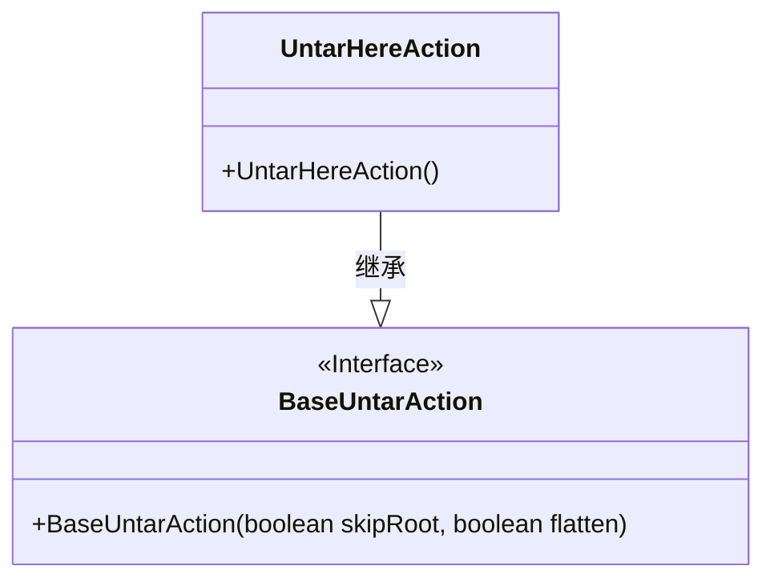
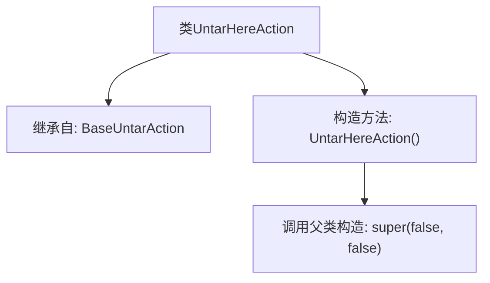

# 基础信息

|      |      |
|------|------|
| 名称 | UntarHereAction |
| 编码语言 | .java |
| 代码路径 | xpipe/ext/base/src/main/java/io/xpipe/ext/base/browser/compress/UntarHereAction.java |
| 包名 | io.xpipe.ext.base.browser.compress |
| 依赖项 | [] |
| 概述说明 | 定义UntarHereAction类，继承BaseUntarAction，构造函数调用父类双false参数方法。 |

# 说明

该内容定义了一个名为UntarHereAction的Java类，继承自BaseUntarAction基类。该类包含一个无参构造函数，在初始化时调用父类构造函数并传入两个布尔参数false，表示不启用某些特定功能。这个类可能用于处理解压tar文件的操作，但具体功能需结合上下文进一步分析。

# 类列表 Class Summary

| 名称   | 类型  | 说明 |
|-------|------|-------------|
| UntarHereAction | class | 定义UntarHereAction类，继承BaseUntarAction，构造函数调用父类super(false, false)。 |

## 类 UntarHereAction

|      |      |
|------|------|
| 访问范围 | public |
| 类型 | class |
| 名称 | UntarHereAction |
| 说明 | 定义UntarHereAction类，继承BaseUntarAction，构造函数调用父类super(false, false)。 |

### UML类图

这段类图展示了UntarHereAction继承自BaseUntarAction接口的层级关系。BaseUntarAction是一个接口（用<<Interface>>标注），定义了一个接收两个布尔参数的构造函数；UntarHereAction作为实现类，提供了一个无参构造函数并通过super调用父类构造方法。该结构体现了子类扩展父类功能的典型设计模式，用于实现特定的解压行为。

### 内部方法调用关系图

这段流程图描述了UntarHereAction类的结构，该类继承自BaseUntarAction基类。核心逻辑是构造方法通过super(false, false)调用父类双参数构造器，表明这是一个不自动解压、不保留原始文件的解压操作实现类。图中清晰展示了类继承关系和构造方法的调用链，层级结构简洁明确。

### 字段列表 Field List

| 名称  | 类型  | 说明 |
|-------|-------|------|

### 方法列表 Method List

| 名称  | 类型  | 说明 |
|-------|-------|------|

