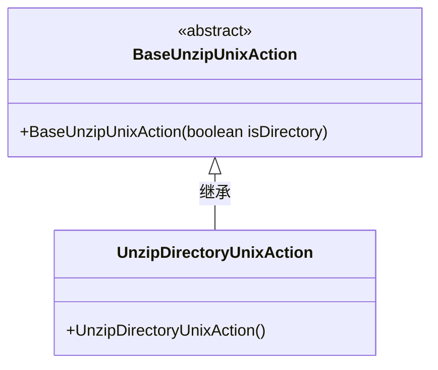
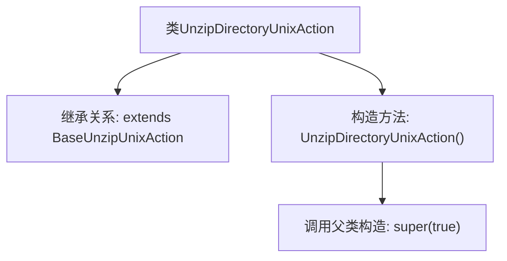

# 基础信息

|      |      |
|------|------|
| 名称 | UnzipDirectoryUnixAction |
| 编码语言 | .java |
| 代码路径 | xpipe/ext/base/src/main/java/io/xpipe/ext/base/browser/compress/UnzipDirectoryUnixAction.java |
| 包名 | io.xpipe.ext.base.browser.compress |
| 依赖项 | [] |
| 概述说明 | Unix解压目录操作类，继承基础解压类，构造时设置目录标志为真。 |

# 说明

该内容定义了一个名为UnzipDirectoryUnixAction的Java类，继承自BaseUnzipUnixAction基类。类中包含一个无参构造函数，通过super(true)调用父类构造函数并传入布尔值true参数。这表明该类专用于处理Unix系统下的目录解压操作，初始化时可能启用了特定功能或配置。

# 类列表 Class Summary

| 名称   | 类型  | 说明 |
|-------|------|-------------|
| UnzipDirectoryUnixAction | class | Unix解压目录操作类，继承基础解压类并设置目录标志。 |

## 类 UnzipDirectoryUnixAction

|      |      |
|------|------|
| 访问范围 | public |
| 类型 | class |
| 名称 | UnzipDirectoryUnixAction |
| 说明 | Unix解压目录操作类，继承基础解压类并设置目录标志。 |

### UML类图

这段类图展示了Unix环境下目录解压操作的类结构。BaseUnzipUnixAction作为抽象基类，通过构造函数参数控制是否为目录操作；UnzipDirectoryUnixAction作为具体实现类，继承基类并默认设置目录标志为true，专用于处理目录解压场景。类图清晰地体现了父子类的继承关系和构造方法的差异化实现。

### 内部方法调用关系图

该流程图展示了UnzipDirectoryUnixAction类的结构，它是一个继承自BaseUnzipUnixAction的子类。图中清晰呈现了类继承关系和构造方法逻辑，其中构造方法通过super(true)显式调用父类构造器。这种设计模式常用于Unix环境下目录解压操作的初始化，确保子类实例化时自动执行父类的特定初始化流程（参数true可能表示需要处理目录的特殊标志）。

### 字段列表 Field List

| 名称  | 类型  | 说明 |
|-------|-------|------|

### 方法列表 Method List

| 名称  | 类型  | 说明 |
|-------|-------|------|

