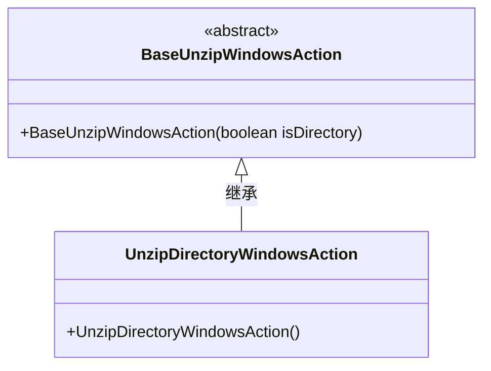
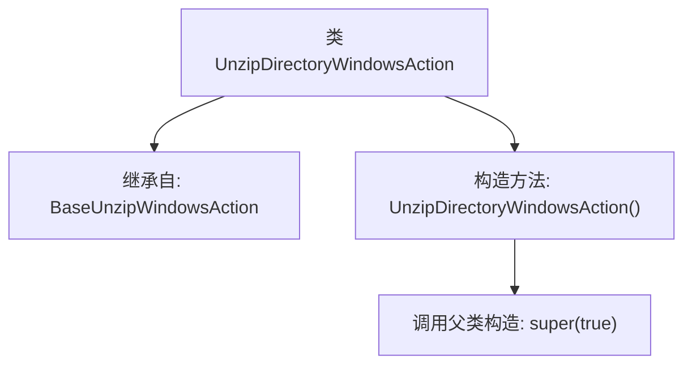

# 基础信息

|      |      |
|------|------|
| 名称 | UnzipDirectoryWindowsAction |
| 编码语言 | .java |
| 代码路径 | xpipe/ext/base/src/main/java/io/xpipe/ext/base/browser/compress/UnzipDirectoryWindowsAction.java |
| 包名 | io.xpipe.ext.base.browser.compress |
| 依赖项 | [] |
| 概述说明 | 解压目录的Windows操作类，继承基础解压类。 |

# 说明

该内容描述了一个名为UnzipDirectoryWindowsAction的Java类，继承自BaseUnzipWindowsAction。该类通过构造函数调用父类的构造方法并传入布尔值true作为参数。这表明该类专门用于处理Windows系统下的目录解压操作，通过继承实现了基础解压功能。

# 类列表 Class Summary

| 名称   | 类型  | 说明 |
|-------|------|-------------|
| UnzipDirectoryWindowsAction | class | 解压目录的Windows操作类，继承基础解压类。 |

## 类 UnzipDirectoryWindowsAction

|      |      |
|------|------|
| 访问范围 | public |
| 类型 | class |
| 名称 | UnzipDirectoryWindowsAction |
| 说明 | 解压目录的Windows操作类，继承基础解压类。 |

### UML类图

这段类图展示了UnzipDirectoryWindowsAction继承自抽象基类BaseUnzipWindowsAction的层级关系。基类通过布尔参数isDirectory控制解压行为，子类通过无参构造器默认设置isDirectory为true，表明专门用于目录解压场景。这种设计实现了Windows平台下目录解压功能的专业化扩展，同时保持了与基础解压逻辑的复用关系。

### 内部方法调用关系图

该流程图展示了UnzipDirectoryWindowsAction类的结构，该类继承自BaseUnzipWindowsAction。主要包含一个无参构造函数，在构造函数中通过super(true)显式调用了父类的带布尔参数的构造方法。这种设计模式常用于扩展父类功能时初始化特定状态，true参数可能表示需要执行某种目录解压的特殊处理方式。整个类结构简洁，体现了面向对象中继承关系的典型用法。

### 字段列表 Field List

| 名称  | 类型  | 说明 |
|-------|-------|------|

### 方法列表 Method List

| 名称  | 类型  | 说明 |
|-------|-------|------|

