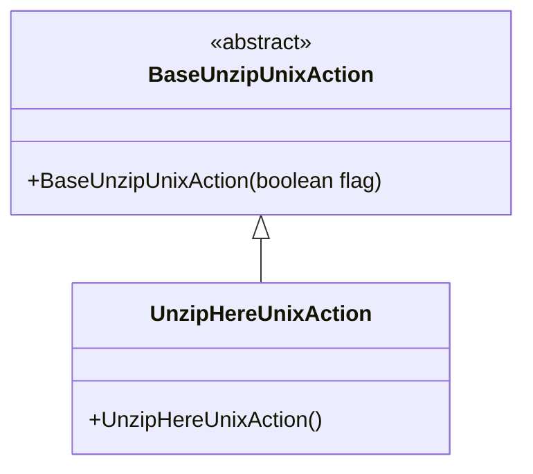
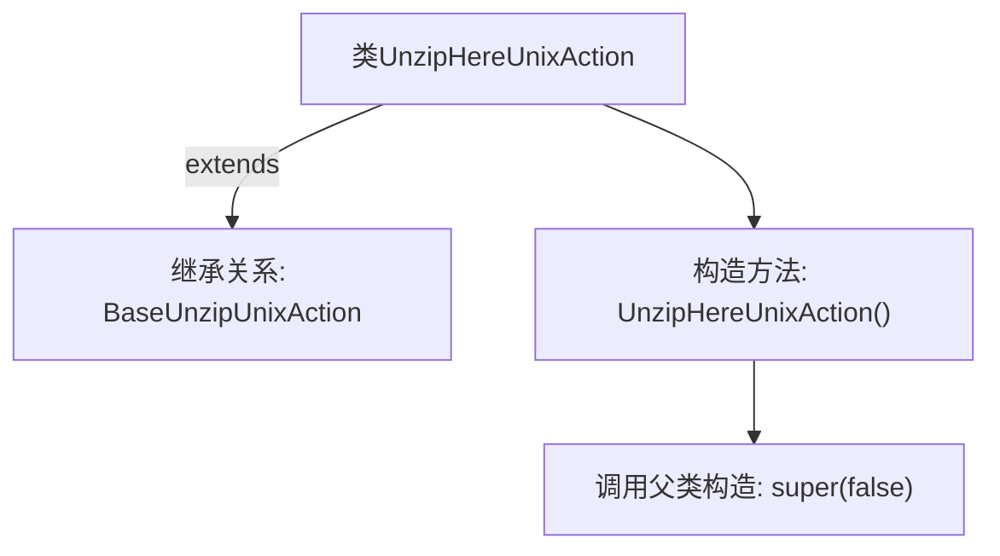

# 基础信息

|      |      |
|------|------|
| 名称 | UnzipHereUnixAction |
| 编码语言 | .java |
| 代码路径 | xpipe/ext/base/src/main/java/io/xpipe/ext/base/browser/compress/UnzipHereUnixAction.java |
| 包名 | io.xpipe.ext.base.browser.compress |
| 依赖项 | [] |
| 概述说明 | Unix解压到当前目录操作类，继承基础解压类。 |

# 说明

这是一个名为UnzipHereUnixAction的Java类，继承自BaseUnzipUnixAction基类。该类包含一个无参构造函数，在初始化时调用父类构造函数并传入false参数。该类的功能与Unix系统下的解压缩操作相关，但具体实现细节未展示。

# 类列表 Class Summary

| 名称   | 类型  | 说明 |
|-------|------|-------------|
| UnzipHereUnixAction | class | Unix解压到当前目录操作类，继承基础解压类，构造时传入false参数。 |

## 类 UnzipHereUnixAction

|      |      |
|------|------|
| 访问范围 | public |
| 类型 | class |
| 名称 | UnzipHereUnixAction |
| 说明 | Unix解压到当前目录操作类，继承基础解压类，构造时传入false参数。 |

### UML类图

这段类图展示了Unix环境下解压缩操作的类层次结构。BaseUnzipUnixAction作为抽象基类，通过构造函数接收布尔参数控制行为；UnzipHereUnixAction是其具体实现子类，采用默认构造函数调用父类构造方法并传入false值。该设计体现了模板方法模式，允许基类控制核心算法而子类定制特定步骤。

### 内部方法调用关系图

这段流程图展示了UnzipHereUnixAction类的结构及其与父类BaseUnzipUnixAction的继承关系。该类仅包含一个无参构造函数，在构造函数中通过super(false)显式调用父类的带布尔参数的构造方法。图形清晰地呈现了类层次结构和初始化逻辑，突出了关键方法调用链，符合面向对象设计中构造函数的初始化规范。

### 字段列表 Field List

| 名称  | 类型  | 说明 |
|-------|-------|------|

### 方法列表 Method List

| 名称  | 类型  | 说明 |
|-------|-------|------|

