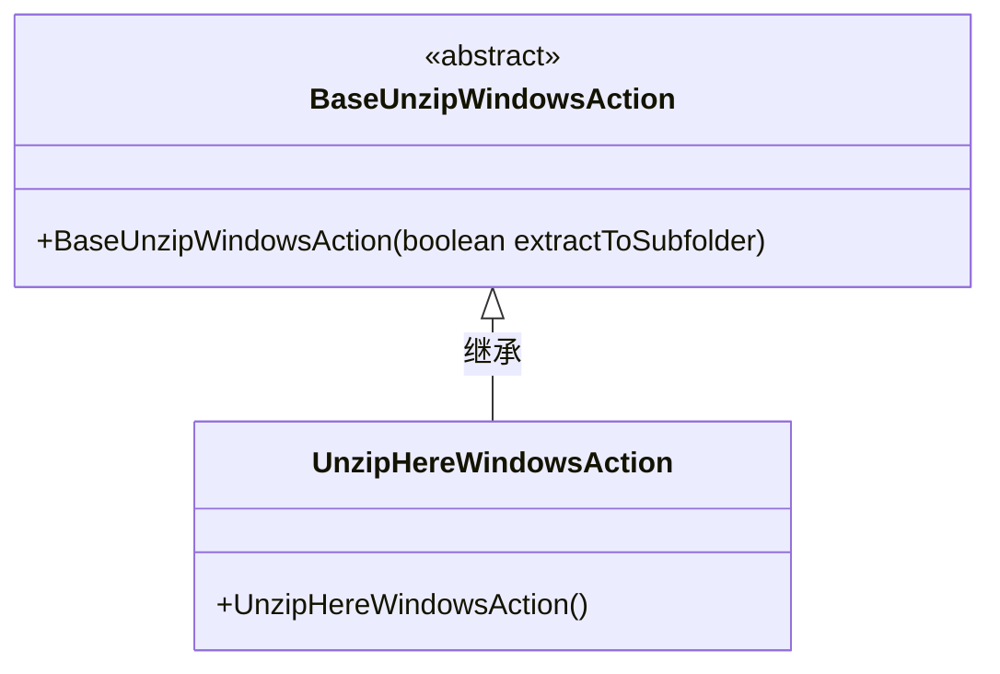
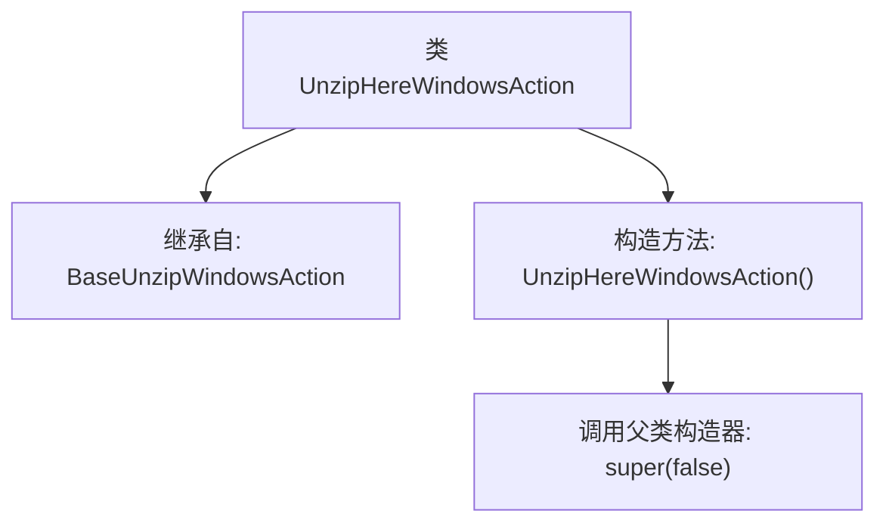

# 基础信息

|      |      |
|------|------|
| 名称 | UnzipHereWindowsAction |
| 编码语言 | .java |
| 代码路径 | xpipe/ext/base/src/main/java/io/xpipe/ext/base/browser/compress/UnzipHereWindowsAction.java |
| 包名 | io.xpipe.ext.base.browser.compress |
| 依赖项 | [] |
| 概述说明 | 定义Windows解压动作类，继承基础解压类，构造函数调用父类并传参false。 |

# 说明

该代码定义了一个名为UnzipHereWindowsAction的类，继承自BaseUnzipWindowsAction。构造函数调用父类构造函数并传入false参数。该类功能与Windows环境下的解压操作相关，具体实现细节由父类处理。

# 类列表 Class Summary

| 名称   | 类型  | 说明 |
|-------|------|-------------|
| UnzipHereWindowsAction | class | 定义Windows解压动作类，继承基础类，构造函数调用父类并传参false。 |

## 类 UnzipHereWindowsAction

|      |      |
|------|------|
| 访问范围 | public |
| 类型 | class |
| 名称 | UnzipHereWindowsAction |
| 说明 | 定义Windows解压动作类，继承基础类，构造函数调用父类并传参false。 |

### UML类图

这段类图展示了Windows环境下解压缩功能的实现结构。BaseUnzipWindowsAction作为抽象基类，定义了带布尔参数的构造函数，控制是否解压到子文件夹。UnzipHereWindowsAction继承该基类，通过调用父类构造函数并固定传值false，实现"解压到当前目录"的特定行为。这种设计模式体现了模板方法模式的思想，父类控制主要流程，子类实现具体细节。

### 内部方法调用关系图

这段流程图展示了UnzipHereWindowsAction类的结构，它是一个继承自BaseUnzipWindowsAction的子类。图中清晰地呈现了类的继承关系，以及构造方法中通过super(false)调用父类构造器的关键步骤。该设计模式体现了Java继承特性，通过父类构造器参数false可能用于控制解压行为（如是否显示进度条或覆盖提示）。整个结构简洁但完整，符合面向对象设计中"is-a"的关系原则。

### 字段列表 Field List

| 名称  | 类型  | 说明 |
|-------|-------|------|

### 方法列表 Method List

| 名称  | 类型  | 说明 |
|-------|-------|------|

