# 基础信息

|      |      |
|------|------|
| 名称 | compress |
| 编码语言 | .java |
| 代码路径 | xpipe/ext/base/src/main/java/io/xpipe/ext/base/browser/compress |
| 包名 | xpipe.ext.base.src.main.java.io.xpipe.ext.base.browser.compress |
| 概述说明 | Java类实现跨平台文件目录压缩解压功能，含Windows/Unix系统专用处理类。 |

# 说明

```markdown
## 概述
该代码模块是一个跨平台的压缩/解压缩功能实现，主要提供对目录和文件的压缩、解压操作支持。模块采用面向对象设计，通过抽象基类(BaseCompressAction、BaseUnzipWindowsAction、BaseUnzipUnixAction、BaseUntarAction)封装通用逻辑，并由具体子类实现不同平台(Windows/Unix)和不同格式(ZIP/TAR/TAR.GZ)的差异化处理。模块支持多种压缩工具(tar、7z、zip等)的自动检测，并通过异步方式执行压缩解压操作。

## 主要业务场景
1. **目录压缩**：
   - 通过DirectoryCompressAction实现，继承BaseCompressAction
   - 支持跨平台操作，自动检测系统可用压缩工具
   - 支持多种压缩格式选项

2. **文件压缩**：
   - 通过FileCompressAction实现，继承BaseCompressAction
   - 与目录压缩共享基础逻辑，但通过构造函数参数(false)区分行为

3. **ZIP文件解压**：
   - Windows平台：
     - 通过BaseUnzipWindowsAction及其子类(UnzipDirectoryWindowsAction/UnzipHereWindowsAction)实现
     - 使用PowerShell的Expand-Archive命令
   - Unix平台：
     - 通过BaseUnzipUnixAction及其子类(UnzipDirectoryUnixAction/UnzipHereUnixAction)实现
     - 使用unzip命令，支持-o覆盖和-d指定目录

4. **TAR/TAR.GZ文件解压**：
   - 通过BaseUntarAction及其子类实现：
     - UntarGzHereAction/UntarGzDirectoryAction：处理.tar.gz格式
     - UntarHereAction/UntarDirectoryAction：处理.tar格式
   - 使用tar命令，支持gz压缩选项
   - 支持解压到指定目录或当前位置

5. **用户交互**：
   - 压缩时弹出对话框让用户输入文件名
   - 自动添加相应扩展名
   - 根据操作类型(压缩/解压)和位置(当前目录/指定目录)显示不同名称
```


### 包内部结构视图

```mermaid
graph TD
    compress --> DirectoryCompressAction.java
    compress --> UnzipDirectoryUnixAction.java
    compress --> UnzipDirectoryWindowsAction.java
    compress --> FileCompressAction.java
    compress --> UntarGzHereAction.java
    compress --> BaseCompressAction.java
    compress --> UntarGzDirectoryAction.java
    compress --> UntarDirectoryAction.java
    compress --> BaseUnzipWindowsAction.java
    compress --> UntarHereAction.java
    compress --> BaseUnzipUnixAction.java
    compress --> BaseUntarAction.java
    compress --> UnzipHereWindowsAction.java
    compress --> UnzipHereUnixAction.java
```



该流程图展示了xpipe项目中压缩功能模块的文件结构，compress目录下包含15个Java实现类，涵盖目录/文件压缩、解压（Windows/Unix平台）、tar/gz格式处理等操作。所有子节点均为具体实现类，无次级目录，呈现扁平化结构。

# 文件列表 File List

| 名称   | 类型  | 说明 |
|-------|------|-------------|
| [UnzipDirectoryWindowsAction.java](UnzipDirectoryWindowsAction.md) | file | 解压目录的Windows操作类，继承基础解压类。 |
| [UnzipHereUnixAction.java](UnzipHereUnixAction.md) | file | Unix解压到当前目录操作类，继承基础解压类。 |
| [UnzipHereWindowsAction.java](UnzipHereWindowsAction.md) | file | 定义Windows解压动作类，继承基础解压类，构造函数调用父类并传参false。 |
| [BaseUnzipUnixAction.java](BaseUnzipUnixAction.md) | file | 抽象类BaseUnzipUnixAction实现Unix解压功能，支持目录解压和单文件解压，仅适用于非Windows系统。 |
| [UntarHereAction.java](UntarHereAction.md) | file | 定义UntarHereAction类，继承BaseUntarAction，构造函数调用父类双false参数方法。 |
| [BaseUnzipWindowsAction.java](BaseUnzipWindowsAction.md) | file | 抽象类实现Windows解压ZIP文件操作，支持解压到目录或当前路径，仅适用于Windows系统。 |
| [UntarDirectoryAction.java](UntarDirectoryAction.md) | file | UntarDirectoryAction类继承BaseUntarAction，构造方法调用父类super(false, true)。 |
| [UntarGzDirectoryAction.java](UntarGzDirectoryAction.md) | file | 解压GZ目录的类，继承基础解压类，构造时启用压缩和目录支持。 |
| [BaseCompressAction.java](BaseCompressAction.md) | file | 抽象类BaseCompressAction实现文件压缩功能，支持不同系统和格式。 |
| [UntarGzHereAction.java](UntarGzHereAction.md) | file | 解压GZ文件到当前位置的类，继承自基础解压类。 |
| [FileCompressAction.java](FileCompressAction.md) | file | 文件压缩动作类，继承基础压缩类，构造时禁用父类参数。 |
| [DirectoryCompressAction.java](DirectoryCompressAction.md) | file | 目录压缩操作类，继承基础压缩类，构造时设置压缩标志为真。 |
| [BaseUntarAction.java](BaseUntarAction.md) | file | BaseUntarAction类实现解压tar文件功能，支持gz压缩和目录解压选项。 |
| [UnzipDirectoryUnixAction.java](UnzipDirectoryUnixAction.md) | file | Unix解压目录操作类，继承基础解压类，构造时设置目录标志为真。 |


