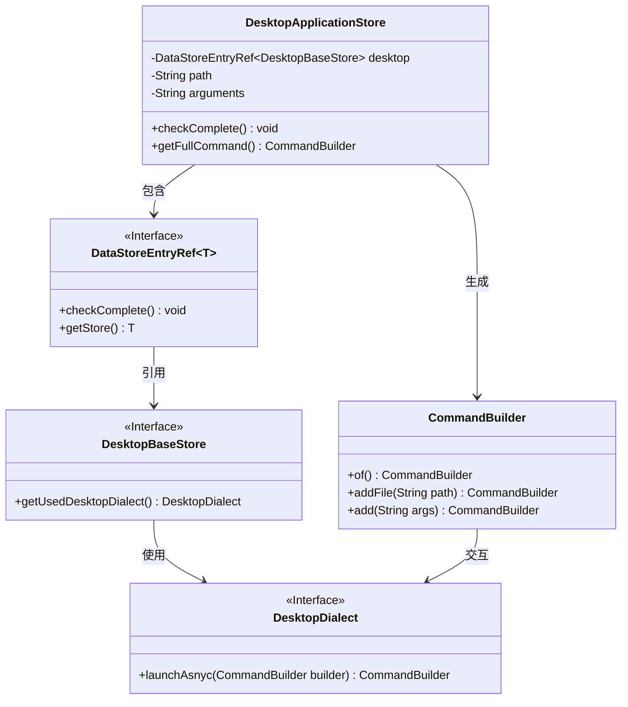
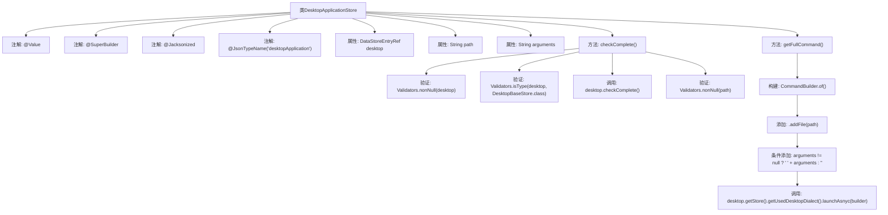

# 基础信息

|      |      |
|------|------|
| 名称 | DesktopApplicationStore |
| 编码语言 | .java |
| 代码路径 | xpipe/ext/base/src/main/java/io/xpipe/ext/base/desktop/DesktopApplicationStore.java |
| 包名 | io.xpipe.ext.base.desktop |
| 依赖项 | ['io.xpipe.app.storage.DataStoreEntryRef', 'io.xpipe.app.util.Validators', 'io.xpipe.core.process.CommandBuilder', 'io.xpipe.core.store.DataStore', 'com.fasterxml.jackson.annotation.JsonTypeName', 'lombok.Value', 'lombok.experimental.SuperBuilder', 'lombok.extern.jackson.Jacksonized'] |
| 概述说明 | 桌面应用存储类，含桌面引用、路径和参数，验证完整性并生成命令。 |

# 说明

这段内容描述了一个名为DesktopApplicationStore的Java类，实现了DataStore接口。该类使用了四个注解：@Value、@SuperBuilder、@Jacksonized和@JsonTypeName。它包含三个字段：desktop（DataStoreEntryRef类型）、path和arguments（均为String类型）。类中定义了两个方法：checkComplete()用于验证字段非空和类型正确，getFullCommand()用于构建包含路径和参数的命令字符串。该类主要用于桌面应用程序的存储和命令构建功能。

# 类列表 Class Summary

| 名称   | 类型  | 说明 |
|-------|------|-------------|
| DesktopApplicationStore | class | Java类DesktopApplicationStore实现DataStore接口，包含desktop、path、arguments字段，提供完整性检查和命令构建功能。 |

## 类 DesktopApplicationStore

|      |      |
|------|------|
| 访问范围 | @Value;@SuperBuilder;@Jacksonized;@JsonTypeName("desktopApplication");public |
| 类型 | class |
| 名称 | DesktopApplicationStore |
| 说明 | Java类DesktopApplicationStore实现DataStore接口，包含desktop、path、arguments字段，提供完整性检查和命令构建功能。 |

### UML类图

这段类图展示了桌面应用存储系统的核心结构。DesktopApplicationStore作为主类，通过DataStoreEntryRef泛型接口关联DesktopBaseStore，并使用CommandBuilder构建命令行。系统包含完整的类型校验机制（checkComplete）和异步启动功能（launchAsnyc），各接口之间通过明确的依赖关系实现解耦，体现了良好的分层设计思想。

### 内部方法调用关系图

这段代码定义了一个名为DesktopApplicationStore的类，实现了DataStore接口。类使用了多个注解进行配置，包含三个属性：desktop、path和arguments。主要功能包括checkComplete()方法进行数据完整性验证，以及getFullCommand()方法构建命令行指令。流程图清晰展示了类结构、属性关系和方法调用链，特别是getFullCommand()中通过链式调用构建命令的过程和条件参数添加的逻辑。

### 字段列表 Field List

| 名称  | 类型  | 说明 |
|-------|-------|------|
| path | String | 定义字符串变量path。 |
| arguments | String | {{String arguments;}} 表示字符串参数声明。 |
| desktop | DataStoreEntryRef<DesktopBaseStore> | 桌面基础存储的数据引用 |

### 方法列表 Method List

| 名称  | 类型  | 说明 |
|-------|-------|------|
| checkComplete | void | 检查非空桌面和路径，验证类型并调用桌面完成检查。 |
| getFullCommand | CommandBuilder | 获取完整命令：合并路径参数并异步启动。 |

