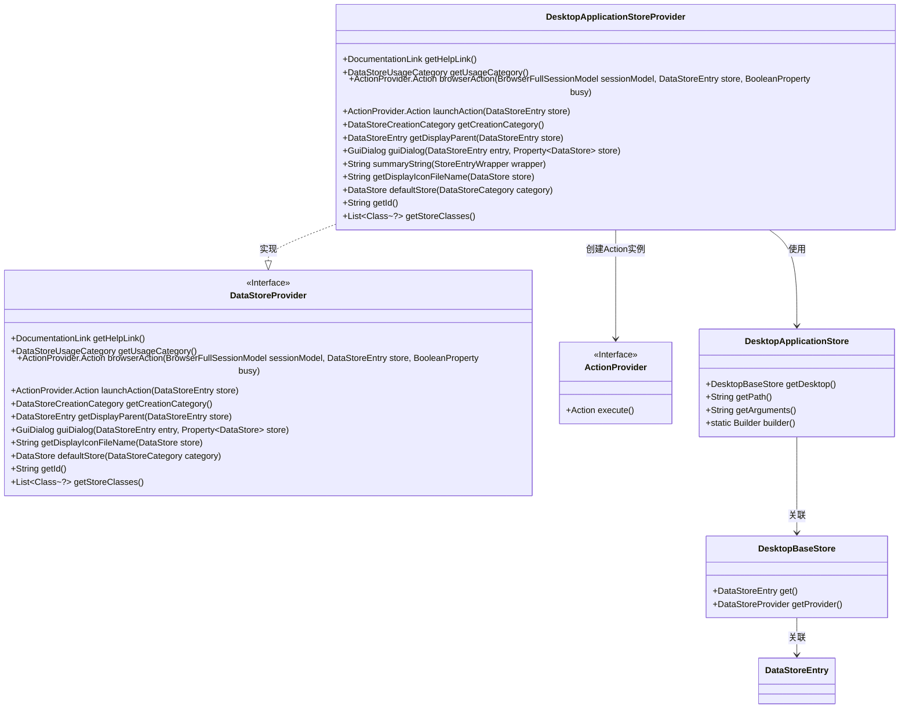

# 基础信息

|      |      |
|------|------|
| 名称 | DesktopApplicationStoreProvider |
| 编码语言 | .java |
| 代码路径 | xpipe/ext/base/src/main/java/io/xpipe/ext/base/desktop/DesktopApplicationStoreProvider.java |
| 包名 | io.xpipe.ext.base.desktop |
| 依赖项 | ['io.xpipe.app.browser.BrowserFullSessionModel', 'io.xpipe.app.comp.store.StoreChoiceComp', 'io.xpipe.app.comp.store.StoreEntryWrapper', 'io.xpipe.app.comp.store.StoreViewState', 'io.xpipe.app.ext', 'io.xpipe.app.storage.DataStoreCategory', 'io.xpipe.app.storage.DataStoreEntry', 'io.xpipe.app.util.DataStoreFormatter', 'io.xpipe.app.util.DocumentationLink', 'io.xpipe.app.util.OptionsBuilder', 'io.xpipe.core.store.DataStore', 'javafx.beans.property.BooleanProperty', 'javafx.beans.property.Property', 'javafx.beans.property.SimpleObjectProperty', 'javafx.beans.property.SimpleStringProperty', 'java.util.List'] |
| 概述说明 | 桌面应用存储提供程序，实现启动、配置和显示功能，支持桌面应用管理和操作。 |

# 说明

DesktopApplicationStoreProvider是一个实现DataStoreProvider接口的类，主要用于管理桌面应用程序的数据存储。它提供了获取帮助链接、使用类别和创建类别的方法，并支持浏览器和启动操作。通过launchAction方法执行桌面应用程序的启动流程，包括激活基础条目和运行应用程序。该类还处理GUI对话框的构建，用于配置桌面应用程序的主机、路径和参数。此外，它提供了显示父条目、图标文件名、默认存储和ID的方法，并支持DesktopApplicationStore类的存储操作。summaryString方法用于生成存储条目的摘要信息。

# 类列表 Class Summary

| 名称   | 类型  | 说明 |
|-------|------|-------------|
| DesktopApplicationStoreProvider | class | 桌面应用存储提供程序，实现启动、配置及管理功能。 |

## 类 DesktopApplicationStoreProvider

|      |      |
|------|------|
| 访问范围 | public |
| 类型 | class |
| 名称 | DesktopApplicationStoreProvider |
| 说明 | 桌面应用存储提供程序，实现启动、配置及管理功能。 |

### UML类图

该类图展示了DesktopApplicationStoreProvider实现DataStoreProvider接口的核心结构，包含与DesktopApplicationStore、DesktopBaseStore的关联关系。DesktopApplicationStoreProvider作为桌面应用存储提供者，实现了数据存储管理、GUI对话框构建、动作执行等功能，并通过泛型Property和Builder模式处理数据存储的创建与绑定。图中清晰呈现了接口实现、类间依赖及核心方法调用链。

### 内部方法调用关系图

```mermaid
graph TD
    A["类DesktopApplicationStoreProvider"]
    B["实现接口: DataStoreProvider"]
    C["方法: DocumentationLink getHelpLink()"]
    D["方法: DataStoreUsageCategory getUsageCategory()"]
    E["方法: Action browserAction(BrowserFullSessionModel, DataStoreEntry, BooleanProperty)"]
    F["方法: Action launchAction(DataStoreEntry)"]
    G["方法: DataStoreCreationCategory getCreationCategory()"]
    H["方法: DataStoreEntry getDisplayParent(DataStoreEntry)"]
    I["方法: GuiDialog guiDialog(DataStoreEntry, Property<DataStore>)"]
    J["方法: String summaryString(StoreEntryWrapper)"]
    K["方法: String getDisplayIconFileName(DataStore)"]
    L["方法: DataStore defaultStore(DataStoreCategory)"]
    M["方法: String getId()"]
    N["方法: List<Class<?>> getStoreClasses()"]
    O["内部执行流程: launchAction.execute()"]
    P["调用: store.getStore().asNeeded()"]
    Q["调用: s.getDesktop().get()"]
    R["调用: baseEntry.getProvider().activateAction()"]
    S["调用: s.getDesktop().getStore().runDesktopApplication()"]

    A --> B
    A --> C
    A --> D
    A --> E
    A --> F
    A --> G
    A --> H
    A --> I
    A --> J
    A --> K
    A --> L
    A --> M
    A --> N
    F --> O
    O --> P
    O --> Q
    O --> R
    O --> S
```

这段代码是DesktopApplicationStoreProvider类的实现，它实现了DataStoreProvider接口，主要用于管理桌面应用程序的存储和操作。类中包含了多个方法，如获取帮助链接、使用类别、创建类别等，其中launchAction方法负责启动桌面应用程序，内部通过多个步骤获取存储信息并执行应用程序。流程图展示了类的方法结构以及launchAction方法内部的详细调用流程，包括获取存储、桌面信息、激活操作和运行应用程序等关键步骤。

### 字段列表 Field List

| 名称  | 类型  | 说明 |
|-------|-------|------|

### 方法列表 Method List

| 名称  | 类型  | 说明 |
|-------|-------|------|
| getDisplayParent | DataStoreEntry | 重写方法，获取存储项的显示父项，返回桌面应用存储的桌面对象。 |
| launchAction | ActionProvider.Action | 重写方法，执行桌面应用启动操作，先激活基础动作再运行应用。 |
| getCreationCategory | DataStoreCreationCategory | 重写方法返回桌面类型的数据存储创建类别。 |
| summaryString | String | Java方法：生成商店条目配置名称，格式为"桌面应用名 config"。 |
| getUsageCategory | DataStoreUsageCategory | 重写方法返回桌面数据存储类别 |
| getHelpLink | DocumentationLink | 重写方法返回桌面文档链接。 |
| guiDialog | GuiDialog | 创建桌面应用对话框，包含主机选择、路径和参数输入，绑定数据存储。 |
| browserAction | ActionProvider.Action | 重写浏览器动作方法，调用启动动作。 |
| getDisplayIconFileName | String | 重写方法返回桌面应用图标文件名。 |
| defaultStore | DataStore | 重写方法返回默认桌面应用数据存储实例。 |
| getId | String | 重写getId方法，返回字符串"desktopApplication"。 |
| getStoreClasses | List<Class<?>> | 重写方法返回DesktopApplicationStore类列表 |

