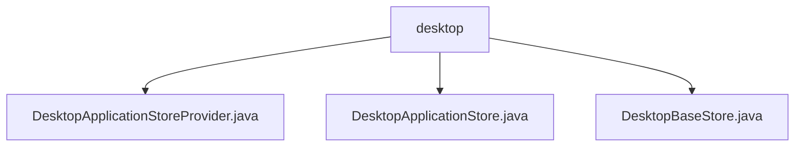

# 基础信息

|      |      |
|------|------|
| 名称 | desktop |
| 编码语言 | .java |
| 代码路径 | xpipe/ext/base/src/main/java/io/xpipe/ext/base/desktop |
| 包名 | xpipe.ext.base.src.main.java.io.xpipe.ext.base.desktop |
| 概述说明 | DesktopApplicationStoreProvider管理桌面应用数据存储，支持启动和配置。DesktopApplicationStore实现DataStore接口，用于命令构建。 |

# 说明

## 概述

该代码模块主要提供桌面应用程序的数据存储和管理功能，包含以下几个核心类：

1. **DesktopApplicationStoreProvider**：实现`DataStoreProvider`接口，负责管理桌面应用程序的数据存储。提供获取帮助链接、使用类别、创建类别等功能，并支持浏览器和应用程序启动操作。处理GUI对话框构建，用于配置应用程序的主机、路径和参数。

2. **DesktopApplicationStore**：实现`DataStore`接口，用于存储桌面应用程序的配置信息。包含以下特性：
   - 使用`@Value`、`@SuperBuilder`、`@Jacksonized`和`@JsonTypeName`注解
   - 包含三个核心字段：`desktop`(DataStoreEntryRef类型)、`path`和`arguments`(均为String类型)
   - 提供`checkComplete()`方法验证字段完整性和类型正确性
   - 提供`getFullCommand()`方法构建包含路径和参数的命令字符串

3. **DesktopBaseStore**：基础存储类(具体功能描述未提供)

## 主要业务场景

1. **桌面应用程序配置管理**：
   - 通过GUI对话框配置应用程序的主机、路径和启动参数
   - 验证配置信息的完整性和正确性

2. **应用程序启动流程**：
   - 执行桌面应用程序的启动流程，包括激活基础条目和运行应用程序
   - 构建完整的启动命令(包含路径和参数)

3. **数据存储操作**：
   - 管理桌面应用程序的存储条目
   - 生成存储条目的摘要信息
   - 支持浏览器和应用程序的存储操作

4. **命令构建**：
   - 根据存储的配置信息构建完整的可执行命令
   - 处理路径和参数的组合逻辑

### 包内部结构视图

该流程图展示了xpipe/ext/base/desktop目录下的层级结构，其中desktop作为父节点，包含三个子节点：DesktopApplicationStoreProvider.java、DesktopApplicationStore.java和DesktopBaseStore.java。这三个文件均位于同一目录层级下，没有进一步的嵌套关系，清晰地呈现了桌面应用相关存储类的文件组织结构。

# 文件列表 File List

| 名称   | 类型  | 说明 |
|-------|------|-------------|
| [DesktopBaseStore.java](DesktopBaseStore.md) | file | 输入内容为空，无法生成概要。请提供具体信息以便总结。 |
| [DesktopApplicationStore.java](DesktopApplicationStore.md) | file | 桌面应用存储类，含桌面引用、路径和参数，验证完整性并生成命令。 |
| [DesktopApplicationStoreProvider.java](DesktopApplicationStoreProvider.md) | file | 桌面应用存储提供程序，实现启动、配置和显示功能，支持桌面应用管理和操作。 |

