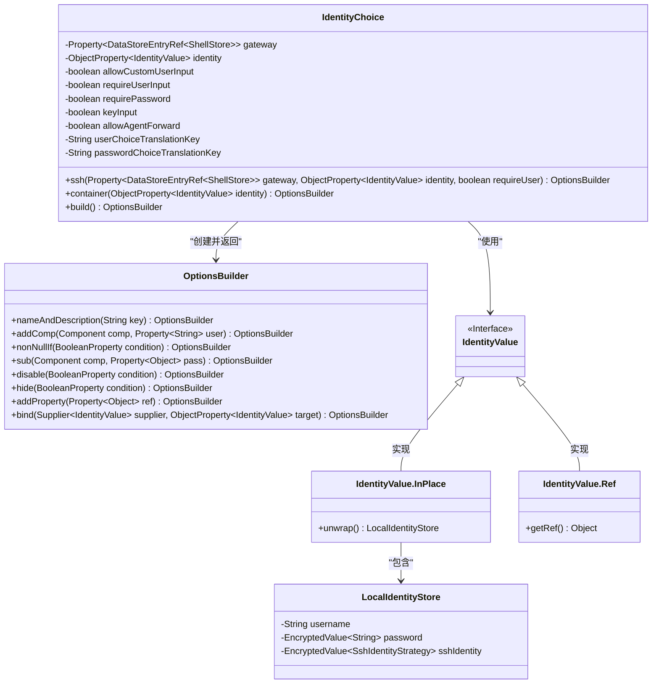
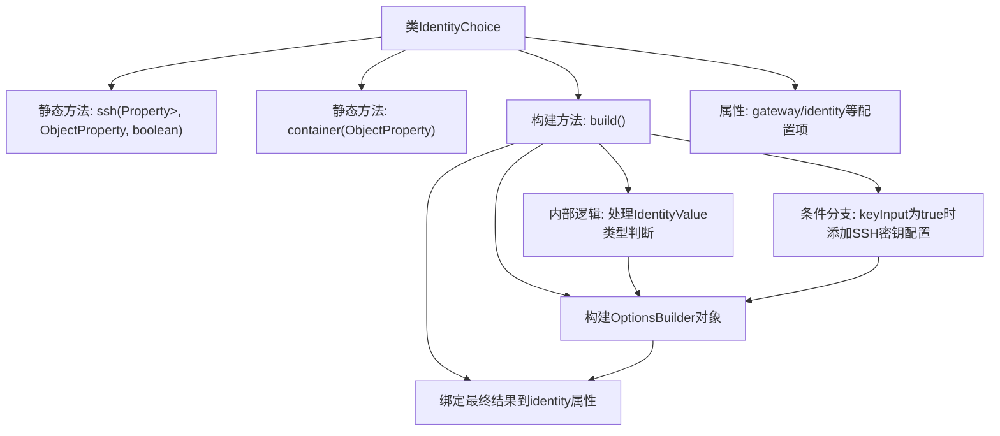

# 基础信息

|      |      |
|------|------|
| 名称 | IdentityChoice |
| 编码语言 | .java |
| 代码路径 | xpipe/ext/base/src/main/java/io/xpipe/ext/base/identity/IdentityChoice.java |
| 包名 | io.xpipe.ext.base.identity |
| 依赖项 | ['io.xpipe.app.ext.ShellStore', 'io.xpipe.app.storage.DataStoreEntryRef', 'io.xpipe.app.util.EncryptedValue', 'io.xpipe.app.util.OptionsBuilder', 'io.xpipe.app.util.SecretRetrievalStrategyHelper', 'javafx.beans.property', 'lombok.AllArgsConstructor', 'lombok.Builder', 'lombok.Value'] |
| 概述说明 | IdentityChoice类提供SSH和容器身份验证选项构建器，支持自定义用户输入、密码和密钥配置。 |

# 说明

IdentityChoice类用于构建身份验证选项，提供SSH和容器两种模式。SSH模式需指定网关、身份属性及用户验证要求，支持自定义用户输入、密码验证、密钥验证及代理转发。容器模式仅需身份属性，使用自定义用户名密码。类包含多个属性控制输入选项，如是否允许自定义用户、是否必填等。build方法根据当前身份值构建选项界面，处理用户名、密码、密钥策略的输入与验证，并绑定最终身份值。根据选择类型（引用或本地）动态显示或隐藏相关字段，确保数据有效性。

# 类列表 Class Summary

| 名称   | 类型  | 说明 |
|-------|------|-------------|
| IdentityChoice | class | IdentityChoice类提供SSH和容器身份验证选项构建功能，支持自定义用户输入、密码和密钥配置。 |

## 类 IdentityChoice

|      |      |
|------|------|
| 访问范围 | @Value;@Builder;@AllArgsConstructor;public |
| 类型 | class |
| 名称 | IdentityChoice |
| 说明 | IdentityChoice类提供SSH和容器身份验证选项构建功能，支持自定义用户输入、密码和密钥配置。 |

### UML类图

类图描述：
该图展示了IdentityChoice类及其关联关系，它是一个用于构建身份验证选项的工厂类，包含ssh()和container()两个静态工厂方法。核心功能通过build()方法返回OptionsBuilder对象来构建复杂选项。IdentityChoice与IdentityValue接口及其两个实现类(InPlace和Ref)交互，其中InPlace类型包含LocalIdentityStore存储具体凭证信息。OptionsBuilder类提供链式API来配置各种验证选项条件。

### 内部方法调用关系图

这段代码流程图展示了IdentityChoice类的核心结构，该类主要用于构建身份验证选项配置。流程从两个静态工厂方法ssh()和container()开始，通过build()方法创建OptionsBuilder对象，期间会处理不同类型的身份验证值（IdentityValue），根据配置添加用户名/密码或SSH密钥验证选项，最终将配置结果绑定到identity属性。特别值得注意的是存在条件分支处理密钥认证的特殊逻辑，以及复杂的属性绑定机制。

### 字段列表 Field List

| 名称  | 类型  | 说明 |
|-------|-------|------|
| keyInput | boolean | 布尔型变量keyInput |
| allowCustomUserInput | boolean | 允许自定义用户输入。 |
| passwordChoiceTranslationKey | String | 字符串密码选择翻译键 |
| allowAgentForward | boolean | 允许代理转发 |
| identity | ObjectProperty<IdentityValue> | 对象属性标识值 |
| gateway | Property<DataStoreEntryRef<ShellStore>> | ShellStore的网关属性 |
| requirePassword | boolean | 需要密码 |
| userChoiceTranslationKey | String | 字符串变量存储用户选择的翻译键。 |
| requireUserInput | boolean | 布尔变量requireUserInput |

### 方法列表 Method List

| 名称  | 类型  | 说明 |
|-------|-------|------|
| ssh | OptionsBuilder | 静态方法ssh创建身份选择器，构建SSH选项。 |
| container | OptionsBuilder | 静态方法创建身份选择构建器，返回OptionsBuilder实例。 |
| build | OptionsBuilder | 构建身份验证选项，包含用户、密码、密钥策略选择，支持引用或本地存储，条件验证与绑定逻辑。 |

