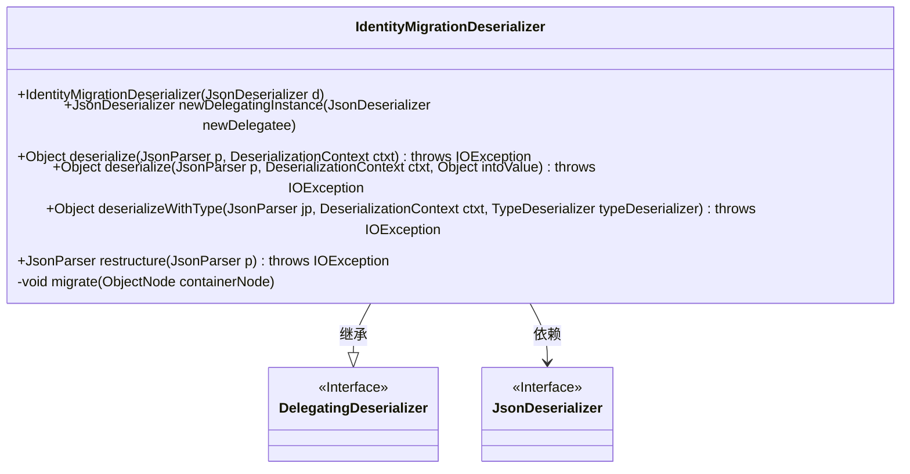
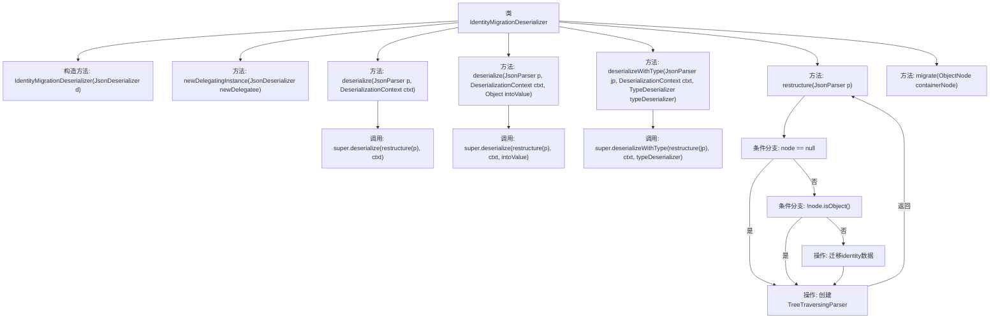

# 基础信息

|      |      |
|------|------|
| 名称 | IdentityMigrationDeserializer |
| 编码语言 | .java |
| 代码路径 | xpipe/ext/base/src/main/java/io/xpipe/ext/base/identity/IdentityMigrationDeserializer.java |
| 包名 | io.xpipe.ext.base.identity |
| 依赖项 | ['com.fasterxml.jackson.core.JsonParser', 'com.fasterxml.jackson.databind.DeserializationContext', 'com.fasterxml.jackson.databind.JsonDeserializer', 'com.fasterxml.jackson.databind.deser.std.DelegatingDeserializer', 'com.fasterxml.jackson.databind.jsontype.TypeDeserializer', 'com.fasterxml.jackson.databind.node.JsonNodeFactory', 'com.fasterxml.jackson.databind.node.ObjectNode', 'com.fasterxml.jackson.databind.node.TreeTraversingParser', 'java.io.IOException'] |
| 概述说明 | IdentityMigrationDeserializer继承DelegatingDeserializer，用于JSON数据迁移和重构。 |

# 说明

IdentityMigrationDeserializer是一个继承自DelegatingDeserializer的JSON反序列化类，主要用于处理身份认证数据的迁移。它通过重写deserialize和deserializeWithType方法，在反序列化前调用restructure方法重构JSON结构。restructure方法将JSON解析为树结构，若非对象节点则直接返回，否则调用migrate方法进行数据迁移。migrate方法处理多种身份认证字段（如user、password、identityStrategy等），将它们重组为统一的identity结构，包含localIdentity类型和inPlace类型的身份存储信息。整个过程确保了旧版身份认证数据能正确迁移到新版格式。

# 类列表 Class Summary

| 名称   | 类型  | 说明 |
|-------|------|-------------|
| IdentityMigrationDeserializer | class | 自定义JSON反序列化器，用于身份数据迁移。 |

## 类 IdentityMigrationDeserializer

|      |      |
|------|------|
| 访问范围 | public |
| 类型 | class |
| 名称 | IdentityMigrationDeserializer |
| 说明 | 自定义JSON反序列化器，用于身份数据迁移。 |

### UML类图

这段代码展示了一个用于JSON反序列化的`IdentityMigrationDeserializer`类，它继承自`DelegatingDeserializer`并实现了多种反序列化方法。主要功能是通过`restructure`方法重构JSON解析器，并在`migrate`方法中处理身份验证数据的迁移逻辑，将旧版数据结构转换为新版格式。该类通过委托模式扩展了基础反序列化功能，特别适用于处理身份验证相关的数据结构转换场景。

### 内部方法调用关系图

流程图描述了IdentityMigrationDeserializer类的核心结构和数据流。该类是一个JSON反序列化器，主要功能是通过restructure方法重构JSON解析器，并在migrate方法中处理身份验证数据的迁移逻辑。流程展示了从反序列化入口方法到最终数据处理的完整路径，包括条件分支和对象创建操作，特别关注了身份验证字段的重组和标准化处理过程。

### 字段列表 Field List

| 名称  | 类型  | 说明 |
|-------|-------|------|

### 方法列表 Method List

| 名称  | 类型  | 说明 |
|-------|-------|------|
| migrate | void | 迁移容器节点身份验证数据，处理用户、密码和身份策略。 |
| deserialize | Object | 重写反序列化方法，调用父类处理重构后的输入。 |
| deserializeWithType | Object | 方法重写，调用父类反序列化方法并预处理输入。 |
| deserialize | Object | 重写反序列化方法，调用父类处理重构后的解析器。 |
| restructure | JsonParser | 重构JSON解析器：读取节点，非对象直接返回，对象则迁移后返回新解析器。 |
| newDelegatingInstance | JsonDeserializer<?> | 重写方法，返回包含新委托的IdentityMigrationDeserializer实例。 |

