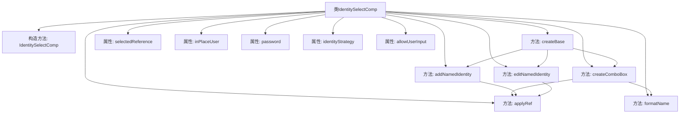
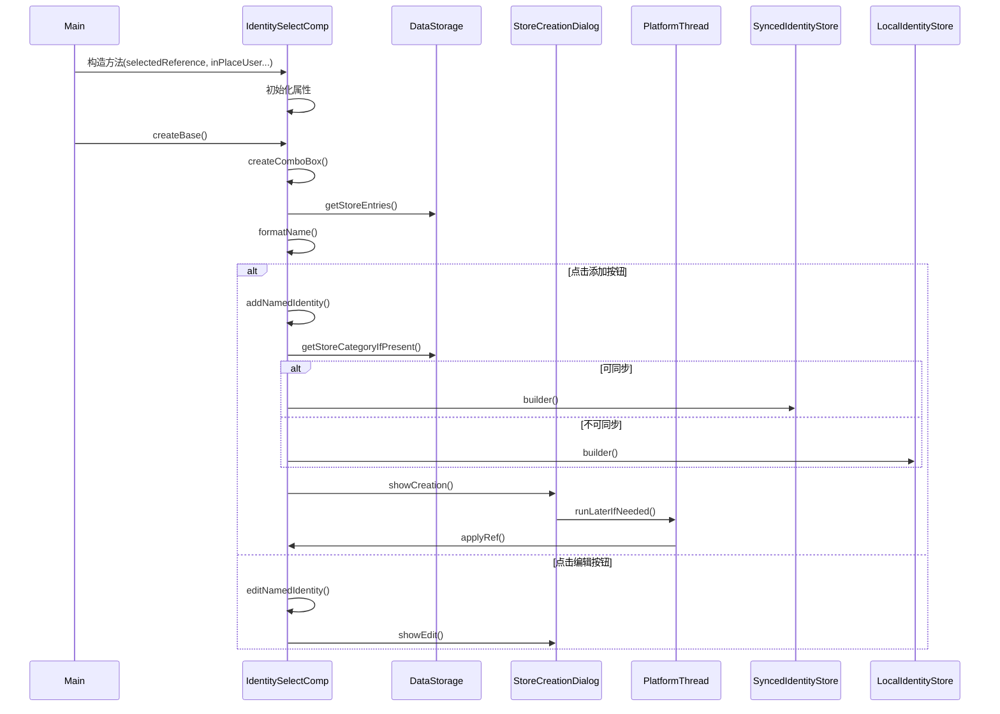

# 基础信息

|      |      |
|------|------|
| 名称 | IdentitySelectComp |
| 编码语言 | .java |
| 代码路径 | xpipe/ext/base/src/main/java/io/xpipe/ext/base/identity/IdentitySelectComp.java |
| 包名 | io.xpipe.ext.base.identity |
| 依赖项 | ['io.xpipe.app.comp.Comp', 'io.xpipe.app.comp.CompStructure', 'io.xpipe.app.comp.SimpleCompStructure', 'io.xpipe.app.comp.base', 'io.xpipe.app.comp.store.StoreCreationDialog', 'io.xpipe.app.comp.store.StoreEntryWrapper', 'io.xpipe.app.comp.store.StoreViewState', 'io.xpipe.app.core.AppFontSizes', 'io.xpipe.app.core.AppI18n', 'io.xpipe.app.ext.DataStoreCreationCategory', 'io.xpipe.app.storage.DataStorage', 'io.xpipe.app.storage.DataStoreEntry', 'io.xpipe.app.storage.DataStoreEntryRef', 'io.xpipe.app.util.EncryptedValue', 'io.xpipe.app.util.LabelGraphic', 'io.xpipe.app.util.PlatformThread', 'io.xpipe.app.util.SecretRetrievalStrategy', 'javafx.application.Platform', 'javafx.beans.binding.Bindings', 'javafx.beans.property.ObjectProperty', 'javafx.beans.property.Property', 'javafx.beans.property.SimpleStringProperty', 'javafx.beans.value.ObservableValue', 'javafx.collections.ListChangeListener', 'javafx.scene.control.ListCell', 'javafx.scene.input.KeyCode', 'javafx.scene.input.KeyEvent', 'javafx.scene.layout.AnchorPane', 'javafx.scene.layout.HBox', 'javafx.scene.layout.Region', 'atlantafx.base.theme.Styles', 'java.util.ArrayList', 'java.util.LinkedHashMap', 'java.util.List'] |
| 概述说明 | 身份选择组件，支持本地和同步身份管理，包含添加、编辑和清除功能。 |

# 说明

IdentitySelectComp是一个用于身份选择的UI组件，继承自Comp类，采用HBox布局。它通过构造函数接收五个参数：selectedReference用于存储选中的身份引用，inPlaceUser表示临时用户名，password和identityStrategy分别处理密码和SSH身份策略，allowUserInput控制是否允许用户输入。组件提供添加和编辑身份的功能，支持本地和同步身份存储，并根据不同条件构建相应类型的身份对象。组件包含一个组合框用于显示可用身份，以及按钮用于触发添加或编辑操作。组合框支持动态更新、键盘事件处理和清除功能，整体布局通过样式类进行定制。

# 类列表 Class Summary

| 名称   | 类型  | 说明 |
|-------|------|-------------|
| IdentitySelectComp | class | 身份选择组件，支持本地和同步存储，可编辑和添加身份。 |


## 类 IdentitySelectComp

|      |      |
|------|------|
| 访问范围 | public |
| 类型 | class |
| 名称 | IdentitySelectComp |
| 说明 | 身份选择组件，支持本地和同步存储，可编辑和添加身份。 |


### UML类图

```mermaid
classDiagram
    class IdentitySelectComp {
        -ObjectProperty~DataStoreEntryRef~IdentityStore~~ selectedReference
        -Property~String~ inPlaceUser
        -ObservableValue~SecretRetrievalStrategy~ password
        -ObservableValue~SshIdentityStrategy~ identityStrategy
        -boolean allowUserInput
        +IdentitySelectComp(ObjectProperty~DataStoreEntryRef~IdentityStore~~, Property~String~, ObservableValue~SecretRetrievalStrategy~, ObservableValue~SshIdentityStrategy~, boolean)
        -void addNamedIdentity()
        -void editNamedIdentity()
        +CompStructure~HBox~ createBase()
        -String formatName(DataStoreEntry)
        -void applyRef(DataStoreEntryRef~IdentityStore~)
        -Comp~?~ createComboBox()
    }

    class <<Interface>> Comp~T~ {
        <<Interface>>
        +CompStructure~T~ createBase()
    }

    class CompStructure~T~ {
        +T get()
    }

    class HBox

    class DataStoreEntryRef~T~

    class IdentityStore {
        <<Interface>>
    }

    class LocalIdentityStore {
        +builder() LocalIdentityStore$Builder
    }

    class SyncedIdentityStore {
        +builder() SyncedIdentityStore$Builder
    }

    class DataStorage {
        +get() DataStorage
        +getStoreCategoryIfPresent(UUID) Optional~StoreCategory~
        +getStoreEntries() Collection~DataStoreEntry~
    }

    class StoreCreationDialog {
        +showCreation(IdentityStore, DataStoreCreationCategory, Consumer~DataStoreEntry~, boolean)
        +showEdit(DataStoreEntryRef~IdentityStore~)
    }

    IdentitySelectComp --> Comp : 实现
    IdentitySelectComp --> CompStructure : 使用
    IdentitySelectComp --> HBox : 使用
    IdentitySelectComp --> DataStoreEntryRef : 使用
    IdentitySelectComp --> IdentityStore : 使用
    IdentitySelectComp --> DataStorage : 依赖
    IdentitySelectComp --> StoreCreationDialog : 依赖
    LocalIdentityStore ..|> IdentityStore : 实现
    SyncedIdentityStore ..|> IdentityStore : 实现
```

这段代码展示了一个用于身份选择的可重用UI组件IdentitySelectComp，它继承自泛型Comp类并实现了创建HBox布局的功能。该组件管理身份存储引用、用户输入属性和密码策略，提供添加/编辑命名身份的功能，并通过组合框显示可用身份列表。核心功能包括：根据同步能力创建不同身份存储类型(Local/Synced)、处理用户输入事件、维护身份引用状态，并与DataStorage和StoreCreationDialog进行交互来实现身份管理的完整生命周期。


### 内部方法调用关系图





流程图展示了IdentitySelectComp类的结构，包含构造方法、6个主要方法和5个属性。核心逻辑集中在身份创建(addNamedIdentity)和编辑(editNamedIdentity)功能，通过createBase方法组织UI组件，createComboBox方法处理下拉列表逻辑。时序图则描述了从对象构造到用户交互的完整流程，特别是身份创建时的分支逻辑（同步/本地存储）和异步回调处理。

### 字段列表 Field List

| 名称  | 类型  | 说明 |
|-------|-------|------|
| inPlaceUser | Property<String> | 私有字符串属性inPlaceUser |
| password | ObservableValue<SecretRetrievalStrategy> | 私有不可变密码检索策略观察值 |
| allowUserInput | boolean | 私有布尔变量，控制是否允许用户输入。 |
| identityStrategy | ObservableValue<SshIdentityStrategy> | 私有不可变SSH身份策略观察值 |
| selectedReference | ObjectProperty<DataStoreEntryRef<IdentityStore>> | 私有对象属性，存储DataStoreEntryRef类型引用，指向IdentityStore。 |

### 方法列表 Method List

| 名称  | 类型  | 说明 |
|-------|-------|------|
| editNamedIdentity | void | 编辑指定身份信息的方法，若身份为空则不执行。 |
| addNamedIdentity | void | 方法根据同步能力创建本地或同步身份存储，设置用户名、密码和SSH密钥，最后显示创建对话框。 |
| createBase | CompStructure<HBox> | 重写方法创建HBox布局，包含动态图标按钮和组合框，按钮根据选择状态切换功能，布局自动聚焦首元素。 |
| formatName | String | 格式化名称方法：根据存储类型添加本地、用户或全局标识后缀。 |
| applyRef | void | 设置选定引用为新引用值。 |
| createComboBox | Comp<?> | 创建组合框，管理身份存储选择，支持用户输入和清除功能。 |


