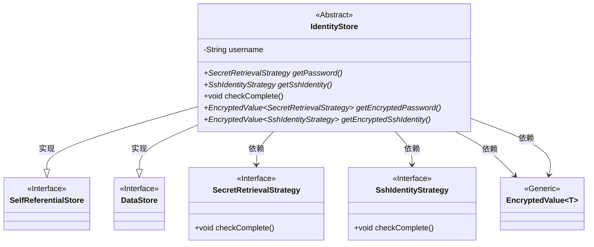
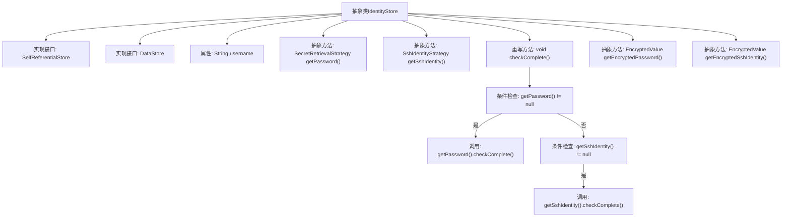

# 基础信息

|      |      |
|------|------|
| 名称 | IdentityStore |
| 编码语言 | .java |
| 代码路径 | xpipe/ext/base/src/main/java/io/xpipe/ext/base/identity/IdentityStore.java |
| 包名 | io.xpipe.ext.base.identity |
| 依赖项 | ['io.xpipe.app.util', 'io.xpipe.core.store', 'io.xpipe.ext.base.SelfReferentialStore', 'lombok.EqualsAndHashCode', 'lombok.Getter', 'lombok.ToString', 'lombok.experimental.SuperBuilder'] |
| 概述说明 | 抽象类IdentityStore实现密码和SSH身份验证策略检查。 |

# 说明

这是一个抽象类IdentityStore，实现了SelfReferentialStore和DataStore接口。类上使用了SuperBuilder、EqualsAndHashCode、ToString和Getter注解。包含username字段和多个抽象方法：getPassword获取密码策略，getSshIdentity获取SSH身份策略，getEncryptedPassword获取加密密码，getEncryptedSshIdentity获取加密SSH身份。重写了checkComplete方法，检查密码和SSH身份策略是否完整。

# 类列表 Class Summary

| 名称   | 类型  | 说明 |
|-------|------|-------------|
| IdentityStore | class | 抽象类IdentityStore实现数据存储接口，包含用户名、密码和SSH身份验证方法，提供完整性检查功能。 |

## 类 IdentityStore

|      |      |
|------|------|
| 访问范围 | @SuperBuilder;@EqualsAndHashCode;@ToString;@Getter;public abstract |
| 类型 | class |
| 名称 | IdentityStore |
| 说明 | 抽象类IdentityStore实现数据存储接口，包含用户名、密码和SSH身份验证方法，提供完整性检查功能。 |

### UML类图

这段代码描述了一个抽象类`IdentityStore`，它实现了`SelfReferentialStore`和`DataStore`接口，用于管理身份验证相关的策略。类中包含用户名字段和多个抽象方法，用于获取密码策略、SSH身份策略及其加密版本。`checkComplete()`方法会检查这些策略是否完整。该类依赖于`SecretRetrievalStrategy`和`SshIdentityStrategy`接口，以及泛型类`EncryptedValue`来封装加密数据。整体设计体现了策略模式，通过抽象方法将具体实现延迟到子类。

### 内部方法调用关系图

该流程图展示了IdentityStore抽象类的结构，包含两个接口实现、一个属性和五个方法。核心逻辑体现在checkComplete()方法中，该方法会依次检查密码和SSH身份策略是否为空，非空时调用对应策略的完整性检查。所有抽象方法都需要子类实现，体现了模板方法设计模式。类通过Lombok注解实现了建造者模式、equals/hashCode和toString功能。

### 字段列表 Field List

| 名称  | 类型  | 说明 |
|-------|-------|------|
| username | String | 声明字符串变量username。 |

### 方法列表 Method List

| 名称  | 类型  | 说明 |
|-------|-------|------|
| checkComplete | void | 检查密码和SSH身份完整性，非空则调用各自检查方法。 |
| getSshIdentity | SshIdentityStrategy | 获取SSH身份验证策略的抽象方法。 |
| getEncryptedSshIdentity | EncryptedValue<SshIdentityStrategy> | 获取加密的SSH身份信息。 |
| getPassword | SecretRetrievalStrategy | 获取密码的抽象策略方法 |
| getEncryptedPassword | EncryptedValue<SecretRetrievalStrategy> | 获取加密密码方法 |

