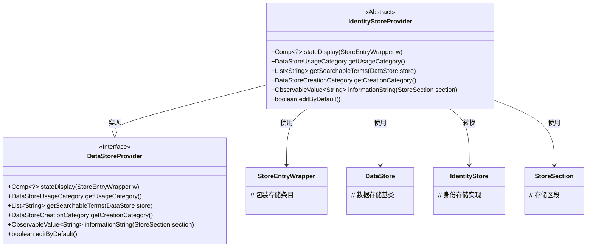
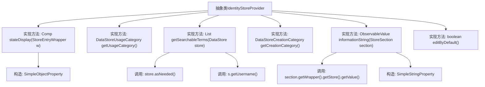

# 基础信息

|      |      |
|------|------|
| 名称 | IdentityStoreProvider |
| 编码语言 | .java |
| 代码路径 | xpipe/ext/base/src/main/java/io/xpipe/ext/base/identity/IdentityStoreProvider.java |
| 包名 | io.xpipe.ext.base.identity |
| 依赖项 | ['io.xpipe.app.comp.Comp', 'io.xpipe.app.comp.store', 'io.xpipe.app.ext', 'io.xpipe.app.util.SecretRetrievalStrategy', 'io.xpipe.core.store.DataStore', 'javafx.beans.property.SimpleObjectProperty', 'javafx.beans.property.SimpleStringProperty', 'javafx.beans.value.ObservableValue', 'java.util.List'] |
| 概述说明 | 抽象类实现身份存储功能，含状态显示、搜索项、信息字符串等方法。 |

# 说明

该抽象类IdentityStoreProvider实现了DataStoreProvider接口，主要用于身份存储管理。它重写了多个方法：stateDisplay返回成功状态的系统组件；getUsageCategory和getCreationCategory均标识为身份类别；getSearchableTerms根据用户名返回可搜索项；informationString生成包含用户名、密码和SSH密钥状态的描述信息；editByDefault默认允许编辑。该类处理身份存储的核心功能，包括状态显示、分类标识和用户信息管理。

# 类列表 Class Summary

| 名称   | 类型  | 说明 |
|-------|------|-------------|
| IdentityStoreProvider | class | 抽象类IdentityStoreProvider实现DataStoreProvider接口，提供身份存储相关功能，包括状态显示、使用分类、搜索项、创建分类、信息字符串和默认编辑设置。 |

## 类 IdentityStoreProvider

|      |      |
|------|------|
| 访问范围 | public abstract |
| 类型 | class |
| 名称 | IdentityStoreProvider |
| 说明 | 抽象类IdentityStoreProvider实现DataStoreProvider接口，提供身份存储相关功能，包括状态显示、使用分类、搜索项、创建分类、信息字符串和默认编辑设置。 |

### UML类图

这段类图展示了IdentityStoreProvider抽象类实现DataStoreProvider接口的关系。IdentityStoreProvider提供了身份数据存储的核心功能，包括状态显示、使用类别获取、可搜索术语处理、创建类别标识、信息字符串生成和默认编辑控制。它依赖StoreEntryWrapper、DataStore、IdentityStore和StoreSection等辅助类来完成具体操作，其中IdentityStore用于处理用户名、密码和SSH密钥等身份信息。该设计体现了接口隔离原则，通过抽象类提供默认实现，同时保持扩展灵活性。

### 内部方法调用关系图

这段代码展示了一个抽象类`IdentityStoreProvider`，它实现了多个关键方法用于身份存储管理。流程图清晰地展示了类结构与各方法间的调用关系，包括数据转换、状态显示和信息字符串生成等核心功能。特别注意边缘情况处理，如空用户名检查、密码和SSH密钥的可选显示逻辑，以及默认编辑权限控制。所有方法都严格遵循接口契约，体现了健壮的身份存储管理功能。

### 字段列表 Field List

| 名称  | 类型  | 说明 |
|-------|-------|------|

### 方法列表 Method List

| 名称  | 类型  | 说明 |
|-------|-------|------|
| informationString | ObservableValue<String> | 重写方法返回用户信息字符串，包含用户名、密码和SSH密钥状态。 |
| stateDisplay | Comp<?> | 重写方法返回系统状态成功组件。 |
| getSearchableTerms | List<String> | 重写方法，从数据存储获取用户名作为可搜索项，若无则返回空列表。 |
| getCreationCategory | DataStoreCreationCategory | 重写方法返回身份验证的数据存储创建类别。 |
| editByDefault | boolean | Java方法重写，默认返回true。 |
| getUsageCategory | DataStoreUsageCategory | 方法返回数据存储用途类别为身份标识。 |

