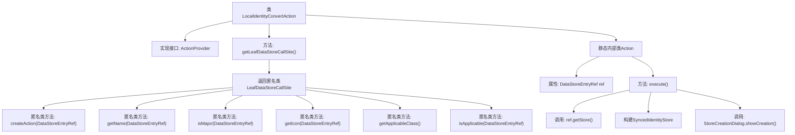

# 基础信息

|      |      |
|------|------|
| 名称 | LocalIdentityConvertAction |
| 编码语言 | .java |
| 代码路径 | xpipe/ext/base/src/main/java/io/xpipe/ext/base/identity/LocalIdentityConvertAction.java |
| 包名 | io.xpipe.ext.base.identity |
| 依赖项 | ['io.xpipe.app.comp.store.StoreCreationDialog', 'io.xpipe.app.core.AppI18n', 'io.xpipe.app.ext.ActionProvider', 'io.xpipe.app.ext.DataStoreCreationCategory', 'io.xpipe.app.storage.DataStorage', 'io.xpipe.app.storage.DataStoreEntryRef', 'io.xpipe.app.util.EncryptedValue', 'io.xpipe.app.util.LabelGraphic', 'javafx.beans.value.ObservableValue', 'lombok.Value'] |
| 概述说明 | LocalIdentityConvertAction实现同步本地身份到远程存储功能。 |

# 说明

LocalIdentityConvertAction是一个实现ActionProvider接口的类，用于将本地身份存储转换为同步身份存储。它通过getLeafDataStoreCallSite方法返回一个LeafDataStoreCallSite实例，定义了创建动作、名称、图标等属性。内部Action类执行转换逻辑，将本地存储的用户名、密码和SSH身份信息加密后构建为SyncedIdentityStore实例，并通过对话框展示创建过程。该动作仅在支持同步时可用，适用于LocalIdentityStore类。

# 类列表 Class Summary

| 名称   | 类型  | 说明 |
|-------|------|-------------|
| LocalIdentityConvertAction | class | LocalIdentityConvertAction实现同步本地身份到远程存储功能。 |


## 类 LocalIdentityConvertAction

|      |      |
|------|------|
| 访问范围 | public |
| 类型 | class |
| 名称 | LocalIdentityConvertAction |
| 说明 | LocalIdentityConvertAction实现同步本地身份到远程存储功能。 |


### UML类图

```mermaid
classDiagram
    class LocalIdentityConvertAction {
        +LeafDataStoreCallSite~?~ getLeafDataStoreCallSite()
    }
    <<Interface>> ActionProvider
    LocalIdentityConvertAction ..|> ActionProvider : 实现

    class LeafDataStoreCallSite~T~ {
        <<Interface>>
        +Action createAction(DataStoreEntryRef~T~ store)
        +ObservableValue~String~ getName(DataStoreEntryRef~T~ store)
        +boolean isMajor(DataStoreEntryRef~T~ o)
        +LabelGraphic getIcon(DataStoreEntryRef~T~ store)
        +Class~?~ getApplicableClass()
        +boolean isApplicable(DataStoreEntryRef~T~ o)
    }
    LocalIdentityConvertAction --> LeafDataStoreCallSite : 创建匿名实现类

    class Action {
        -DataStoreEntryRef~LocalIdentityStore~ ref
        +void execute()
    }
    LocalIdentityConvertAction *-- Action : 包含

    class DataStoreEntryRef~T~ {
        <<Interface>>
    }
    Action --> DataStoreEntryRef : 依赖

    class LocalIdentityStore {
    }
    DataStoreEntryRef --> LocalIdentityStore : 泛型参数

    class SyncedIdentityStore {
        +builder()$
    }
    Action --> SyncedIdentityStore : 创建实例

    class StoreCreationDialog {
        +showCreation()$
    }
    Action --> StoreCreationDialog : 调用静态方法
```

这段类图展示了LocalIdentityConvertAction及其相关组件的结构关系。该动作提供者实现了ActionProvider接口，通过内部类LeafDataStoreCallSite处理数据存储操作，并包含一个具体的Action类来执行身份转换逻辑。图中清晰地呈现了泛型参数传递、接口实现、类组合等关键设计，特别是展示了从本地身份存储到同步身份存储的转换流程中涉及的各个组件及其交互方式。


### 内部方法调用关系图



这段代码展示了一个实现ActionProvider接口的LocalIdentityConvertAction类，主要用于本地身份存储到同步身份存储的转换。核心是通过getLeafDataStoreCallSite()方法返回一个匿名类，实现创建动作、获取名称/图标、校验适用性等功能。内部类Action封装了具体的执行逻辑，包括获取存储引用、构建同步身份对象并触发创建对话框。整体设计采用工厂模式和建造者模式，强调可扩展性和类型安全。

### 字段列表 Field List

| 名称  | 类型  | 说明 |
|-------|-------|------|

### 方法列表 Method List

| 名称  | 类型  | 说明 |
|-------|-------|------|
| getLeafDataStoreCallSite | LeafDataStoreCallSite<?> | 重写方法返回LeafDataStoreCallSite实例，定义同步操作、名称、图标及适用条件。 |


