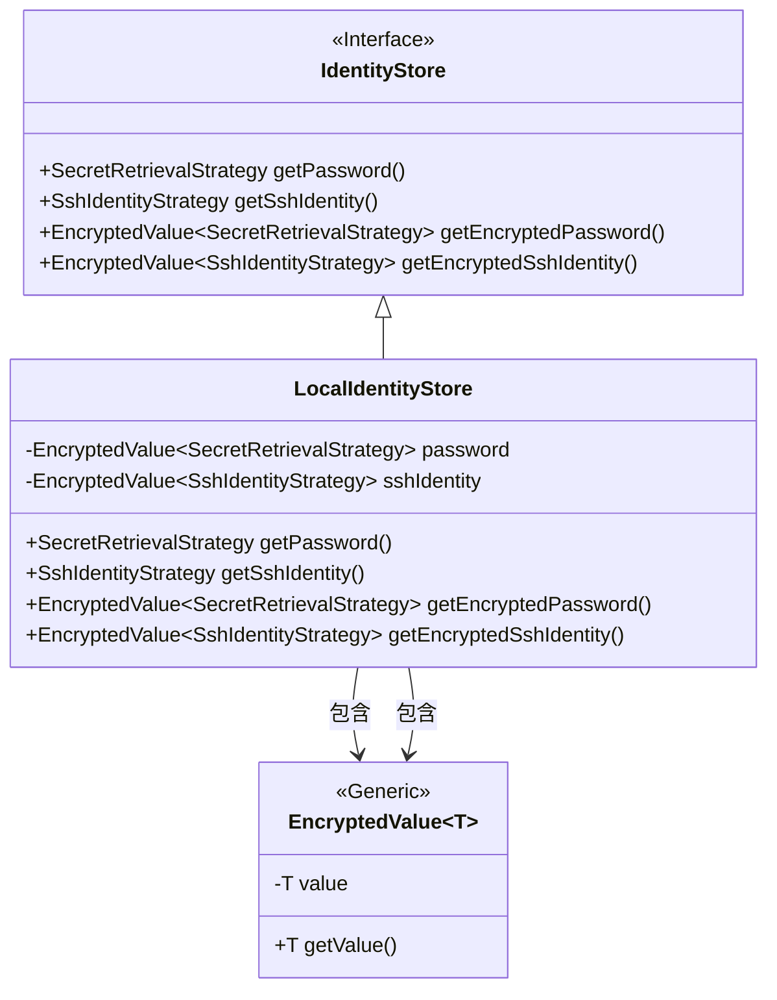
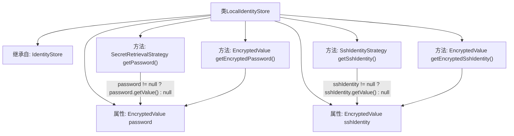

# 基础信息

|      |      |
|------|------|
| 名称 | LocalIdentityStore |
| 编码语言 | .java |
| 代码路径 | xpipe/ext/base/src/main/java/io/xpipe/ext/base/identity/LocalIdentityStore.java |
| 包名 | io.xpipe.ext.base.identity |
| 依赖项 | ['io.xpipe.app.util.EncryptedValue', 'io.xpipe.app.util.SecretRetrievalStrategy', 'com.fasterxml.jackson.annotation.JsonTypeName', 'lombok.EqualsAndHashCode', 'lombok.ToString', 'lombok.Value', 'lombok.experimental.SuperBuilder', 'lombok.extern.jackson.Jacksonized'] |
| 概述说明 | LocalIdentityStore类继承IdentityStore，包含加密密码和SSH身份字段及对应方法。 |

# 说明

这是一个名为LocalIdentityStore的Java类，继承自IdentityStore类。该类使用了多个注解，包括SuperBuilder、JsonTypeName、Jacksonized、Value、EqualsAndHashCode和ToString。类中包含两个加密值字段：password和sshIdentity，分别存储SecretRetrievalStrategy和SshIdentityStrategy类型的数据。提供了四个方法：getPassword和getSshIdentity用于获取解密后的值，getEncryptedPassword和getEncryptedSshIdentity用于获取加密值对象。该类主要用于本地身份信息的存储和管理。

# 类列表 Class Summary

| 名称   | 类型  | 说明 |
|-------|------|-------------|
| LocalIdentityStore | class | LocalIdentityStore类继承IdentityStore，包含加密密码和SSH身份字段及获取方法。 |

## 类 LocalIdentityStore

|      |      |
|------|------|
| 访问范围 | @SuperBuilder;@JsonTypeName("localIdentity");@Jacksonized;@Value;@EqualsAndHashCode(callSuper = true);@ToString(callSuper = true);public |
| 类型 | class |
| 名称 | LocalIdentityStore |
| 说明 | LocalIdentityStore类继承IdentityStore，包含加密密码和SSH身份字段及获取方法。 |

### UML类图

该类图展示了LocalIdentityStore类继承自IdentityStore接口，并包含两个泛型EncryptedValue字段。LocalIdentityStore实现了获取密码和SSH身份的明文及加密值的方法，通过泛型类EncryptedValue封装敏感数据。图中清晰呈现了接口实现关系、类之间的组合关系，以及泛型类的使用方式，体现了安全存储身份信息的类结构设计。

### 内部方法调用关系图

该流程图展示了LocalIdentityStore类的结构，这是一个继承自IdentityStore的类，包含两个加密属性(password和sshIdentity)和四个核心方法。主要逻辑集中在getPassword()和getSshIdentity()方法，它们分别检查对应属性是否为null后返回解密值或null。getEncryptedPassword()和getEncryptedSshIdentity()则直接返回原始加密值。类使用了Lombok的@Value注解实现不可变性，并通过@SuperBuilder支持构建器模式。

### 字段列表 Field List

| 名称  | 类型  | 说明 |
|-------|-------|------|
| sshIdentity | EncryptedValue<SshIdentityStrategy> | 加密SSH身份策略变量 |
| password | EncryptedValue<SecretRetrievalStrategy> | 加密密码存储策略 |

### 方法列表 Method List

| 名称  | 类型  | 说明 |
|-------|-------|------|
| getSshIdentity | SshIdentityStrategy | 重写getSshIdentity方法，返回sshIdentity值或null。 |
| getEncryptedPassword | EncryptedValue<SecretRetrievalStrategy> | 重写方法返回加密密码。 |
| getPassword | SecretRetrievalStrategy | 重写getPassword方法，返回密码值或null。 |
| getEncryptedSshIdentity | EncryptedValue<SshIdentityStrategy> | 获取加密SSH身份的方法，返回sshIdentity。 |

