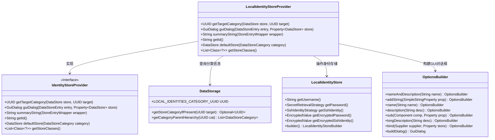
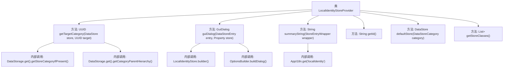

# 基础信息

|      |      |
|------|------|
| 名称 | LocalIdentityStoreProvider |
| 编码语言 | .java |
| 代码路径 | xpipe/ext/base/src/main/java/io/xpipe/ext/base/identity/LocalIdentityStoreProvider.java |
| 包名 | io.xpipe.ext.base.identity |
| 依赖项 | ['io.xpipe.app.comp.store.StoreEntryWrapper', 'io.xpipe.app.core.AppI18n', 'io.xpipe.app.ext.GuiDialog', 'io.xpipe.app.storage', 'io.xpipe.app.util.EncryptedValue', 'io.xpipe.app.util.OptionsBuilder', 'io.xpipe.app.util.SecretRetrievalStrategy', 'io.xpipe.app.util.SecretRetrievalStrategyHelper', 'io.xpipe.core.store.DataStore', 'javafx.beans.property.Property', 'javafx.beans.property.SimpleObjectProperty', 'javafx.beans.property.SimpleStringProperty', 'java.util.List', 'java.util.UUID'] |
| 概述说明 | 本地身份存储提供类，实现获取分类、创建对话框、生成摘要等功能。 |

# 说明

LocalIdentityStoreProvider继承自IdentityStoreProvider，主要功能包括获取目标类别、构建GUI对话框、生成摘要字符串等。其核心方法getTargetCategory通过检查目标类别是否属于本地身份类别来返回相应UUID。guiDialog方法创建包含用户名、密码和SSH密钥认证选项的对话框，并绑定数据到LocalIdentityStore对象。summaryString返回本地身份标识，getId返回提供者ID。此外，还提供默认存储实例及支持的存储类列表。

# 类列表 Class Summary

| 名称   | 类型  | 说明 |
|-------|------|-------------|
| LocalIdentityStoreProvider | class | 本地身份存储提供程序，处理身份验证和GUI对话框构建。 |

## 类 LocalIdentityStoreProvider

|      |      |
|------|------|
| 访问范围 | public |
| 类型 | class |
| 名称 | LocalIdentityStoreProvider |
| 说明 | 本地身份存储提供程序，处理身份验证和GUI对话框构建。 |

### UML类图

该类图展示了LocalIdentityStoreProvider实现IdentityStoreProvider接口的核心结构，主要处理本地身份存储的类别判断、GUI对话框构建和默认存储创建。通过DataStorage获取分类信息，使用LocalIdentityStore存储具体身份数据，并借助OptionsBuilder构建交互界面。整体设计体现了身份管理系统的模块化架构，各组件职责明确，通过属性绑定实现数据同步。

### 内部方法调用关系图

该流程图展示了LocalIdentityStoreProvider类的核心结构和内部调用关系。类继承自IdentityStoreProvider，主要实现身份存储相关功能，包含6个关键方法：getTargetCategory用于获取目标分类UUID，guiDialog构建身份验证对话框，summaryString生成摘要文本，getId返回标识符，defaultStore创建默认存储实例，getStoreClasses返回支持的存储类。方法间通过DataStorage、LocalIdentityStore.builder等工具类交互，形成完整的身份管理逻辑链。

### 字段列表 Field List

| 名称  | 类型  | 说明 |
|-------|-------|------|

### 方法列表 Method List

| 名称  | 类型  | 说明 |
|-------|-------|------|
| defaultStore | DataStore | 重写defaultStore方法，返回无密码和SSH的本地存储实例。 |
| getTargetCategory | UUID | 获取目标分类：本地分类则返回目标，否则返回本地分类ID。 |
| guiDialog | GuiDialog | 创建GUI对话框，设置用户名、密码和SSH密钥认证，绑定数据存储。 |
| getId | String | 重写getId方法，返回固定字符串"localIdentity"。 |
| summaryString | String | 重写方法返回本地身份存储的国际化标签。 |
| getStoreClasses | List<Class<?>> | 重写方法返回LocalIdentityStore类列表。 |

