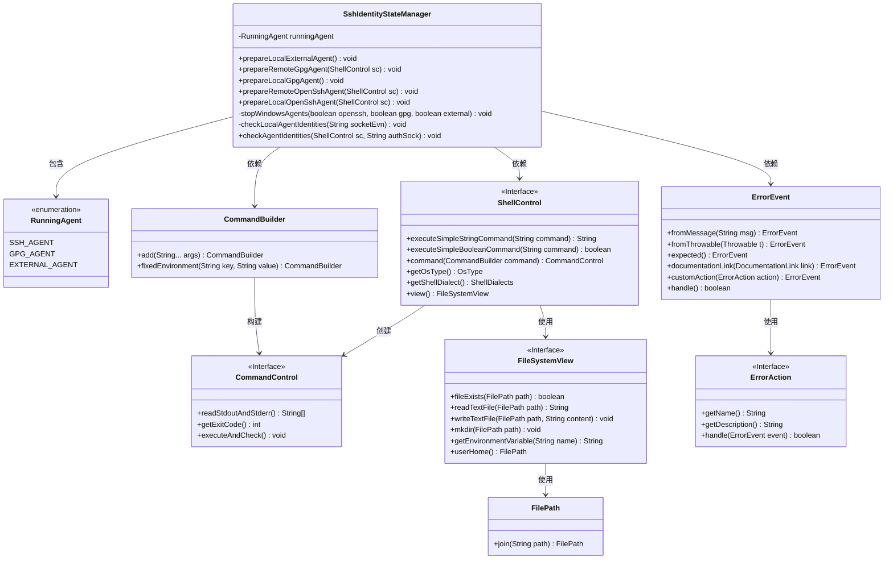
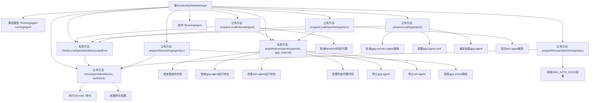

# 基础信息

|      |      |
|------|------|
| 名称 | SshIdentityStateManager |
| 编码语言 | .java |
| 代码路径 | xpipe/ext/base/src/main/java/io/xpipe/ext/base/identity/SshIdentityStateManager.java |
| 包名 | io.xpipe.ext.base.identity |
| 依赖项 | ['io.xpipe.app.issue.ErrorAction', 'io.xpipe.app.issue.ErrorEvent', 'io.xpipe.app.util.CommandSupport', 'io.xpipe.app.util.DocumentationLink', 'io.xpipe.app.util.LocalShell', 'io.xpipe.core.process.CommandBuilder', 'io.xpipe.core.process.OsType', 'io.xpipe.core.process.ShellControl', 'io.xpipe.core.process.ShellDialects', 'io.xpipe.core.store.FilePath', 'java.util.concurrent.atomic.AtomicBoolean'] |
| 概述说明 | 管理SSH代理状态，支持Windows和Linux，处理外部、GPG和OpenSSH代理。 |

# 说明

SshIdentityStateManager类管理SSH代理状态，包含停止Windows代理、检查本地代理身份、准备外部代理、GPG代理和OpenSSH代理等方法。通过ShellControl执行命令，处理不同操作系统下的代理配置，确保代理运行状态正确。涉及Windows下的OpenSSH和GPG代理停止、配置文件修改及身份验证检查。

# 类列表 Class Summary

| 名称   | 类型  | 说明 |
|-------|------|-------------|
| SshIdentityStateManager | class | 管理SSH代理状态，支持Windows和Linux，处理外部、GPG和OpenSSH代理。 |

## 类 SshIdentityStateManager

|      |      |
|------|------|
| 访问范围 | public |
| 类型 | class |
| 名称 | SshIdentityStateManager |
| 说明 | 管理SSH代理状态，支持Windows和Linux，处理外部、GPG和OpenSSH代理。 |

### UML类图

这段代码主要实现了一个SSH身份状态管理器(SshIdentityStateManager)，用于管理不同类型的SSH代理(GPG、OpenSSH和外部代理)。类图展示了核心类及其关系：主类通过ShellControl接口执行命令，使用CommandBuilder构建命令，通过ErrorEvent处理错误，并维护RunningAgent枚举状态。系统支持跨平台操作，包含Windows特定逻辑，提供代理检测、停止和配置功能。各组件职责明确，通过接口隔离实现松耦合设计。

### 内部方法调用关系图

这段代码实现了一个SSH身份状态管理器，主要用于管理和控制不同类型的SSH代理(GPG、OpenSSH和外部代理)。流程图展示了类的主要结构和关键方法调用关系，包括停止Windows代理、检查本地代理身份、准备各种类型代理等核心功能。代码特别处理了Windows平台下的代理管理，包括管道检查、服务停止和配置更新等操作，同时提供了跨平台的代理状态检查和初始化能力。

### 字段列表 Field List

| 名称  | 类型  | 说明 |
|-------|-------|------|
| runningAgent | RunningAgent | 私有静态运行代理实例。 |

### 方法列表 Method List

| 名称  | 类型  | 说明 |
|-------|-------|------|
| checkLocalAgentIdentities | void | 检查本地代理身份，使用指定环境变量。异常时抛出错误。 |
| checkAgentIdentities | void | 检查SSH代理身份，失败时抛出异常并提示配置问题。 |
| prepareRemoteOpenSshAgent | void | 检查SSH代理身份，Windows和其他系统处理方式不同。 |
| prepareLocalGpgAgent | void | 准备本地GPG代理，检查配置并支持SSH，处理Windows和Unix差异。 |
| prepareLocalExternalAgent | void | 检查并准备外部SSH代理，确保Windows管道存在且代理运行中，无代理则报错，最后设置代理状态。 |
| stopWindowsAgents | void | 停止Windows代理：检查并关闭gpg和openssh代理，处理外部代理冲突。 |
| prepareLocalOpenSshAgent | void | 静态同步方法prepareLocalOpenSshAgent检查并启动本地SSH代理，支持Windows和Unix系统。 |
| prepareRemoteGpgAgent | void | 检查远程GpgAgent，Windows验证身份，其他系统检查本地代理。 |

