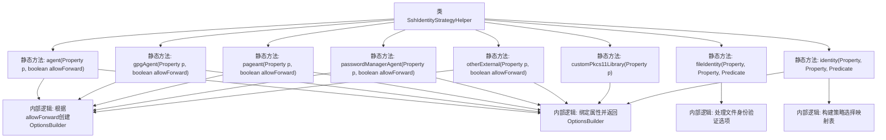

# 基础信息

|      |      |
|------|------|
| 名称 | SshIdentityStrategyHelper |
| 编码语言 | .java |
| 代码路径 | xpipe/ext/base/src/main/java/io/xpipe/ext/base/identity/SshIdentityStrategyHelper.java |
| 包名 | io.xpipe.ext.base.identity |
| 依赖项 | ['io.xpipe.app.comp.base.ContextualFileReferenceChoiceComp', 'io.xpipe.app.comp.base.ContextualFileReferenceSync', 'io.xpipe.app.core.AppI18n', 'io.xpipe.app.ext.ShellStore', 'io.xpipe.app.storage.ContextualFileReference', 'io.xpipe.app.storage.DataStoreEntryRef', 'io.xpipe.app.util', 'javafx.beans.property', 'javafx.beans.value.ObservableValue', 'java.nio.file.Path', 'java.util.LinkedHashMap', 'java.util.List', 'java.util.function.Predicate'] |
| 概述说明 | SSH身份策略助手类，提供多种身份验证方法选项构建器，包括文件、代理、PKCS11库等。 |

# 说明

该代码定义了一个SSH身份验证策略助手类，包含多种身份验证方式的构建逻辑。主要功能包括：处理SSH代理（SshAgent、GpgAgent、Pageant、PasswordManagerAgent、OtherExternal）的转发选项配置，支持自定义PKCS11库路径设置，以及文件身份验证（密钥路径和密码管理）。通过OptionsBuilder构建选项，根据用户选择动态绑定不同策略（如无验证、密钥文件、各类代理等）。代码结构采用工厂方法模式，支持许可证控制的功能开关，并通过属性监听实现数据同步。

# 类列表 Class Summary

| 名称   | 类型  | 说明 |
|-------|------|-------------|
| SshIdentityStrategyHelper | class | SSH身份策略助手类，提供多种认证方式配置选项。 |

## 类 SshIdentityStrategyHelper

|      |      |
|------|------|
| 访问范围 | public |
| 类型 | class |
| 名称 | SshIdentityStrategyHelper |
| 说明 | SSH身份策略助手类，提供多种认证方式配置选项。 |

### UML类图

```mermaid
classDiagram
    class SshIdentityStrategyHelper {
        -agent(Property~SshIdentityStrategy.SshAgent~ p, boolean allowForward) OptionsBuilder
        -gpgAgent(Property~SshIdentityStrategy.GpgAgent~ p, boolean allowForward) OptionsBuilder
        -pageant(Property~SshIdentityStrategy.Pageant~ p, boolean allowForward) OptionsBuilder
        -passwordManagerAgent(Property~SshIdentityStrategy.PasswordManagerAgent~ p, boolean allowForward) OptionsBuilder
        -otherExternal(Property~SshIdentityStrategy.OtherExternal~ p, boolean allowForward) OptionsBuilder
        -customPkcs11Library(Property~SshIdentityStrategy.CustomPkcs11Library~ p) OptionsBuilder
        -fileIdentity(Property~DataStoreEntryRef~ShellStore~~ proxy, Property~SshIdentityStrategy.File~ fileProperty, Predicate~Path~ perUserFile, boolean allowSync) OptionsBuilder
        +identity(Property~DataStoreEntryRef~ShellStore~~ proxy, Property~SshIdentityStrategy~ strategyProperty, Predicate~Path~ perUserFile, boolean allowSync, boolean allowForward) OptionsBuilder
    }

    class OptionsBuilder {
        +bind(Function~R~, Property~T~) OptionsBuilder
        +nameAndDescription(String name, String description) OptionsBuilder
        +addToggle(SimpleBooleanProperty toggle) OptionsBuilder
        +nonNull() OptionsBuilder
        +addString(SimpleStringProperty string) OptionsBuilder
        +addComp(Component comp, ObjectProperty~T~ property) OptionsBuilder
        +sub(Component comp, ObjectProperty~T~ property) OptionsBuilder
        +choice(SimpleIntegerProperty choice, LinkedHashMap~ObservableValue~String~, OptionsBuilder~ map) OptionsBuilder
        +bindChoice(Function~ObjectProperty~T~~, Property~T~) OptionsBuilder
    }

    class SshIdentityStrategy {
        <<Interface>>
    }

    class SshIdentityStrategy.SshAgent {
        -forwardAgent: boolean
        +isForwardAgent() boolean
    }

    class SshIdentityStrategy.GpgAgent {
        -forwardAgent: boolean
        +isForwardAgent() boolean
    }

    class SshIdentityStrategy.Pageant {
        -forwardAgent: boolean
        +isForwardAgent() boolean
    }

    class SshIdentityStrategy.PasswordManagerAgent {
        -forwardAgent: boolean
        +isForwardAgent() boolean
    }

    class SshIdentityStrategy.OtherExternal {
        -forwardAgent: boolean
        +isForwardAgent() boolean
    }

    class SshIdentityStrategy.CustomPkcs11Library {
        -file: String
        +getFile() String
    }

    class SshIdentityStrategy.File {
        -file: ContextualFileReference
        -password: SecretRetrievalStrategy
        +getFile() ContextualFileReference
        +getPassword() SecretRetrievalStrategy
    }

    class SshIdentityStrategy.None {
    }

    class SshIdentityStrategy.YubikeyPiv {
    }

    SshIdentityStrategyHelper --> OptionsBuilder : 使用
    SshIdentityStrategyHelper --> SshIdentityStrategy : 构建
    OptionsBuilder --> SimpleBooleanProperty : 操作
    OptionsBuilder --> SimpleStringProperty : 操作
    OptionsBuilder --> SimpleObjectProperty : 操作
    SshIdentityStrategy <|-- SshIdentityStrategy.SshAgent
    SshIdentityStrategy <|-- SshIdentityStrategy.GpgAgent
    SshIdentityStrategy <|-- SshIdentityStrategy.Pageant
    SshIdentityStrategy <|-- SshIdentityStrategy.PasswordManagerAgent
    SshIdentityStrategy <|-- SshIdentityStrategy.OtherExternal
    SshIdentityStrategy <|-- SshIdentityStrategy.CustomPkcs11Library
    SshIdentityStrategy <|-- SshIdentityStrategy.File
    SshIdentityStrategy <|-- SshIdentityStrategy.None
    SshIdentityStrategy <|-- SshIdentityStrategy.YubikeyPiv
```

该代码实现了一个SSH身份验证策略的构建器，通过OptionsBuilder动态生成不同策略的配置选项。核心类SshIdentityStrategyHelper提供了8种策略的构建方法，包括文件密钥、SSH代理、GPG代理等，通过属性绑定和条件判断实现灵活配置。类图展示了策略接口与具体实现的继承关系，以及Helper类与构建器的协作方式，体现了策略模式的典型应用。

### 内部方法调用关系图

该流程图展示了SshIdentityStrategyHelper类的核心结构，包含8个静态方法及其内部调用关系。主要功能是处理SSH身份验证策略的配置选项，包括代理验证(agent/gpgAgent/pageant)、文件身份验证(fileIdentity)和PKCS11库验证(customPkcs11Library)等多种策略。identity方法作为入口点，通过构建策略映射表并绑定属性，最终返回配置好的OptionsBuilder对象。所有方法都遵循相似的逻辑模式：根据输入参数创建配置选项，绑定属性值，最后返回构建器对象。

### 字段列表 Field List

| 名称  | 类型  | 说明 |
|-------|-------|------|

### 方法列表 Method List

| 名称  | 类型  | 说明 |
|-------|-------|------|
| pageant | OptionsBuilder | 静态方法`pageant`根据`allowForward`参数创建`OptionsBuilder`，绑定`SshIdentityStrategy.Pageant`实例到属性`p`，可选支持代理转发。 |
| otherExternal | OptionsBuilder | 静态方法根据属性p和allowForward参数构建选项：若不允许转发，返回禁用转发的策略；否则添加转发开关并绑定到属性p。 |
| gpgAgent | OptionsBuilder | 定义gpgAgent方法，根据allowForward参数绑定GpgAgent策略，可选是否转发代理。 |
| passwordManagerAgent | OptionsBuilder | 静态方法passwordManagerAgent根据allowForward参数创建OptionsBuilder，控制SSH代理转发。 |
| agent | OptionsBuilder | 定义方法`agent`，根据`allowForward`参数创建`OptionsBuilder`实例，绑定`SshAgent`策略，可选代理转发功能。 |
| customPkcs11Library | OptionsBuilder | 自定义PKCS11库配置方法，绑定文件路径并生成库实例。 |
| fileIdentity | OptionsBuilder | 静态方法构建SSH文件身份选项，含路径监听、密码属性和同步功能。 |
| identity | OptionsBuilder | 构建SSH身份验证选项，支持多种策略如文件、代理、密码管理器等，并绑定选择逻辑。 |

