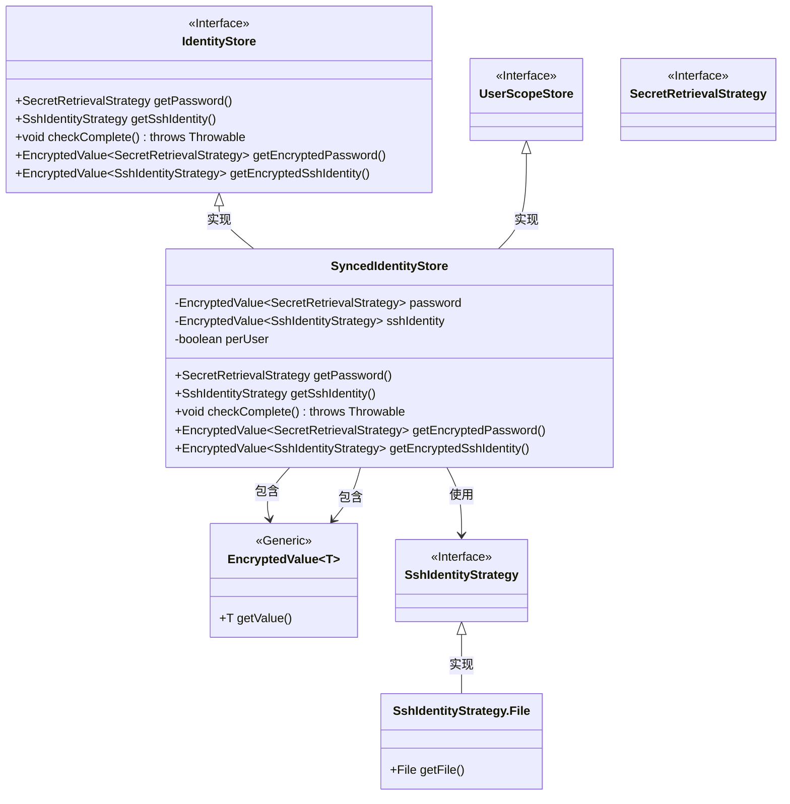
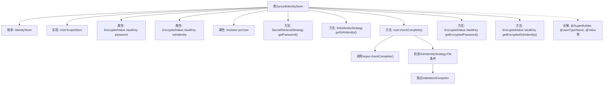

# 基础信息

|      |      |
|------|------|
| 名称 | SyncedIdentityStore |
| 编码语言 | .java |
| 代码路径 | xpipe/ext/base/src/main/java/io/xpipe/ext/base/identity/SyncedIdentityStore.java |
| 包名 | io.xpipe.ext.base.identity |
| 依赖项 | ['io.xpipe.app.ext.UserScopeStore', 'io.xpipe.app.util.EncryptedValue', 'io.xpipe.app.util.SecretRetrievalStrategy', 'io.xpipe.core.util.ValidationException', 'com.fasterxml.jackson.annotation.JsonTypeName', 'lombok.EqualsAndHashCode', 'lombok.ToString', 'lombok.Value', 'lombok.experimental.SuperBuilder', 'lombok.extern.jackson.Jacksonized'] |
| 概述说明 | SyncedIdentityStore类继承IdentityStore，存储加密密码和SSH身份，支持用户范围存储，验证完整性。 |

# 说明

SyncedIdentityStore是一个继承自IdentityStore并实现UserScopeStore接口的Java类，使用Lombok注解简化代码。类中包含两个加密字段：password和sshIdentity，分别存储密码和SSH身份信息，以及一个布尔值perUser表示是否为每个用户单独存储。类提供了获取密码和SSH身份信息的方法，并实现了checkComplete方法用于验证SSH密钥文件是否同步到数据目录。此外，还提供了获取加密密码和SSH身份信息的方法。

# 类列表 Class Summary

| 名称   | 类型  | 说明 |
|-------|------|-------------|
| SyncedIdentityStore | class | SyncedIdentityStore类继承IdentityStore，包含加密密码和SSH身份字段，支持用户范围存储和完整性检查。 |

## 类 SyncedIdentityStore

|      |      |
|------|------|
| 访问范围 | @SuperBuilder;@JsonTypeName("syncedIdentity");@Value;@EqualsAndHashCode(callSuper = true);@ToString(callSuper = true);@Jacksonized;public |
| 类型 | class |
| 名称 | SyncedIdentityStore |
| 说明 | SyncedIdentityStore类继承IdentityStore，包含加密密码和SSH身份字段，支持用户范围存储和完整性检查。 |

### UML类图

该类图展示了SyncedIdentityStore继承自IdentityStore和UserScopeStore接口，包含加密密码和SSH身份信息的功能。SyncedIdentityStore通过泛型EncryptedValue类存储敏感数据，并实现了接口定义的密码获取、SSH身份验证及完整性检查方法。其中SshIdentityStrategy.File作为嵌套类实现了文件路径验证逻辑，体现了对安全数据的严格管理机制。

### 内部方法调用关系图

该流程图展示了SyncedIdentityStore类的结构，包括其继承关系、实现的接口、属性和方法。类通过注解实现构建器和JSON序列化功能，核心逻辑体现在密码/SSH身份验证的加密值管理，以及通过checkComplete()方法实现的完整性检查，其中包含对文件路径的验证逻辑。箭头清晰表示了类成员间的层级关系和关键方法调用链。

### 字段列表 Field List

| 名称  | 类型  | 说明 |
|-------|-------|------|
| perUser | boolean | 布尔变量perUser |
| password | EncryptedValue.VaultKey<SecretRetrievalStrategy> | 加密密码存储密钥 |
| sshIdentity | EncryptedValue.VaultKey<SshIdentityStrategy> | 加密SSH身份策略的保险库密钥变量。 |

### 方法列表 Method List

| 名称  | 类型  | 说明 |
|-------|-------|------|
| getSshIdentity | SshIdentityStrategy | 重写getSshIdentity方法，返回sshIdentity值或null。 |
| getPassword | SecretRetrievalStrategy | 获取密码策略，非空则返回值否则返回空。 |
| checkComplete | void | 检查SSH密钥文件是否同步，未同步则抛出异常。 |
| getEncryptedPassword | EncryptedValue.VaultKey<SecretRetrievalStrategy> | 重写方法返回加密密码的VaultKey对象。 |
| getEncryptedSshIdentity | EncryptedValue.VaultKey<SshIdentityStrategy> | 重写方法，返回加密的SSH身份密钥。 |

