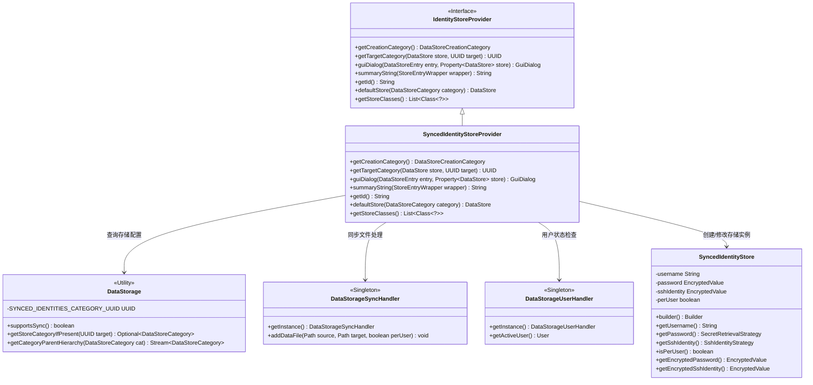
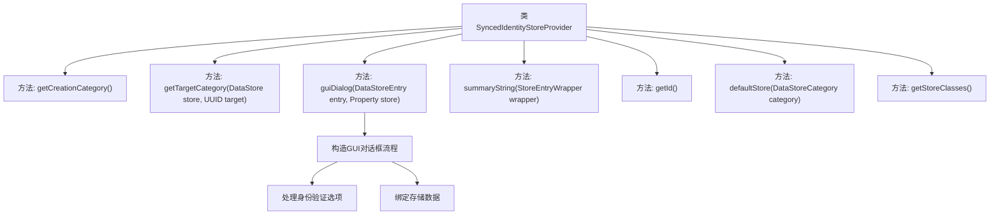

# 基础信息

|      |      |
|------|------|
| 名称 | SyncedIdentityStoreProvider |
| 编码语言 | .java |
| 代码路径 | xpipe/ext/base/src/main/java/io/xpipe/ext/base/identity/SyncedIdentityStoreProvider.java |
| 包名 | io.xpipe.ext.base.identity |
| 依赖项 | ['io.xpipe.app.comp.store.StoreEntryWrapper', 'io.xpipe.app.core.AppI18n', 'io.xpipe.app.ext.DataStoreCreationCategory', 'io.xpipe.app.ext.GuiDialog', 'io.xpipe.app.storage', 'io.xpipe.app.util', 'io.xpipe.core.store.DataStore', 'javafx.beans.property.Property', 'javafx.beans.property.SimpleBooleanProperty', 'javafx.beans.property.SimpleObjectProperty', 'javafx.beans.property.SimpleStringProperty', 'java.nio.file.Files', 'java.nio.file.Path', 'java.util.List', 'java.util.UUID'] |
| 概述说明 | SyncedIdentityStoreProvider类处理同步身份存储，支持用户名、密码和SSH密钥认证，提供GUI配置和用户/全局身份管理。 |

# 说明

SyncedIdentityStoreProvider是一个继承自IdentityStoreProvider的类，主要用于管理同步身份存储。它提供了多种方法，包括获取存储创建类别、确定目标类别、构建GUI对话框、生成摘要字符串等。该类支持用户名、密码和SSH密钥的身份验证，并允许按用户或全局配置。GUI对话框包含用户名输入、密码验证、密钥认证等选项，并支持数据同步处理。此外，它还提供了默认存储配置和获取存储类的方法。

# 类列表 Class Summary

| 名称   | 类型  | 说明 |
|-------|------|-------------|
| SyncedIdentityStoreProvider | class | 同步身份存储提供者类，处理身份验证配置，支持用户名、密码和SSH密钥，区分全局和用户级存储。 |

## 类 SyncedIdentityStoreProvider

|      |      |
|------|------|
| 访问范围 | public |
| 类型 | class |
| 名称 | SyncedIdentityStoreProvider |
| 说明 | 同步身份存储提供者类，处理身份验证配置，支持用户名、密码和SSH密钥，区分全局和用户级存储。 |

### UML类图

类图描述：该图展示了SyncedIdentityStoreProvider类继承自IdentityStoreProvider接口，并依赖DataStorage、DataStorageSyncHandler、DataStorageUserHandler等工具类实现同步身份存储功能。核心类SyncedIdentityStore用于封装身份信息，包含用户名、加密密码、SSH密钥等属性。整体结构体现了身份存储的创建、同步和用户关联处理逻辑，通过多个单例类协作完成数据同步和用户状态管理。

### 内部方法调用关系图

该流程图展示了SyncedIdentityStoreProvider类的核心结构，重点描述了其继承自IdentityStoreProvider的7个关键方法。其中guiDialog方法包含复杂逻辑，涉及构建GUI对话框、处理身份验证选项（密码/密钥）以及绑定存储数据等子流程。类主要处理同步身份存储的创建、分类和交互界面，特别关注SSH密钥和密码的同步存储机制，通过DataStorage和DataStorageSyncHandler实现数据同步功能。

### 字段列表 Field List

| 名称  | 类型  | 说明 |
|-------|-------|------|

### 方法列表 Method List

| 名称  | 类型  | 说明 |
|-------|-------|------|
| getTargetCategory | UUID | 获取目标分类ID，若在同步分类中则返回目标ID，否则返回同步分类ID。 |
| getCreationCategory | DataStoreCreationCategory | 检查数据存储是否支持同步，支持则返回身份类别，否则返回空。 |
| guiDialog | GuiDialog | 创建SSH身份验证对话框，管理用户名、密码、密钥及用户权限设置。 |
| summaryString | String | 方法根据条目类型返回用户身份或全局身份标签。 |
| getId | String | 重写getId方法，返回固定值"syncedIdentity"。 |
| defaultStore | DataStore | 重写defaultStore方法，返回无密码和SSH的同步身份存储实例。 |
| getStoreClasses | List<Class<?>> | 重写方法返回包含SyncedIdentityStore的列表。 |

