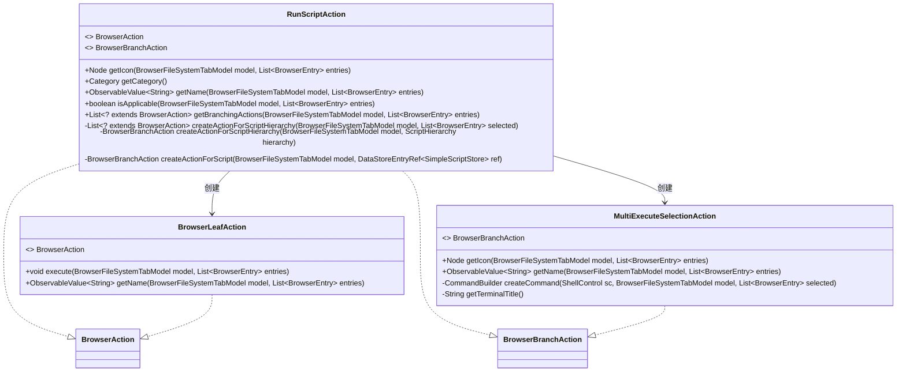
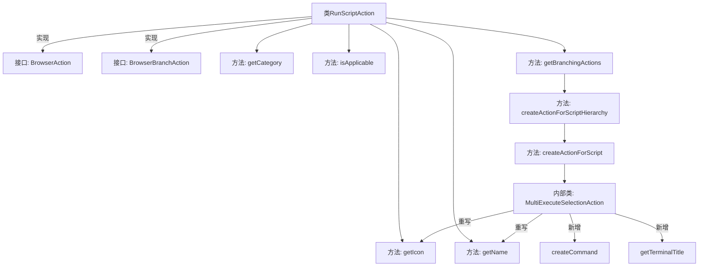

# 基础信息

|      |      |
|------|------|
| 名称 | RunScriptAction |
| 编码语言 | .java |
| 代码路径 | xpipe/ext/base/src/main/java/io/xpipe/ext/base/script/RunScriptAction.java |
| 包名 | io.xpipe.ext.base.script |
| 依赖项 | ['io.xpipe.app.browser.BrowserFullSessionModel', 'io.xpipe.app.browser.action.BrowserAction', 'io.xpipe.app.browser.action.BrowserBranchAction', 'io.xpipe.app.browser.action.BrowserLeafAction', 'io.xpipe.app.browser.file.BrowserEntry', 'io.xpipe.app.browser.file.BrowserFileSystemTabModel', 'io.xpipe.app.comp.base.PrettyImageHelper', 'io.xpipe.app.comp.store.StoreViewState', 'io.xpipe.app.core.AppI18n', 'io.xpipe.app.core.AppLayoutModel', 'io.xpipe.app.storage.DataStorage', 'io.xpipe.app.storage.DataStoreEntryRef', 'io.xpipe.app.util.ScriptHelper', 'io.xpipe.core.process.CommandBuilder', 'io.xpipe.core.process.ShellControl', 'io.xpipe.ext.base.browser.MultiExecuteSelectionAction', 'javafx.beans.property.SimpleStringProperty', 'javafx.beans.value.ObservableValue', 'javafx.scene.Node', 'org.kordamp.ikonli.javafx.FontIcon', 'java.util.List'] |
| 概述说明 | 实现脚本运行的浏览器动作类，包含图标、名称、可用性检查及脚本执行逻辑。 |

# 说明

RunScriptAction是一个实现浏览器操作的类，用于执行脚本。它提供图标、名称和类别信息，并检查是否适用于当前浏览器模型。当脚本被禁用时，显示禁用提示；若无可用脚本，则引导用户到脚本管理界面。对于可用脚本，构建层次化操作列表，包括脚本图标、名称和执行逻辑。执行时生成脚本命令，处理选中的文件条目，并设置终端标题。

# 类列表 Class Summary

| 名称   | 类型  | 说明 |
|-------|------|-------------|
| RunScriptAction | class | 实现脚本运行功能的浏览器动作类，包含图标、名称、分类及脚本执行逻辑。 |

## 类 RunScriptAction

|      |      |
|------|------|
| 访问范围 | public |
| 类型 | class |
| 名称 | RunScriptAction |
| 说明 | 实现脚本运行功能的浏览器动作类，包含图标、名称、分类及脚本执行逻辑。 |

### UML类图

这段代码描述了一个实现浏览器脚本运行功能的复杂动作系统。RunScriptAction类实现了BrowserAction和BrowserBranchAction接口，负责处理脚本执行的逻辑流程，包括图标获取、名称显示、适用性判断以及分支动作生成。它通过内部方法创建BrowserLeafAction和MultiExecuteSelectionAction实例来处理不同场景下的脚本执行需求，如脚本禁用或无脚本可用时的提示，以及实际脚本执行的命令构建。整个设计体现了分层和策略模式的思想，能够灵活应对多种脚本执行场景。

### 内部方法调用关系图

这段代码流程图展示了RunScriptAction类的结构及其与接口的关系。该类实现了BrowserAction和BrowserBranchAction接口，包含多个核心方法如获取图标、名称、分类等。关键方法getBranchingActions通过调用createActionForScriptHierarchy生成脚本层次结构，最终创建MultiExecuteSelectionAction内部类来处理脚本执行逻辑。流程体现了从配置检查到脚本执行的完整分支处理过程，涉及多个层级的条件判断和对象创建。

### 字段列表 Field List

| 名称  | 类型  | 说明 |
|-------|-------|------|

### 方法列表 Method List

| 名称  | 类型  | 说明 |
|-------|-------|------|
| getBranchingActions | List<? extends BrowserAction> | 方法根据配置返回脚本操作列表，禁用时显示禁用提示，无脚本时跳转至脚本分类。 |
| getIcon | Node | 重写方法返回代码图标FontIcon。 |
| getCategory | Category | 重写方法返回MUTATION类别。 |
| isApplicable | boolean | 检查模型是否为BrowserFullSessionModel实例 |
| getName | ObservableValue<String> | 重写方法返回可观察的脚本运行名称字符串。 |
| createActionForScriptHierarchy | List<? extends BrowserAction> | 创建脚本层次结构的浏览器动作，检查文件脚本和兼容性后返回分支动作。 |
| createActionForScriptHierarchy | BrowserBranchAction | 创建浏览器分支动作，处理脚本层次结构，返回图标、子动作列表和名称。 |
| createActionForScript | BrowserBranchAction | 创建自定义浏览器脚本操作类，处理图标、名称、命令构建及终端标题。 |

