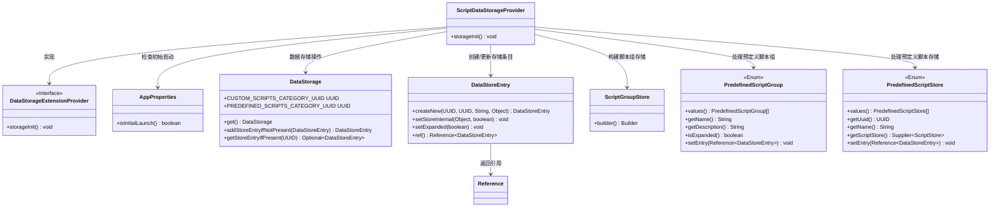
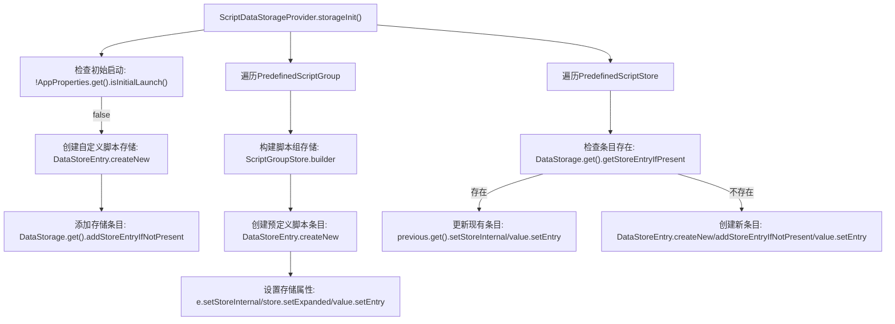

# 基础信息

|      |      |
|------|------|
| 名称 | ScriptDataStorageProvider |
| 编码语言 | .java |
| 代码路径 | xpipe/ext/base/src/main/java/io/xpipe/ext/base/script/ScriptDataStorageProvider.java |
| 包名 | io.xpipe.ext.base.script |
| 依赖项 | ['io.xpipe.app.core.AppProperties', 'io.xpipe.app.ext.DataStorageExtensionProvider', 'io.xpipe.app.storage.DataStorage', 'io.xpipe.app.storage.DataStoreEntry', 'java.nio.charset.StandardCharsets', 'java.util.UUID'] |
| 概述说明 | ScriptDataStorageProvider初始化脚本存储，处理自定义和预定义脚本组及脚本条目。 |

# 说明

ScriptDataStorageProvider继承DataStorageExtensionProvider，在storageInit方法中处理脚本存储初始化。若非首次启动则跳过。创建自定义脚本存储条目，并为每个预定义脚本组和脚本创建或更新存储条目，设置UUID、名称、描述等属性，维护引用关系。确保条目存在且状态正确。

# 类列表 Class Summary

| 名称   | 类型  | 说明 |
|-------|------|-------------|
| ScriptDataStorageProvider | class | ScriptDataStorageProvider初始化存储，处理自定义和预定义脚本组及脚本条目。 |

## 类 ScriptDataStorageProvider

|      |      |
|------|------|
| 访问范围 | public |
| 类型 | class |
| 名称 | ScriptDataStorageProvider |
| 说明 | ScriptDataStorageProvider初始化存储，处理自定义和预定义脚本组及脚本条目。 |

### UML类图

该代码实现了一个脚本数据存储提供者，主要功能是在应用初始启动时初始化脚本存储结构。类图展示了核心组件关系：ScriptDataStorageProvider继承自DataStorageExtensionProvider接口，通过DataStorage管理存储条目(DataStoreEntry)，处理两类脚本数据（自定义脚本和预定义脚本）。预定义脚本通过PredefinedScriptGroup和PredefinedScriptStore枚举配置，使用ScriptGroupStore构建存储结构，整个过程严格检查初始启动状态以避免重复初始化。

### 内部方法调用关系图

这段代码流程图展示了ScriptDataStorageProvider类的初始化过程。首先检查是否为首次启动，然后分别处理自定义脚本和预定义脚本的存储初始化。对于预定义脚本，会遍历枚举值创建或更新存储条目，设置相关属性如UUID、名称、描述等，并通过引用关联存储对象。整个过程确保数据存储的完整性和一致性，同时避免重复创建已有条目。

### 字段列表 Field List

| 名称  | 类型  | 说明 |
|-------|-------|------|

### 方法列表 Method List

| 名称  | 类型  | 说明 |
|-------|-------|------|
| storageInit | void | 初始化存储，检查首次启动后添加自定义和预定义脚本组及脚本条目。 |

