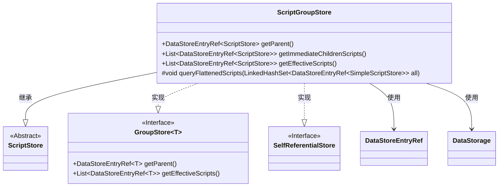

# 基础信息

|      |      |
|------|------|
| 名称 | ScriptGroupStore |
| 编码语言 | .java |
| 代码路径 | xpipe/ext/base/src/main/java/io/xpipe/ext/base/script/ScriptGroupStore.java |
| 包名 | io.xpipe.ext.base.script |
| 依赖项 | ['io.xpipe.app.storage.DataStorage', 'io.xpipe.app.storage.DataStoreEntryRef', 'io.xpipe.ext.base.GroupStore', 'io.xpipe.ext.base.SelfReferentialStore', 'com.fasterxml.jackson.annotation.JsonTypeName', 'lombok.EqualsAndHashCode', 'lombok.ToString', 'lombok.Value', 'lombok.experimental.SuperBuilder', 'lombok.extern.jackson.Jacksonized', 'java.util.LinkedHashSet', 'java.util.List'] |
| 概述说明 | ScriptGroupStore类继承ScriptStore，实现组存储和自引用功能，包含父子脚本查询方法。 |

# 说明

这是一个名为ScriptGroupStore的Java类，继承自ScriptStore并实现了GroupStore和SelfReferentialStore接口。该类使用Lombok注解生成构建器、equals/hashCode和toString方法，并标记为JSON类型"scriptGroup"。主要功能包括：获取父级引用、查询扁平化脚本列表、获取直接子脚本列表和获取有效脚本列表。通过DataStorage获取子项并进行可用性过滤，返回DataStoreEntryRef引用列表。

# 类列表 Class Summary

| 名称   | 类型  | 说明 |
|-------|------|-------------|
| ScriptGroupStore | class | ScriptGroupStore类继承ScriptStore，实现GroupStore接口，管理脚本存储层级关系。 |


## 类 ScriptGroupStore

|      |      |
|------|------|
| 访问范围 | @Value;@EqualsAndHashCode(callSuper = true);@ToString(callSuper = true);@SuperBuilder;@Jacksonized;@JsonTypeName("scriptGroup");public |
| 类型 | class |
| 名称 | ScriptGroupStore |
| 说明 | ScriptGroupStore类继承ScriptStore，实现GroupStore接口，管理脚本存储层级关系。 |


### UML类图



这段代码展示了一个`ScriptGroupStore`类，它继承自`ScriptStore`并实现了`GroupStore<ScriptStore>`和`SelfReferentialStore`接口。该类主要用于管理脚本组存储，提供了获取父脚本、直接子脚本和所有有效脚本的方法。通过`DataStorage`和`DataStoreEntryRef`进行数据存储和引用操作，其中包含对脚本有效性的过滤逻辑。类图清晰地展示了继承、实现和依赖关系，体现了该类的核心功能和协作对象。


### 内部方法调用关系图

```mermaid
graph TD
    A["类ScriptGroupStore"]
    B["继承: ScriptStore"]
    C["实现: GroupStore<ScriptStore>, SelfReferentialStore"]
    D["方法: getParent()"]
    E["方法: queryFlattenedScripts(LinkedHashSet<DataStoreEntryRef<SimpleScriptStore>> all)"]
    F["方法: getImmediateChildrenScripts()"]
    G["方法: getEffectiveScripts()"]
    H["内部操作: getSelfEntry()"]
    I["内部操作: DataStorage.get().getStoreChildren()"]
    J["内部操作: DataStorage.get().getDeepStoreChildren()"]
    K["过滤条件: entry.getValidity().isUsable()"]
    L["映射操作: dataStoreEntry.<ScriptStore>ref()"]

    A --> B
    A --> C
    A --> D
    A --> E
    A --> F
    A --> G
    F --> H
    F --> I
    F --> K
    F --> L
    G --> H
    G --> J
    G --> K
    G --> L
    E -->|遍历| G
    E -->|递归调用| 'simpleScriptStore.queryFlattenedScripts(all)'
```

这段代码展示了一个`ScriptGroupStore`类，它继承自`ScriptStore`并实现了`GroupStore`和`SelfReferentialStore`接口。核心功能包括获取父级引用、查询扁平化脚本列表、获取直接子脚本和有效脚本列表。流程图清晰地呈现了类继承关系、方法调用链和数据处理流程，特别是通过`DataStorage`获取子节点时的过滤和映射操作，以及`queryFlattenedScripts`方法中的递归调用结构。所有方法都遵循有效性检查和使用引用转换的统一模式。

### 字段列表 Field List

| 名称  | 类型  | 说明 |
|-------|-------|------|

### 方法列表 Method List

| 名称  | 类型  | 说明 |
|-------|-------|------|
| getParent | DataStoreEntryRef<? extends ScriptStore> | 重写getParent方法，返回ScriptStore类型的DataStoreEntryRef对象。 |
| queryFlattenedScripts | void | 重写方法，遍历有效脚本并递归查询扁平化脚本集合。 |
| getImmediateChildrenScripts | List<DataStoreEntryRef<ScriptStore>> | 获取当前条目下所有可用的直接子脚本条目列表。 |
| getEffectiveScripts | List<DataStoreEntryRef<ScriptStore>> | 获取有效脚本列表：筛选可用子条目并转为引用。 |


