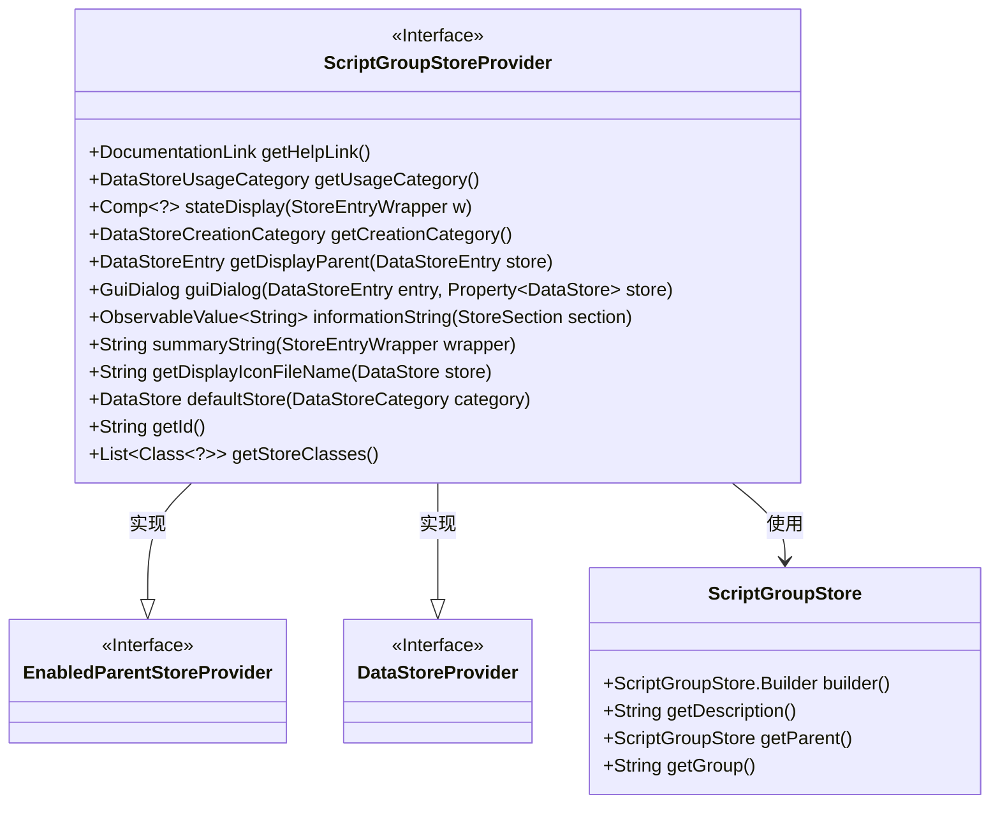

# 基础信息

|      |      |
|------|------|
| 名称 | ScriptGroupStoreProvider |
| 编码语言 | .java |
| 代码路径 | xpipe/ext/base/src/main/java/io/xpipe/ext/base/script/ScriptGroupStoreProvider.java |
| 包名 | io.xpipe.ext.base.script |
| 依赖项 | ['io.xpipe.app.comp.Comp', 'io.xpipe.app.comp.store', 'io.xpipe.app.ext', 'io.xpipe.app.storage.DataStoreCategory', 'io.xpipe.app.storage.DataStoreEntry', 'io.xpipe.app.util.DocumentationLink', 'io.xpipe.app.util.OptionsBuilder', 'io.xpipe.core.store.DataStore', 'javafx.beans.property.Property', 'javafx.beans.property.SimpleObjectProperty', 'javafx.beans.property.SimpleStringProperty', 'javafx.beans.value.ObservableValue', 'lombok.SneakyThrows', 'java.util.List'] |
| 概述说明 | ScriptGroupStoreProvider实现数据存储接口，提供脚本组管理功能。 |

# 说明

ScriptGroupStoreProvider是一个实现了EnabledParentStoreProvider和DataStoreProvider接口的类，主要用于管理脚本组存储。它提供了获取帮助链接、使用类别、状态显示、创建类别等功能。该类支持通过GUI对话框配置脚本组和描述信息，并能返回父存储条目。它还定义了信息字符串、摘要字符串、显示图标文件名等属性，并提供了默认存储实现。该类标识为scriptGroup，支持ScriptGroupStore类的存储操作。

# 类列表 Class Summary

| 名称   | 类型  | 说明 |
|-------|------|-------------|
| ScriptGroupStoreProvider | class | ScriptGroupStoreProvider实现数据存储接口，提供脚本组管理功能。 |

## 类 ScriptGroupStoreProvider

|      |      |
|------|------|
| 访问范围 | public |
| 类型 | class |
| 名称 | ScriptGroupStoreProvider |
| 说明 | ScriptGroupStoreProvider实现数据存储接口，提供脚本组管理功能。 |

### UML类图

该类图展示了ScriptGroupStoreProvider同时实现EnabledParentStoreProvider和DataStoreProvider两个接口，提供脚本组存储相关的功能。核心类ScriptGroupStore用于存储脚本组信息，包含描述、父组和组名等属性。ScriptGroupStoreProvider通过guiDialog()方法创建配置对话框，并依赖ScriptGroupStore进行数据操作，实现了完整的脚本组存储管理功能，包括状态显示、信息获取和默认存储创建等。

### 内部方法调用关系图

```mermaid
graph TD
    A["类ScriptGroupStoreProvider"]
    B["接口实现: EnabledParentStoreProvider"]
    C["接口实现: DataStoreProvider"]
    D["方法: getHelpLink() --> DocumentationLink.SCRIPTING"]
    E["方法: getUsageCategory() --> DataStoreUsageCategory.GROUP"]
    F["方法: stateDisplay() --> SystemStateComp"]
    G["方法: getCreationCategory() --> DataStoreCreationCategory.SCRIPT"]
    H["方法: getDisplayParent() --> 获取父存储或null"]
    I["方法: guiDialog() --> 构建配置对话框"]
    J["方法: informationString() --> 返回描述信息"]
    K["方法: summaryString() --> 'Script group'"]
    L["方法: getDisplayIconFileName() --> 'proc:shellEnvironment_icon.svg'"]
    M["方法: defaultStore() --> 新建ScriptGroupStore"]
    N["方法: getId() --> 'scriptGroup'"]
    O["方法: getStoreClasses() --> List.of(ScriptGroupStore.class)"]

    A -->|实现| B
    A -->|实现| C
    A --> D
    A --> E
    A --> F
    A --> G
    A --> H
    A --> I
    A --> J
    A --> K
    A --> L
    A --> M
    A --> N
    A --> O
```

该流程图展示了ScriptGroupStoreProvider类的完整结构，该类实现了两个接口并包含14个核心方法。主要功能包括：提供脚本组存储的元信息（如帮助链接、使用类别）、构建GUI配置对话框、管理存储条目关系（如获取父存储）、以及处理存储对象的显示和描述信息。关键方法guiDialog()通过OptionsBuilder构建包含脚本组选择和描述字段的交互界面，而informationString()和summaryString()分别提供详细和简化的存储描述。该类作为脚本组存储的核心提供者，统一处理了存储生命周期中的各类操作。

### 字段列表 Field List

| 名称  | 类型  | 说明 |
|-------|-------|------|

### 方法列表 Method List

| 名称  | 类型  | 说明 |
|-------|-------|------|
| getDisplayIconFileName | String | 方法返回shell环境图标文件名。 |
| stateDisplay | Comp<?> | 重写方法返回成功状态组件。 |
| guiDialog | GuiDialog | 创建GUI对话框，包含描述和脚本组选项，绑定数据存储。 |
| informationString | ObservableValue<String> | 重写方法返回脚本存储描述的可观察字符串属性。 |
| getCreationCategory | DataStoreCreationCategory | 重写方法返回脚本类型的数据存储创建类别。 |
| summaryString | String | 覆盖方法返回"Script group"字符串。 |
| getHelpLink | DocumentationLink | 重写方法返回脚本帮助文档链接。 |
| getUsageCategory | DataStoreUsageCategory | 重写方法返回GROUP类型的数据存储用途分类。 |
| getDisplayParent | DataStoreEntry | 获取存储项的显示父项，若无则返回空。 |
| defaultStore | DataStore | 重写方法，返回ScriptGroupStore实例作为默认数据存储。 |
| getId | String | 重写getId方法，返回"scriptGroup"。 |
| getStoreClasses | List<Class<?>> | 重写方法返回ScriptGroupStore类列表。 |

