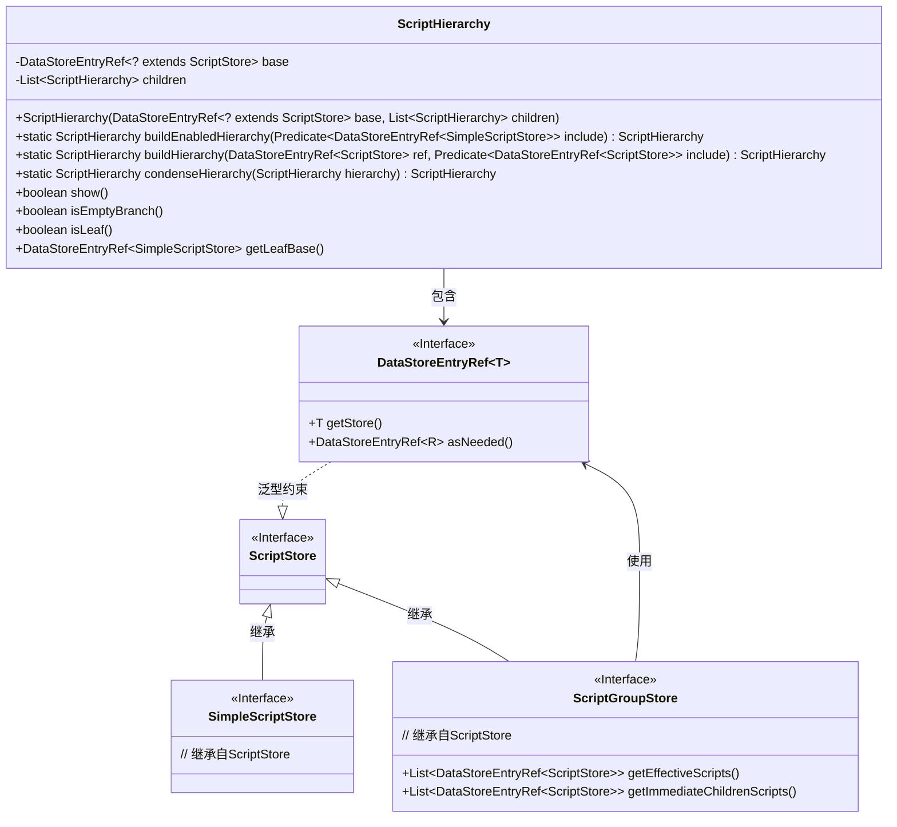
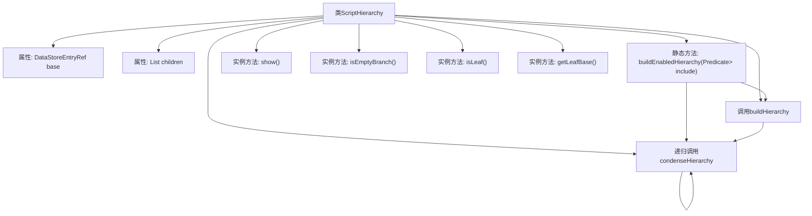

# 基础信息

|      |      |
|------|------|
| 名称 | ScriptHierarchy |
| 编码语言 | .java |
| 代码路径 | xpipe/ext/base/src/main/java/io/xpipe/ext/base/script/ScriptHierarchy.java |
| 包名 | io.xpipe.ext.base.script |
| 依赖项 | ['io.xpipe.app.storage.DataStorage', 'io.xpipe.app.storage.DataStoreEntryRef', 'lombok.Value', 'java.util.Comparator', 'java.util.HashSet', 'java.util.List', 'java.util.function.Predicate'] |
| 概述说明 | 构建脚本层次结构，包含启用脚本、组脚本及其父子关系，支持条件过滤和层次压缩。 |

# 说明

该代码定义了一个ScriptHierarchy类，用于构建和管理脚本层次结构。主要功能包括：构建启用的脚本层次结构，处理脚本组和子脚本关系，添加父脚本引用，过滤和排序脚本，以及压缩单子节点的层次结构。类提供了判断节点类型的方法（如是否为叶子节点或空分支），并支持通过条件谓词筛选脚本。整体实现了脚本数据的树形结构管理和优化展示。

# 类列表 Class Summary

| 名称   | 类型  | 说明 |
|-------|------|-------------|
| ScriptHierarchy | class | 构建脚本层次结构，包含启用脚本、组子项和父项，支持条件过滤和层次压缩。 |

## 类 ScriptHierarchy

|      |      |
|------|------|
| 访问范围 | @Value;public |
| 类型 | class |
| 名称 | ScriptHierarchy |
| 说明 | 构建脚本层次结构，包含启用脚本、组子项和父项，支持条件过滤和层次压缩。 |

### UML类图

这段代码实现了一个脚本层次结构的构建和优化系统。ScriptHierarchy类通过递归方式构建脚本的树状结构，支持脚本组(ScriptGroupStore)和简单脚本(SimpleScriptStore)两种类型。核心功能包括：构建启用的脚本层次结构(buildEnabledHierarchy)、递归构建子层次结构(buildHierarchy)、压缩单节点层次结构(condenseHierarchy)，以及提供各种状态检查方法(show/isEmptyBranch/isLeaf)。该类与DataStoreEntryRef泛型接口紧密协作，后者提供了对ScriptStore及其子类型(SimpleScriptStore/ScriptGroupStore)的引用能力。

### 内部方法调用关系图

这段代码展示了一个用于构建脚本层次结构的类ScriptHierarchy，包含核心构建方法buildEnabledHierarchy和递归处理方法buildHierarchy/condenseHierarchy。流程图清晰地呈现了类结构和方法调用关系，其中buildEnabledHierarchy作为入口方法，通过调用buildHierarchy构建初始树结构，再通过condenseHierarchy进行层次压缩优化。实例方法用于检查节点状态（叶节点/空分支等），整个设计采用组合模式处理脚本和脚本组的层级关系。

### 字段列表 Field List

| 名称  | 类型  | 说明 |
|-------|-------|------|
| children | List<ScriptHierarchy> | 子脚本列表 |
| base | DataStoreEntryRef<? extends ScriptStore> | 存储脚本引用的数据存储基类。 |

### 方法列表 Method List

| 名称  | 类型  | 说明 |
|-------|-------|------|
| isLeaf | boolean | 检查是否为叶子节点：基础非空、存储类型为SimpleScriptStore且无子节点。 |
| show | boolean | 方法show返回是否为叶子节点或非空分支。 |
| buildEnabledHierarchy | ScriptHierarchy | 构建启用脚本的层次结构，包含子项、父项及过滤条件。 |
| getLeafBase | DataStoreEntryRef<SimpleScriptStore> | 获取基础数据存储引用，返回简单脚本存储的叶子节点。 |
| buildHierarchy | ScriptHierarchy | 构建脚本层次结构，递归处理子脚本并按名称排序。 |
| condenseHierarchy | ScriptHierarchy | 递归压缩脚本层级结构，单子节点时合并嵌套。 |
| isEmptyBranch | boolean | 检查分支是否为空：基础为空或脚本组存储且无子项。 |

