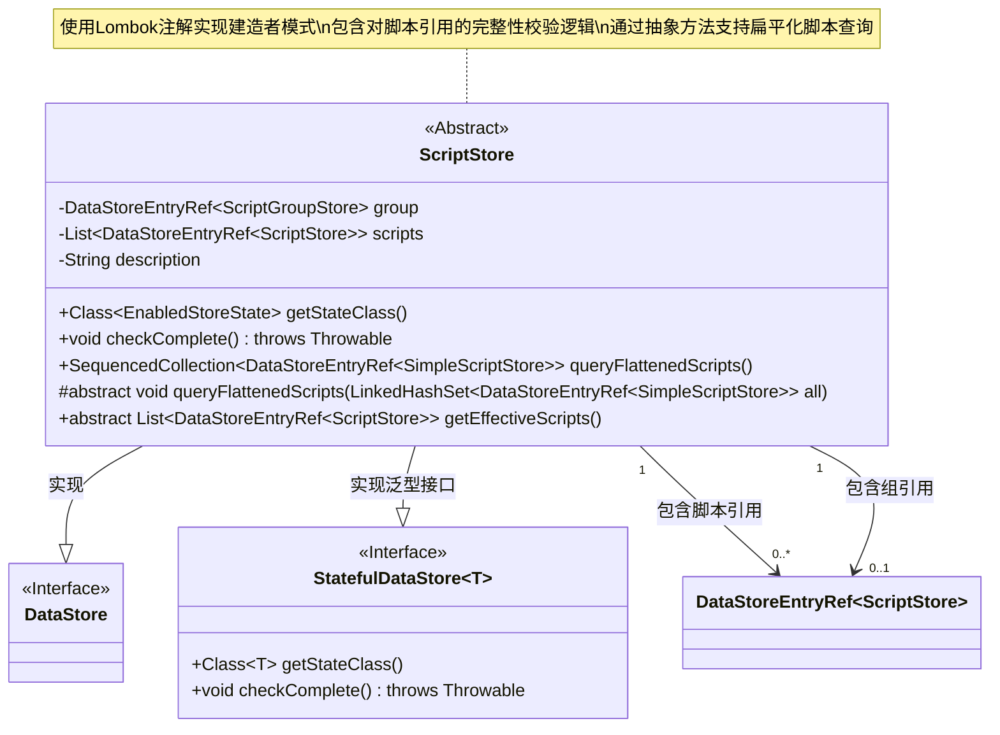
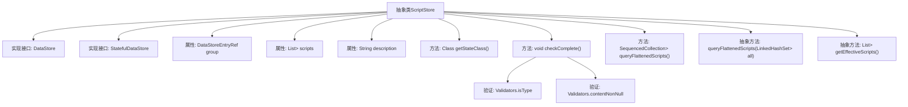

# 基础信息

|      |      |
|------|------|
| 名称 | ScriptStore |
| 编码语言 | .java |
| 代码路径 | xpipe/ext/base/src/main/java/io/xpipe/ext/base/script/ScriptStore.java |
| 包名 | io.xpipe.ext.base.script |
| 依赖项 | ['io.xpipe.app.storage.DataStoreEntryRef', 'io.xpipe.app.util.Validators', 'io.xpipe.core.store', None, 'lombok.experimental.SuperBuilder', 'java.util'] |
| 概述说明 | 抽象类ScriptStore实现DataStore接口，包含脚本组引用、脚本列表和描述，提供状态检查和扁平化查询方法。 |

# 说明

这是一个抽象类ScriptStore，实现了DataStore和StatefulDataStore接口。类使用Lombok注解生成构建器、getter、全参构造器等。包含三个主要字段：ScriptGroupStore类型的group引用、ScriptStore类型的scripts列表和description字符串。重写了getStateClass方法返回EnabledStoreState类，并实现checkComplete方法进行非空校验。提供了queryFlattenedScripts方法查询SimpleScriptStore集合，以及抽象方法queryFlattenedScripts和getEffectiveScripts供子类实现。注释显示为避免栈溢出，未递归检查scripts完整性。

# 类列表 Class Summary

| 名称   | 类型  | 说明 |
|-------|------|-------------|
| ScriptStore | class | 抽象类ScriptStore实现数据存储接口，包含脚本组、脚本列表和描述，提供状态检查和扁平化查询功能。 |

## 类 ScriptStore

|      |      |
|------|------|
| 访问范围 | @SuperBuilder(toBuilder = true);@Getter;@AllArgsConstructor;@EqualsAndHashCode;@ToString;public abstract |
| 类型 | class |
| 名称 | ScriptStore |
| 说明 | 抽象类ScriptStore实现数据存储接口，包含脚本组、脚本列表和描述，提供状态检查和扁平化查询功能。 |

### UML类图

这段类图描述了一个抽象类ScriptStore，它实现了DataStore和StatefulDataStore<EnabledStoreState>两个接口。该类使用Lombok注解实现了建造者模式，包含三个主要字段：脚本组引用(group)、脚本列表(scripts)和描述信息(description)。它提供了完整性检查方法(checkComplete)和抽象方法(queryFlattenedScripts)来支持扁平化脚本查询，同时通过getEffectiveScripts抽象方法获取有效脚本列表。类图中清晰展示了其与接口的继承关系、与数据存储引用类的组合关系，以及关键的泛型类型参数。

### 内部方法调用关系图

该流程图展示了ScriptStore抽象类的完整结构，包含3个核心属性、5个方法（其中2个是抽象方法）和2个接口实现关系。重点描述了checkComplete()方法的验证流程，其中包含对group类型的校验和scripts列表的非空检查。类通过Lombok注解实现了建造者模式、Getter、全参构造器等特性，同时保持了对状态管理和数据存储的核心功能抽象。两个抽象方法queryFlattenedScripts()和getEffectiveScripts()为子类提供了扩展点。

### 字段列表 Field List

| 名称  | 类型  | 说明 |
|-------|-------|------|
| description | String | 保护性最终字符串描述 |
| scripts | List<DataStoreEntryRef<ScriptStore>> | 受保护脚本存储引用列表。 |
| group | DataStoreEntryRef<ScriptGroupStore> | 受保护的最终数据存储引用：ScriptGroupStore类型。 |

### 方法列表 Method List

| 名称  | 类型  | 说明 |
|-------|-------|------|
| queryFlattenedScripts | void | 抽象方法：查询扁平化脚本，参数为LinkedHashSet类型。 |
| getEffectiveScripts | List<DataStoreEntryRef<ScriptStore>> | 获取有效脚本列表的抽象方法。 |
| queryFlattenedScripts | SequencedCollection<DataStoreEntryRef<SimpleScriptStore>> | 查询扁平化脚本集合，返回唯一引用集。 |
| checkComplete | void | 检查脚本组和脚本的有效性，避免栈溢出。 |
| getStateClass | Class<EnabledStoreState> | 重写方法返回EnabledStoreState类类型。 |

