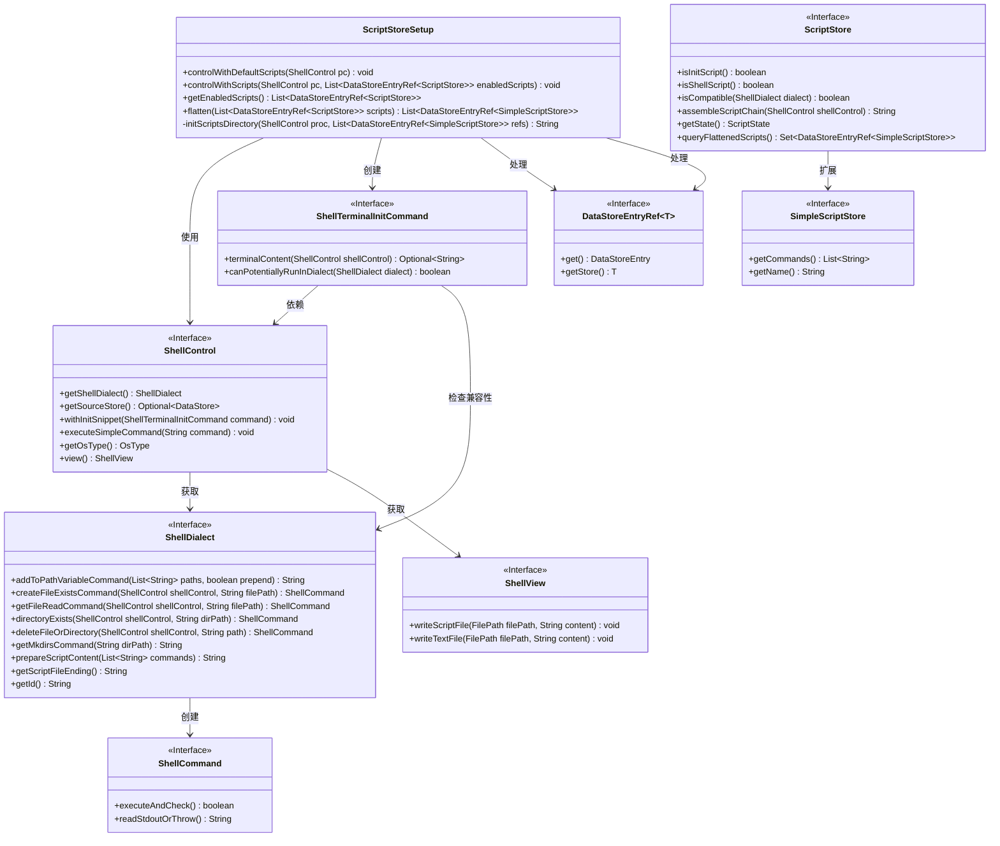
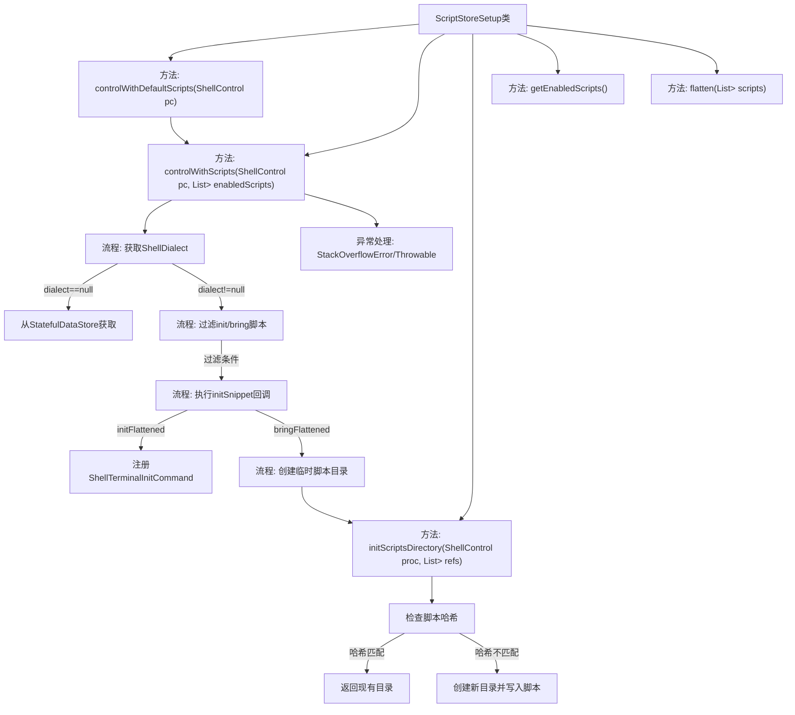
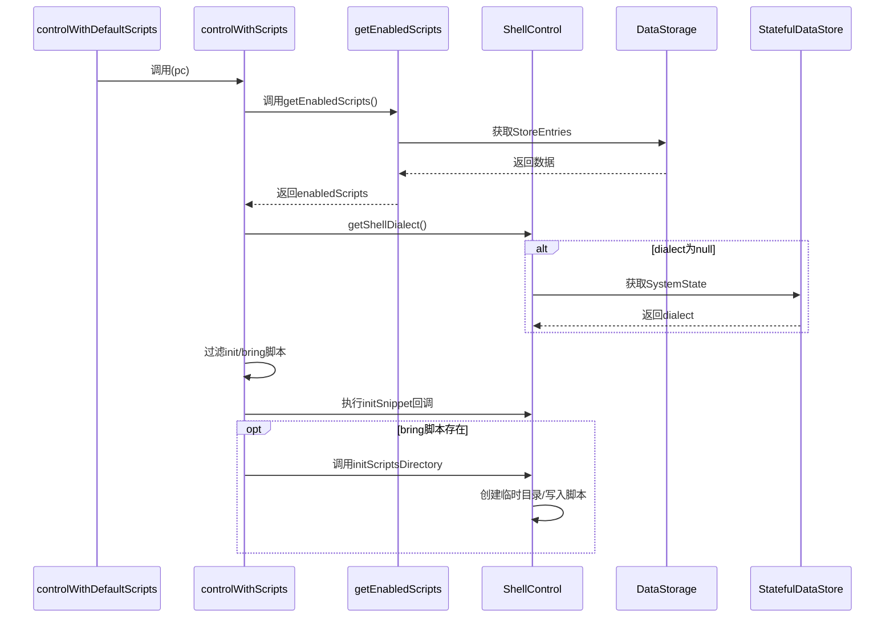

# 基础信息

|      |      |
|------|------|
| 名称 | ScriptStoreSetup |
| 编码语言 | .java |
| 代码路径 | xpipe/ext/base/src/main/java/io/xpipe/ext/base/script/ScriptStoreSetup.java |
| 包名 | io.xpipe.ext.base.script |
| 依赖项 | ['io.xpipe.app.issue.ErrorEvent', 'io.xpipe.app.storage.DataStorage', 'io.xpipe.app.storage.DataStoreEntry', 'io.xpipe.app.storage.DataStoreEntryRef', 'io.xpipe.app.util.ShellTemp', 'io.xpipe.core.process', 'io.xpipe.core.store.FileNames', 'io.xpipe.core.store.FilePath', 'io.xpipe.core.store.StatefulDataStore', 'java.util'] |
| 概述说明 | ScriptStoreSetup类控制脚本执行，处理初始化与兼容性检查，管理脚本依赖与临时目录。 |

# 说明

该代码定义了一个ScriptStoreSetup类，提供脚本存储的配置功能。主要包含三个核心方法：controlWithDefaultScripts使用默认启用的脚本进行控制；controlWithScripts根据给定的脚本列表和Shell方言处理初始化脚本和Shell脚本，包括脚本兼容性检查、临时目录创建和脚本文件写入；getEnabledScripts获取所有可用且启用的脚本存储条目；flatten方法展开脚本依赖关系并进行拓扑排序。异常处理包括循环依赖检测和通用错误捕获。整体实现了脚本管理的核心逻辑，包括脚本加载、依赖处理和执行环境配置。

# 类列表 Class Summary

| 名称   | 类型  | 说明 |
|-------|------|-------------|
| ScriptStoreSetup | class | 脚本管理类，处理初始化与执行脚本，支持方言兼容性检查与依赖排序。 |

## 类 ScriptStoreSetup

|      |      |
|------|------|
| 访问范围 | public |
| 类型 | class |
| 名称 | ScriptStoreSetup |
| 说明 | 脚本管理类，处理初始化与执行脚本，支持方言兼容性检查与依赖排序。 |

### UML类图

这段代码主要实现了脚本存储和管理的功能，核心类ScriptStoreSetup提供了控制脚本执行的方法，包括默认脚本控制和自定义脚本控制。它通过ShellControl接口与Shell终端交互，使用ShellDialect处理不同Shell方言的兼容性，并通过DataStoreEntryRef管理脚本存储引用。类图中清晰地展示了各接口之间的依赖关系和层级结构，包括脚本存储、Shell控制、命令执行等核心组件。

### 内部方法调用关系图

这段代码主要实现了脚本存储的初始化和管理功能。流程图展示了类结构和方法调用关系，时序图详细描述了从默认脚本控制到实际脚本执行的完整流程。核心逻辑包括：1) 获取可用的脚本列表；2) 根据Shell方言过滤脚本；3) 处理初始化脚本和Shell环境脚本；4) 创建临时目录管理脚本文件。异常处理机制确保了在脚本循环依赖等错误情况下的稳定运行。

### 字段列表 Field List

| 名称  | 类型  | 说明 |
|-------|-------|------|

### 方法列表 Method List

| 名称  | 类型  | 说明 |
|-------|-------|------|
| controlWithDefaultScripts | void | 静态方法调用带默认脚本的ShellControl控制。 |
| getEnabledScripts | List<DataStoreEntryRef<ScriptStore>> | 获取所有启用脚本的引用列表。 |
| controlWithScripts | void | 方法根据脚本类型和兼容性初始化终端命令，处理异常。 |
| initScriptsDirectory | String | 初始化脚本目录，检查兼容性并处理哈希验证，最后创建或更新脚本文件。 |
| flatten | List<DataStoreEntryRef<SimpleScriptStore>> | 过滤可用脚本并排序依赖关系。 |

