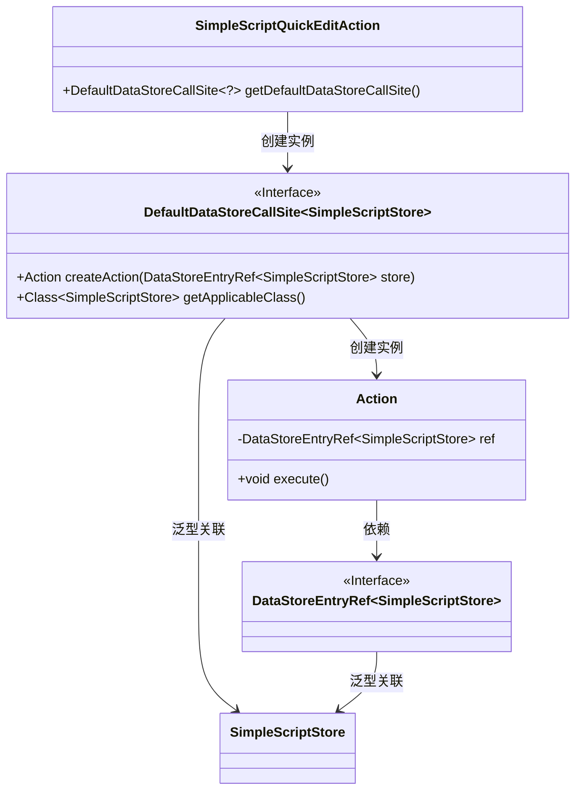
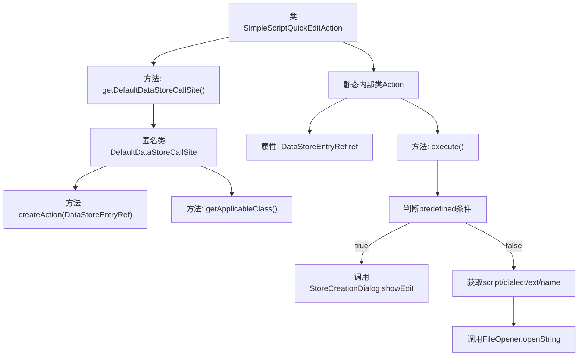

# 基础信息

|      |      |
|------|------|
| 名称 | SimpleScriptQuickEditAction |
| 编码语言 | .java |
| 代码路径 | xpipe/ext/base/src/main/java/io/xpipe/ext/base/script/SimpleScriptQuickEditAction.java |
| 包名 | io.xpipe.ext.base.script |
| 依赖项 | ['io.xpipe.app.comp.store.StoreCreationDialog', 'io.xpipe.app.ext.ActionProvider', 'io.xpipe.app.storage.DataStorage', 'io.xpipe.app.storage.DataStoreEntryRef', 'io.xpipe.app.util.FileOpener', 'io.xpipe.core.process.OsType', 'lombok.Value', 'java.util.Arrays'] |
| 概述说明 | SimpleScriptQuickEditAction类实现ActionProvider接口，提供脚本编辑功能，支持预定义脚本和自定义脚本的编辑与保存。 |

# 说明

这是一个实现脚本快速编辑功能的Java类。主要包含两个部分：DefaultDataStoreCallSite提供默认数据存储调用站点，返回适用于SimpleScriptStore类的Action实例；Action类实现具体编辑逻辑，首先检查是否为预定义脚本，是则显示编辑对话框，否则根据脚本方言生成文件名并打开编辑器，保存时将修改内容更新回数据存储。整个结构实现了对简单脚本的快速编辑功能，支持预定义脚本和自定义脚本的不同处理流程。

# 类列表 Class Summary

| 名称   | 类型  | 说明 |
|-------|------|-------------|
| SimpleScriptQuickEditAction | class | SimpleScriptQuickEditAction类实现ActionProvider接口，提供脚本编辑功能，支持预定义脚本和自定义脚本的编辑与保存。 |

## 类 SimpleScriptQuickEditAction

|      |      |
|------|------|
| 访问范围 | public |
| 类型 | class |
| 名称 | SimpleScriptQuickEditAction |
| 说明 | SimpleScriptQuickEditAction类实现ActionProvider接口，提供脚本编辑功能，支持预定义脚本和自定义脚本的编辑与保存。 |

### UML类图

这段代码展示了一个脚本快速编辑功能的实现架构。SimpleScriptQuickEditAction作为入口类，通过DefaultDataStoreCallSite接口创建Action实例，Action类包含核心业务逻辑，处理脚本存储的编辑操作。类图中清晰地呈现了泛型参数传递（SimpleScriptStore）、接口实现关系（DefaultDataStoreCallSite）以及核心的数据依赖流向（DataStoreEntryRef）。整个设计采用分层结构，通过接口隔离实现细节，支持不同类型的脚本存储操作。

### 内部方法调用关系图

这段代码流程图展示了SimpleScriptQuickEditAction类的核心结构，主要包含获取默认数据存储调用站点的方法和内部Action类的执行流程。Action的execute()方法会先检查脚本是否预定义，如果是则直接打开编辑对话框，否则会通过FileOpener打开脚本文件进行编辑。整个流程涉及条件判断、数据存储操作和文件处理等多个环节，清晰地反映了脚本快速编辑功能的执行路径。

### 字段列表 Field List

| 名称  | 类型  | 说明 |
|-------|-------|------|

### 方法列表 Method List

| 名称  | 类型  | 说明 |
|-------|-------|------|
| getDefaultDataStoreCallSite | DefaultDataStoreCallSite<?> | 重写方法返回默认数据存储调用点，包含创建动作和获取适用类逻辑。 |

