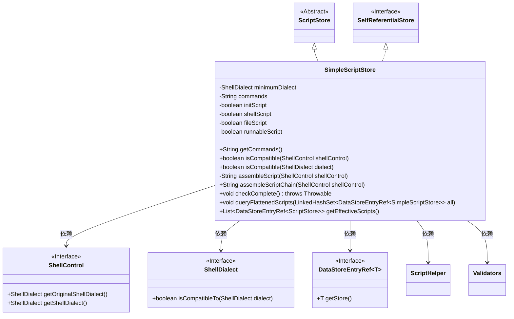
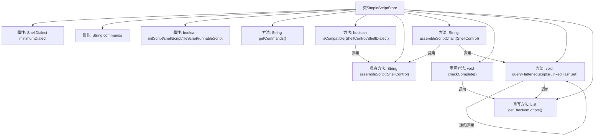

# 基础信息

|      |      |
|------|------|
| 名称 | SimpleScriptStore |
| 编码语言 | .java |
| 代码路径 | xpipe/ext/base/src/main/java/io/xpipe/ext/base/script/SimpleScriptStore.java |
| 包名 | io.xpipe.ext.base.script |
| 依赖项 | ['io.xpipe.app.core.AppI18n', 'io.xpipe.app.storage.DataStoreEntryRef', 'io.xpipe.app.util.ScriptHelper', 'io.xpipe.app.util.Validators', 'io.xpipe.core.process.ShellControl', 'io.xpipe.core.process.ShellDialect', 'io.xpipe.core.util.ValidationException', 'io.xpipe.ext.base.SelfReferentialStore', 'com.fasterxml.jackson.annotation.JsonTypeName', 'lombok.EqualsAndHashCode', 'lombok.ToString', 'lombok.Value', 'lombok.experimental.SuperBuilder', 'lombok.extern.jackson.Jacksonized', 'java.util.LinkedHashSet', 'java.util.List', 'java.util.Objects', 'java.util.stream.Collectors'] |
| 概述说明 | SimpleScriptStore类扩展ScriptStore，支持脚本组装、兼容性检查及链式脚本生成。 |

# 说明

SimpleScriptStore类继承自ScriptStore并实现SelfReferentialStore接口，用于存储脚本信息。类注解表明其不可变且支持JSON序列化。主要属性包括最小Shell方言、命令字符串及四种脚本类型标识。提供命令获取方法，并实现Shell兼容性检查。核心功能包括脚本组装、脚本链生成及完整性校验。通过queryFlattenedScripts方法收集扁平化脚本引用，防止循环引用。getEffectiveScripts方法筛选可用脚本引用。整体设计注重类型安全与脚本执行兼容性。

# 类列表 Class Summary

| 名称   | 类型  | 说明 |
|-------|------|-------------|
| SimpleScriptStore | class | SimpleScriptStore类继承ScriptStore，包含脚本命令、兼容性检查及组装功能，支持多种脚本类型验证。 |

## 类 SimpleScriptStore

|      |      |
|------|------|
| 访问范围 | @SuperBuilder(toBuilder = true);@Value;@Jacksonized;@JsonTypeName("script");@EqualsAndHashCode(callSuper = true);@ToString(callSuper = true);public |
| 类型 | class |
| 名称 | SimpleScriptStore |
| 说明 | SimpleScriptStore类继承ScriptStore，包含脚本命令、兼容性检查及组装功能，支持多种脚本类型验证。 |

### UML类图

这段类图展示了SimpleScriptStore类的继承关系和主要依赖。SimpleScriptStore继承自抽象类ScriptStore并实现了SelfReferentialStore接口，包含对ShellControl、ShellDialect等接口的依赖。该类主要处理脚本存储和组装逻辑，提供了脚本兼容性检查、脚本组装链生成、有效性验证等功能，通过泛型DataStoreEntryRef管理脚本引用关系，体现了复杂的脚本处理能力。

### 内部方法调用关系图

该流程图展示了SimpleScriptStore类的完整结构，包含4个核心属性、7个关键方法及其调用关系。类继承自ScriptStore并实现SelfReferentialStore接口，主要处理脚本存储和组装逻辑。核心方法assembleScript负责脚本兼容性检查和格式处理，queryFlattenedScripts通过递归实现脚本引用链的扁平化收集，checkComplete方法验证脚本类型完整性。箭头清晰显示了方法间的调用链，特别是queryFlattenedScripts的递归调用和与getEffectiveScripts的交互关系。

### 字段列表 Field List

| 名称  | 类型  | 说明 |
|-------|-------|------|
| minimumDialect | ShellDialect | ShellDialect最小方言定义 |
| shellScript | boolean | 布尔型shell脚本 |
| fileScript | boolean | 布尔变量fileScript声明。 |
| initScript | boolean | 布尔变量initScript声明。 |
| runnableScript | boolean | 布尔变量runnableScript声明。 |
| commands | String | 字符串命令 |

### 方法列表 Method List

| 名称  | 类型  | 说明 |
|-------|-------|------|
| isCompatible | boolean | 检查ShellDialect兼容性，若minimumDialect为空或兼容则返回真。 |
| queryFlattenedScripts | void | 递归查询脚本引用，避免循环，先添加后处理再移除重添。 |
| isCompatible | boolean | 检查ShellControl兼容性：目标类型符合最小要求即返回真。 |
| checkComplete | void | 检查脚本类型非空，否则抛出异常。 |
| assembleScriptChain | String | 方法合并脚本链，若无结果返回空，否则用换行符连接。 |
| assembleScript | String | 组装兼容脚本，跳过shebang行，按目标类型生成执行命令。 |
| getCommands | String | 获取命令字符串，若为空则返回空字符串。 |
| getEffectiveScripts | List<DataStoreEntryRef<ScriptStore>> | 重写方法返回有效脚本列表，过滤空引用和不可用项。 |

