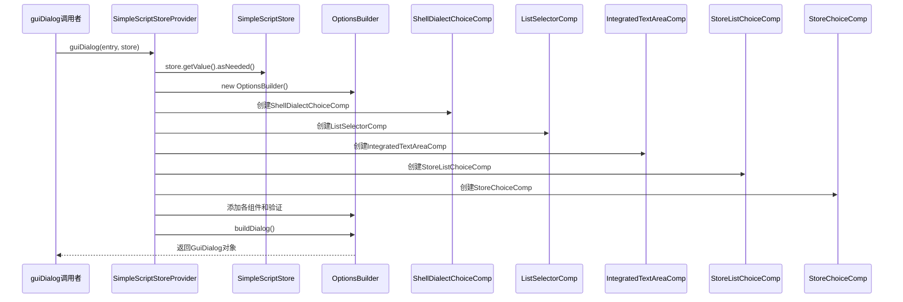

# 基础信息

|      |      |
|------|------|
| 名称 | SimpleScriptStoreProvider |
| 编码语言 | .java |
| 代码路径 | xpipe/ext/base/src/main/java/io/xpipe/ext/base/script/SimpleScriptStoreProvider.java |
| 包名 | io.xpipe.ext.base.script |
| 依赖项 | ['io.xpipe.app.comp.Comp', 'io.xpipe.app.comp.base.IntegratedTextAreaComp', 'io.xpipe.app.comp.base.ListSelectorComp', 'io.xpipe.app.comp.store', 'io.xpipe.app.core.AppExtensionManager', 'io.xpipe.app.core.AppI18n', 'io.xpipe.app.ext.DataStoreCreationCategory', 'io.xpipe.app.ext.DataStoreProvider', 'io.xpipe.app.ext.EnabledParentStoreProvider', 'io.xpipe.app.ext.GuiDialog', 'io.xpipe.app.storage.DataStoreCategory', 'io.xpipe.app.storage.DataStoreEntry', 'io.xpipe.app.util', 'io.xpipe.core.process.ShellDialect', 'io.xpipe.core.process.ShellDialects', 'io.xpipe.core.store.DataStore', 'javafx.beans.binding.Bindings', 'javafx.beans.property.Property', 'javafx.beans.property.SimpleListProperty', 'javafx.beans.property.SimpleObjectProperty', 'javafx.collections.FXCollections', 'lombok.SneakyThrows', 'java.util.ArrayList', 'java.util.List', 'java.util.function.Function', 'java.util.stream.Stream'] |
| 概述说明 | SimpleScriptStoreProvider实现脚本存储功能，支持多种Shell方言，提供脚本编辑、执行类型选择和分组管理。 |

# 说明

SimpleScriptStoreProvider是一个实现EnabledParentStoreProvider和DataStoreProvider接口的类，用于管理脚本存储。它提供了一系列方法控制脚本的显示、编辑和执行行为。主要功能包括：默认不显示提供者选择，帮助文档链接到脚本部分，不支持移动类别，默认允许编辑，不显示扫描选项。状态显示为成功状态，创建类别为脚本。通过对话框配置脚本属性，包括最小Shell方言、脚本内容、执行类型、代码片段和脚本组。支持多种Shell方言如SH、BASH、ZSH等。可配置脚本为初始化、可运行、文件或Shell类型。提供图标显示和默认存储构建。标识符为"script"，支持的存储类为SimpleScriptStore。

# 类列表 Class Summary

| 名称   | 类型  | 说明 |
|-------|------|-------------|
| SimpleScriptStoreProvider | class | SimpleScriptStoreProvider实现脚本存储功能，支持多种Shell方言和脚本类型，提供配置对话框和图标管理。 |

## 类 SimpleScriptStoreProvider

|      |      |
|------|------|
| 访问范围 | public |
| 类型 | class |
| 名称 | SimpleScriptStoreProvider |
| 说明 | SimpleScriptStoreProvider实现脚本存储功能，支持多种Shell方言和脚本类型，提供配置对话框和图标管理。 |

### UML类图

```mermaid
classDiagram
    class SimpleScriptStoreProvider {
        <<Interface>> EnabledParentStoreProvider
        <<Interface>> DataStoreProvider
        +boolean showProviderChoice()
        +DocumentationLink getHelpLink()
        +boolean canMoveCategories()
        +boolean editByDefault()
        +boolean shouldShowScan()
        +Comp~?~ stateDisplay(StoreEntryWrapper w)
        +DataStoreCreationCategory getCreationCategory()
        +DataStoreEntry getDisplayParent(DataStoreEntry store)
        +GuiDialog guiDialog(DataStoreEntry entry, Property~DataStore~ store)
        +boolean alwaysShowSummary()
        +String summaryString(StoreEntryWrapper wrapper)
        +String getDisplayIconFileName(DataStore store)
        +DataStore defaultStore(DataStoreCategory category)
        +String getId()
        +List~Class~?~~ getStoreClasses()
    }

    class DocumentationLink {
        <<Enumeration>>
        +SCRIPTING
        +SCRIPTING_COMPATIBILITY
        +SCRIPTING_EDITING
        +SCRIPTING_TYPES
        +SCRIPTING_GROUPS
        +SCRIPTING_DEPENDENCIES
    }

    class DataStoreCreationCategory {
        <<Enumeration>>
        +SCRIPT
    }

    class SimpleScriptStore {
        +SimpleScriptStore asNeeded()
        +Property~DataStoreEntry~ getGroup()
        +ShellDialect getMinimumDialect()
        +List~String~ getEffectiveScripts()
        +String getCommands()
        +boolean isInitScript()
        +boolean isRunnableScript()
        +boolean isFileScript()
        +boolean isShellScript()
        +String getDescription()
        +static Builder builder()
    }

    class ShellDialect {
        <<Interface>>
        +String getDisplayName()
        +String getScriptFileEnding()
    }

    class ShellDialects {
        <<Enumeration>>
        +SH
        +BASH
        +ZSH
        +FISH
        +CMD
        +POWERSHELL
        +POWERSHELL_CORE
    }

    class StoreEntryWrapper {
        +DataStoreEntry getEntry()
    }

    class DataStoreEntry {
        +DataStore getStore()
    }

    class DataStore {
        <<Interface>>
    }

    class Property~T~ {
        <<Interface>>
        +T getValue()
    }

    class SimpleObjectProperty~T~ {
        +SimpleObjectProperty(T initialValue)
    }

    class SimpleListProperty~T~ {
        +SimpleListProperty(ObservableList~T~ initialValue)
    }

    class FXCollections {
        <<Utility>>
        +static ~ObservableList~T~~ observableArrayList(Collection~? extends T~ c)
        +static ~ObservableList~T~~ observableList(List~T~ list)
    }

    class AppI18n {
        <<Utility>>
        +static String get(String key)
        +static ObservableStringValue observable(String key)
    }

    class Validator {
        <<Utility>>
        +static Validator nonEmpty(Validator parent, ObservableStringValue name, ObservableList~?~ list)
    }

    SimpleScriptStoreProvider ..|> EnabledParentStoreProvider
    SimpleScriptStoreProvider ..|> DataStoreProvider
    SimpleScriptStoreProvider --> DocumentationLink : 使用
    SimpleScriptStoreProvider --> DataStoreCreationCategory : 使用
    SimpleScriptStoreProvider --> SimpleScriptStore : 创建/操作
    SimpleScriptStoreProvider --> ShellDialect : 使用
    SimpleScriptStoreProvider --> ShellDialects : 使用
    SimpleScriptStoreProvider --> StoreEntryWrapper : 使用
    SimpleScriptStoreProvider --> DataStoreEntry : 使用
    SimpleScriptStoreProvider --> Property~DataStore~ : 使用
    SimpleScriptStoreProvider --> SimpleObjectProperty~T~ : 使用
    SimpleScriptStoreProvider --> SimpleListProperty~T~ : 使用
    SimpleScriptStoreProvider --> FXCollections : 使用
    SimpleScriptStoreProvider --> AppI18n : 使用
    SimpleScriptStoreProvider --> Validator : 使用
    ShellDialects ..|> ShellDialect
    DataStoreEntry --> DataStore : 包含
    SimpleScriptStore --> DataStore : 实现
```

这段类图展示了SimpleScriptStoreProvider类如何实现EnabledParentStoreProvider和DataStoreProvider接口，并与其他关键类如SimpleScriptStore、ShellDialect等进行交互。该类主要负责脚本存储的配置管理，包括对话框构建、状态显示、国际化支持等功能，通过属性绑定和验证机制确保数据一致性，同时支持多种Shell方言和脚本类型。

### 内部方法调用关系图

```mermaid
graph TD
    A["类SimpleScriptStoreProvider"]
    B["接口实现: EnabledParentStoreProvider, DataStoreProvider"]
    C["方法: boolean showProviderChoice()"]
    D["方法: DocumentationLink getHelpLink()"]
    E["方法: boolean canMoveCategories()"]
    F["方法: boolean editByDefault()"]
    G["方法: boolean shouldShowScan()"]
    H["方法: Comp<?> stateDisplay(StoreEntryWrapper w)"]
    I["方法: DataStoreCreationCategory getCreationCategory()"]
    J["方法: DataStoreEntry getDisplayParent(DataStoreEntry store)"]
    K["方法: GuiDialog guiDialog(DataStoreEntry entry, Property<DataStore> store)"]
    L["方法: boolean alwaysShowSummary()"]
    M["方法: String summaryString(StoreEntryWrapper wrapper)"]
    N["方法: String getDisplayIconFileName(DataStore store)"]
    O["方法: DataStore defaultStore(DataStoreCategory category)"]
    P["方法: String getId()"]
    Q["方法: List<Class<?>> getStoreClasses()"]

    A --> B
    A --> C
    A --> D
    A --> E
    A --> F
    A --> G
    A --> H
    A --> I
    A --> J
    A --> K
    A --> L
    A --> M
    A --> N
    A --> O
    A --> P
    A --> Q
```

这段代码实现了一个脚本存储提供者SimpleScriptStoreProvider，它管理脚本存储的创建、配置和显示逻辑。流程图展示了类结构和25个核心方法，包括GUI对话框构建、状态显示、帮助链接获取等功能。时序图详细描述了guiDialog方法的调用过程，涉及多个组件的创建和配置，最终构建并返回一个完整的对话框对象。该提供者支持多种脚本类型（初始化/可运行/文件/Shell），并能处理脚本依赖关系和分组管理。

### 字段列表 Field List

| 名称  | 类型  | 说明 |
|-------|-------|------|

### 方法列表 Method List

| 名称  | 类型  | 说明 |
|-------|-------|------|
| shouldShowScan | boolean | 覆盖方法，返回false不显示扫描。 |
| canMoveCategories | boolean | Java方法重写，禁止移动分类。 |
| getHelpLink | DocumentationLink | 重写getHelpLink方法，返回SCRIPTING文档链接。 |
| alwaysShowSummary | boolean | 重写方法，始终返回true以显示摘要。 |
| getCreationCategory | DataStoreCreationCategory | 重写方法返回脚本类型的数据存储创建类别。 |
| showProviderChoice | boolean | 重写方法，始终返回false。 |
| stateDisplay | Comp<?> | 重写方法返回系统状态成功组件。 |
| defaultStore | DataStore | 重写方法，返回空脚本存储实例。 |
| getId | String | 重写getId方法，返回字符串"script"。 |
| getStoreClasses | List<Class<?>> | 重写方法返回包含SimpleScriptStore类的列表。 |
| guiDialog | GuiDialog | 创建脚本对话框，设置Shell方言、内容、执行类型、依赖和分组。 |
| summaryString | String | 生成脚本类型及属性摘要字符串，包含初始化、文件、Shell等标记。 |
| getDisplayIconFileName | String | 获取显示图标文件名，根据存储状态返回对应图标路径。 |
| editByDefault | boolean | Java方法重写，默认返回true。 |
| getDisplayParent | DataStoreEntry | 重写方法，获取存储项的显示父项。 |

