# 基础信息

|      |      |
|------|------|
| 名称 | script |
| 编码语言 | .java |
| 代码路径 | xpipe/ext/base/src/main/java/io/xpipe/ext/base/script |
| 包名 | xpipe.ext.base.src.main.java.io.xpipe.ext.base.script |
| 概述说明 | XPipe脚本管理模块：包含脚本组存储、初始化、执行控制及层次结构管理功能。 |

# 说明

```markdown
## 概述
该代码模块是一个基于Java实现的脚本管理系统，核心功能包括脚本存储管理、脚本组管理、脚本执行和编辑等。模块采用分层设计，通过抽象类、接口和具体实现类构建完整的脚本处理流程，支持多种Shell方言（如SH、BASH、ZSH）和脚本类型（初始化/可运行/文件/Shell）。关键特性包括：
1. **层次化存储结构**：通过`ScriptGroupStore`和`ScriptStore`实现脚本组嵌套管理
2. **生命周期管理**：提供从存储初始化(`ScriptDataStorageProvider`)、配置(`ScriptStoreSetup`)到运行时执行(`RunScriptAction`)的全流程支持
3. **类型安全**：严格校验Shell兼容性和脚本依赖关系，包含循环引用检测机制
4. **GUI集成**：支持通过对话框配置脚本属性，提供快速编辑功能(`SimpleScriptQuickEditAction`)

## 主要业务场景
1. **脚本存储管理**
   - 初始化时自动创建预定义脚本组和脚本条目（`ScriptDataStorageProvider`）
   - 支持扁平化脚本查询和拓扑排序（`ScriptStoreSetup.flatten`）
   - 维护脚本间的引用关系（`ScriptGroupStore.getParentRef`）

2. **脚本执行控制**
   - 构建可执行脚本的层次化操作列表（`RunScriptAction`）
   - 处理脚本禁用状态和可用性过滤（`SimpleScriptStore.getEffectiveScripts`）
   - 终端命令生成与标题设置（`RunScriptAction.buildCommand`）

3. **脚本配置与编辑**
   - 通过GUI对话框配置脚本属性（`SimpleScriptStoreProvider`）
   - 区分预定义脚本和自定义脚本的编辑流程（`SimpleScriptQuickEditAction`）
   - 支持多脚本类型配置（代码片段/文件/Shell命令）

4. **脚本依赖处理**
   - 检测脚本兼容性（`SimpleScriptStore.checkCompleteness`）
   - 处理循环依赖（`ScriptStoreSetup`中的拓扑排序）
   - 优化单子节点结构（`ScriptHierarchy.compressSingleChildNodes`）

5. **可视化展示**
   - 构建树形脚本层次结构（`ScriptHierarchy`）
   - 提供图标和状态显示（`ScriptGroupStoreProvider.getDisplayIconFileName`）
   - 生成摘要信息（`ScriptGroupStoreProvider.toSummaryString`）
```


### 包内部结构视图

```mermaid
graph TD
    script --> ScriptTargetType.java
    script --> ScriptGroupStore.java
    script --> ScriptDataStorageProvider.java
    script --> ScriptStoreSetup.java
    script --> SimpleScriptStoreProvider.java
    script --> ScriptStore.java
    script --> SimpleScriptQuickEditAction.java
    script --> SimpleScriptStore.java
    script --> RunScriptAction.java
    script --> PredefinedScriptStore.java
    script --> PredefinedScriptGroup.java
    script --> ScriptGroupStoreProvider.java
    script --> ScriptHierarchy.java
```



该流程图展示了xpipe项目中script模块的Java类文件结构。所有文件均直接位于script目录下，没有更深层级的子目录。这些文件包括各种脚本相关的存储、操作、配置和提供者类，如脚本存储(ScriptStore)、脚本组存储(ScriptGroupStore)、脚本操作(RunScriptAction)等，共同构成了脚本功能的基础实现。

# 文件列表 File List

| 名称   | 类型  | 说明 |
|-------|------|-------------|
| [SimpleScriptQuickEditAction.java](SimpleScriptQuickEditAction.md) | file | SimpleScriptQuickEditAction类实现ActionProvider接口，提供脚本编辑功能，支持预定义脚本和自定义脚本的编辑与保存。 |
| [ScriptStore.java](ScriptStore.md) | file | 抽象类ScriptStore实现DataStore接口，包含脚本组引用、脚本列表和描述，提供状态检查和扁平化查询方法。 |
| [ScriptDataStorageProvider.java](ScriptDataStorageProvider.md) | file | ScriptDataStorageProvider初始化脚本存储，处理自定义和预定义脚本组及脚本条目。 |
| [ScriptGroupStore.java](ScriptGroupStore.md) | file | ScriptGroupStore类继承ScriptStore，实现组存储和自引用功能，包含父子脚本查询方法。 |
| [ScriptTargetType.java](ScriptTargetType.md) | file | 输入内容为空，无法生成概要描述。 |
| [SimpleScriptStoreProvider.java](SimpleScriptStoreProvider.md) | file | SimpleScriptStoreProvider实现脚本存储功能，支持多种Shell方言，提供脚本编辑、执行类型选择和分组管理。 |
| [ScriptStoreSetup.java](ScriptStoreSetup.md) | file | ScriptStoreSetup类控制脚本执行，处理初始化与兼容性检查，管理脚本依赖与临时目录。 |
| [ScriptHierarchy.java](ScriptHierarchy.md) | file | 构建脚本层次结构，包含启用脚本、组脚本及其父子关系，支持条件过滤和层次压缩。 |
| [ScriptGroupStoreProvider.java](ScriptGroupStoreProvider.md) | file | ScriptGroupStoreProvider实现数据存储接口，提供脚本组管理功能。 |
| [PredefinedScriptGroup.java](PredefinedScriptGroup.md) | file | 输入内容为空，无法生成概要描述。 |
| [PredefinedScriptStore.java](PredefinedScriptStore.md) | file | 输入内容为空，无法生成概要。 |
| [RunScriptAction.java](RunScriptAction.md) | file | 实现脚本运行的浏览器动作类，包含图标、名称、可用性检查及脚本执行逻辑。 |
| [SimpleScriptStore.java](SimpleScriptStore.md) | file | SimpleScriptStore类扩展ScriptStore，支持脚本组装、兼容性检查及链式脚本生成。 |


