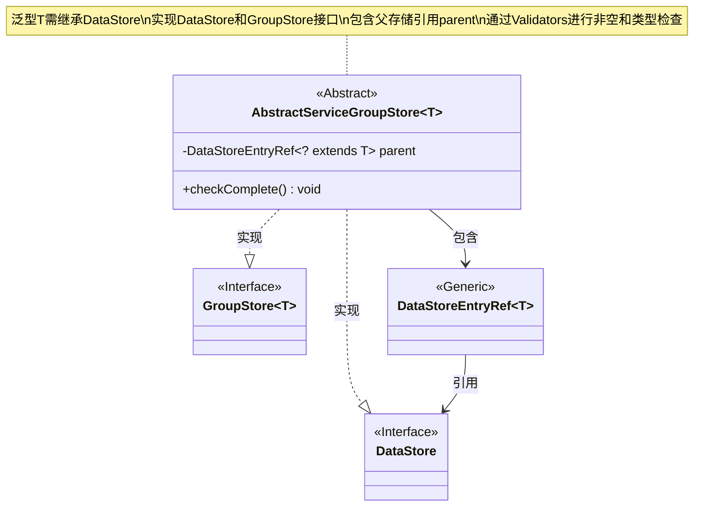
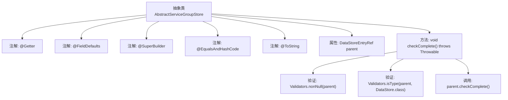

# 基础信息

|      |      |
|------|------|
| 名称 | AbstractServiceGroupStore |
| 编码语言 | .java |
| 代码路径 | xpipe/ext/base/src/main/java/io/xpipe/ext/base/service/AbstractServiceGroupStore.java |
| 包名 | io.xpipe.ext.base.service |
| 依赖项 | ['io.xpipe.app.storage.DataStoreEntryRef', 'io.xpipe.app.util.Validators', 'io.xpipe.core.store.DataStore', 'io.xpipe.ext.base.GroupStore', 'lombok.AccessLevel', 'lombok.EqualsAndHashCode', 'lombok.Getter', 'lombok.ToString', 'lombok.experimental.FieldDefaults', 'lombok.experimental.SuperBuilder'] |
| 概述说明 | 抽象类实现数据存储和组存储接口，包含父引用检查和完整性验证。 |

# 说明

这是一个名为AbstractServiceGroupStore的抽象类，实现了DataStore和GroupStore接口。类使用了多个注解：@Getter生成getter方法，@FieldDefaults设置字段为private final，@SuperBuilder支持构建器模式，@EqualsAndHashCode和@ToString分别生成相应方法。类包含一个parent字段，类型为DataStoreEntryRef。checkComplete方法检查parent非空且类型正确，并调用其checkComplete方法。

# 类列表 Class Summary

| 名称   | 类型  | 说明 |
|-------|------|-------------|
| AbstractServiceGroupStore | class | 抽象类实现数据存储接口，包含父引用检查和完整性验证。 |

## 类 AbstractServiceGroupStore

|      |      |
|------|------|
| 访问范围 | @Getter;@FieldDefaults(makeFinal = true, level = AccessLevel.PRIVATE);@SuperBuilder;@EqualsAndHashCode;@ToString;public abstract |
| 类型 | class |
| 名称 | AbstractServiceGroupStore |
| 说明 | 抽象类实现数据存储接口，包含父引用检查和完整性验证。 |

### UML类图

这段代码描述了一个抽象类`AbstractServiceGroupStore`，它实现了`DataStore`和泛型接口`GroupStore<T>`，其中泛型参数`T`必须继承`DataStore`。类中包含一个`DataStoreEntryRef`类型的父存储引用`parent`，并通过`checkComplete()`方法验证该引用的非空性和类型匹配性。类图展示了其与接口的实现关系、与`DataStoreEntryRef`的关联关系，以及泛型参数的约束条件，体现了存储结构的层级验证机制。

### 内部方法调用关系图

这段代码展示了一个使用Lombok注解的抽象类AbstractServiceGroupStore，它实现了DataStore和GroupStore接口。流程图清晰地呈现了类的结构，包括类级别的注解、私有final属性parent以及关键的checkComplete方法逻辑。该方法通过Validators工具进行非空和类型验证，最后调用父存储的完整性检查。整个设计体现了组合复用和契约式编程思想，适用于需要严格类型约束的存储服务场景。

### 字段列表 Field List

| 名称  | 类型  | 说明 |
|-------|-------|------|
| parent | DataStoreEntryRef<? extends T> | 父级数据存储引用 |

### 方法列表 Method List

| 名称  | 类型  | 说明 |
|-------|-------|------|
| checkComplete | void | 检查父对象非空且为DataStore类型，并调用其完成检查方法。 |

