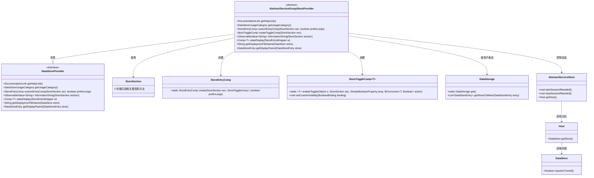
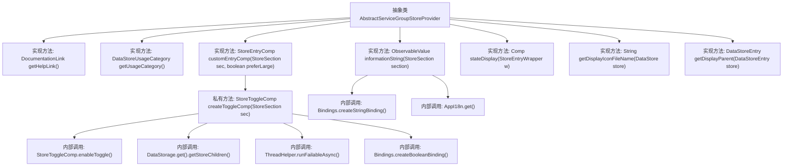

# 基础信息

|      |      |
|------|------|
| 名称 | AbstractServiceGroupStoreProvider |
| 编码语言 | .java |
| 代码路径 | xpipe/ext/base/src/main/java/io/xpipe/ext/base/service/AbstractServiceGroupStoreProvider.java |
| 包名 | io.xpipe.ext.base.service |
| 依赖项 | ['io.xpipe.app.comp.Comp', 'io.xpipe.app.comp.store', 'io.xpipe.app.core.AppI18n', 'io.xpipe.app.ext.DataStoreProvider', 'io.xpipe.app.ext.DataStoreUsageCategory', 'io.xpipe.app.storage.DataStorage', 'io.xpipe.app.storage.DataStoreEntry', 'io.xpipe.app.util.DocumentationLink', 'io.xpipe.app.util.ThreadHelper', 'io.xpipe.core.store.DataStore', 'javafx.beans.binding.Bindings', 'javafx.beans.property.SimpleBooleanProperty', 'javafx.beans.property.SimpleObjectProperty', 'javafx.beans.value.ObservableValue'] |
| 概述说明 | 抽象服务组存储提供类，实现数据存储接口，管理子服务开关状态及信息显示。 |

# 说明

这是一个抽象类AbstractServiceGroupStoreProvider，实现了DataStoreProvider接口，用于管理服务组存储。主要功能包括：提供帮助文档链接和存储使用类别；创建自定义存储条目组件，包含切换控件用于批量启停子服务；根据子服务状态动态控制切换控件可见性；生成信息字符串显示子服务数量；提供状态显示组件和显示图标；支持获取存储条目的父级条目。核心逻辑围绕服务组及其子服务的状态管理和UI展示展开。

# 类列表 Class Summary

| 名称   | 类型  | 说明 |
|-------|------|-------------|
| AbstractServiceGroupStoreProvider | class | 抽象服务组存储提供者实现，包含帮助链接、分类、自定义组件及状态显示功能。 |

## 类 AbstractServiceGroupStoreProvider

|      |      |
|------|------|
| 访问范围 | public abstract |
| 类型 | class |
| 名称 | AbstractServiceGroupStoreProvider |
| 说明 | 抽象服务组存储提供者实现，包含帮助链接、分类、自定义组件及状态显示功能。 |

### UML类图

这段代码展示了一个抽象类`AbstractServiceGroupStoreProvider`，它实现了`DataStoreProvider`接口，主要用于管理服务组存储的配置和状态。该类提供了创建存储条目组件、生成信息字符串、显示状态图标等功能，并通过私有方法`createToggleComp`创建可切换的组件来控制子服务的启停。类图中清晰地展示了与`StoreSection`、`StoreEntryComp`等辅助类的关系，以及通过`DataStorage`获取子条目和操作`AbstractServiceStore`的依赖关系。

### 内部方法调用关系图

该流程图展示了AbstractServiceGroupStoreProvider抽象类的完整结构，重点描述了8个核心方法的实现关系和内部调用链。其中createToggleComp()方法包含最复杂的逻辑，涉及异步线程操作、数据存储访问和动态绑定创建；informationString()方法通过多语言绑定实现状态显示；其他方法则处理基础服务组存储的元信息获取和UI组件生成。所有方法共同构成了一个完整的服务组存储提供者实现框架。

### 字段列表 Field List

| 名称  | 类型  | 说明 |
|-------|-------|------|

### 方法列表 Method List

| 名称  | 类型  | 说明 |
|-------|-------|------|
| getHelpLink | DocumentationLink | 重写getHelpLink方法，返回SERVICES文档链接。 |
| customEntryComp | StoreEntryComp | 重写方法，创建带切换组件的商店条目。 |
| getUsageCategory | DataStoreUsageCategory | 重写方法返回GROUP类型的数据存储用途分类。 |
| informationString | ObservableValue<String> | 重写方法，根据子项数量返回不同格式的国际化字符串。 |
| createToggleComp | StoreToggleComp | 创建切换组件，控制服务存储的会话启停，根据隧道需求设置可见性。 |
| stateDisplay | Comp<?> | 重写方法返回成功状态组件。 |
| getDisplayIconFileName | String | 重写getDisplayIconFileName方法，返回指定图标路径。 |
| getDisplayParent | DataStoreEntry | 重写方法，获取存储条目的父级显示项。 |

