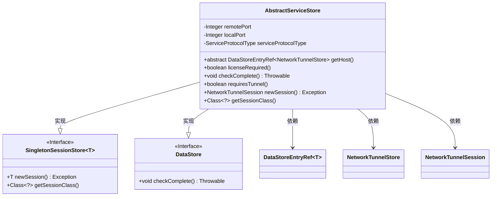
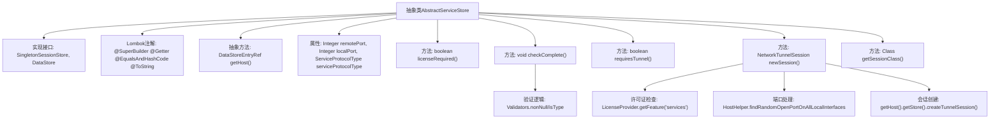

# 基础信息

|      |      |
|------|------|
| 名称 | AbstractServiceStore |
| 编码语言 | .java |
| 代码路径 | xpipe/ext/base/src/main/java/io/xpipe/ext/base/service/AbstractServiceStore.java |
| 包名 | io.xpipe.ext.base.service |
| 依赖项 | ['io.xpipe.app.storage.DataStorage', 'io.xpipe.app.storage.DataStoreEntryRef', 'io.xpipe.app.util.HostHelper', 'io.xpipe.app.util.LicenseProvider', 'io.xpipe.app.util.Validators', 'io.xpipe.core.store.DataStore', 'io.xpipe.core.store.NetworkTunnelSession', 'io.xpipe.core.store.NetworkTunnelStore', 'io.xpipe.core.store.SingletonSessionStore', 'lombok.EqualsAndHashCode', 'lombok.Getter', 'lombok.ToString', 'lombok.experimental.SuperBuilder'] |
| 概述说明 | 抽象类实现网络隧道会话存储，含端口配置、许可证检查及会话创建逻辑。 |

# 说明

这是一个名为AbstractServiceStore的抽象类，实现了SingletonSessionStore和DataStore接口。该类使用Lombok注解生成构建器、getter、equals/hashCode和toString方法。核心功能包括管理网络隧道会话，包含远程端口、本地端口和服务协议类型等属性。类中定义了主机获取、许可证检查、会话创建等方法，并实现了完整性校验逻辑。会话创建时会检查许可证支持情况，自动分配本地端口，并通过主机存储创建隧道会话。该类还提供了会话类类型查询功能，要求实现类必须提供主机存储引用。

# 类列表 Class Summary

| 名称   | 类型  | 说明 |
|-------|------|-------------|
| AbstractServiceStore | class | 抽象类AbstractServiceStore实现SingletonSessionStore和DataStore接口，包含端口、协议类型等字段，提供会话创建和验证功能。 |

## 类 AbstractServiceStore

|      |      |
|------|------|
| 访问范围 | @SuperBuilder;@Getter;@EqualsAndHashCode;@ToString;public abstract |
| 类型 | class |
| 名称 | AbstractServiceStore |
| 说明 | 抽象类AbstractServiceStore实现SingletonSessionStore和DataStore接口，包含端口、协议类型等字段，提供会话创建和验证功能。 |

### UML类图

这段代码定义了一个抽象类`AbstractServiceStore`，它实现了`SingletonSessionStore<NetworkTunnelSession>`和`DataStore`两个接口。该类主要功能是管理网络隧道会话，包含端口号、协议类型等配置信息，并提供会话创建、许可证检查等方法。通过`@SuperBuilder`等Lombok注解简化了代码，核心逻辑集中在会话创建和验证逻辑上，体现了对网络隧道服务的管理能力。

### 内部方法调用关系图

该流程图展示了AbstractServiceStore抽象类的核心结构和功能。类通过Lombok注解实现建造者模式和常用方法，包含端口配置、许可证验证、会话管理等核心功能。主要流程包括参数校验（checkComplete）、会话创建（newSession）时的许可证检查和动态端口分配，最终通过NetworkTunnelStore创建隧道会话。所有方法都围绕网络隧道服务的生命周期管理展开，体现了严格的参数校验和资源控制机制。

### 字段列表 Field List

| 名称  | 类型  | 说明 |
|-------|-------|------|
| serviceProtocolType | ServiceProtocolType | 私有服务协议类型变量 |
| localPort | Integer | 私有整型本地端口变量 |
| remotePort | Integer | 私有整型远程端口变量。 |

### 方法列表 Method List

| 名称  | 类型  | 说明 |
|-------|-------|------|
| getSessionClass | Class<?> | 重写方法返回NetworkTunnelSession类。 |
| requiresTunnel | boolean | 检查主机存储是否需要隧道连接。 |
| getHost | DataStoreEntryRef<NetworkTunnelStore> | 获取主机网络隧道存储的抽象数据存储引用。 |
| newSession | NetworkTunnelSession | 检查许可证并创建网络隧道会话，若需许可且无支持则验证其他服务状态，最后分配本地端口建立会话。 |
| licenseRequired | boolean | 方法返回true表示需要许可证。 |
| checkComplete | void | 检查非空及类型验证 |

