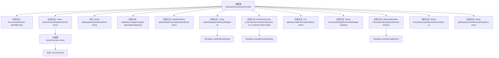

# 基础信息

|      |      |
|------|------|
| 名称 | AbstractServiceStoreProvider |
| 编码语言 | .java |
| 代码路径 | xpipe/ext/base/src/main/java/io/xpipe/ext/base/service/AbstractServiceStoreProvider.java |
| 包名 | io.xpipe.ext.base.service |
| 依赖项 | ['io.xpipe.app.comp.Comp', 'io.xpipe.app.comp.store', 'io.xpipe.app.core.AppI18n', 'io.xpipe.app.ext.ActionProvider', 'io.xpipe.app.ext.DataStoreProvider', 'io.xpipe.app.ext.DataStoreUsageCategory', 'io.xpipe.app.ext.SingletonSessionStoreProvider', 'io.xpipe.app.storage.DataStorage', 'io.xpipe.app.storage.DataStoreEntry', 'io.xpipe.app.util.DataStoreFormatter', 'io.xpipe.app.util.DocumentationLink', 'io.xpipe.app.util.StoreStateFormat', 'io.xpipe.core.store.DataStore', 'javafx.beans.binding.Bindings', 'javafx.beans.value.ObservableValue', 'java.util.List'] |
| 概述说明 | 抽象服务存储提供者类，实现会话和数据存储接口，支持隧道功能、状态显示和自定义条目组件。 |

# 说明

AbstractServiceStoreProvider是一个抽象类，实现了SingletonSessionStoreProvider和DataStoreProvider接口。它提供了服务存储的核心功能，包括获取帮助链接、执行启动操作、显示名称、使用类别、获取合成父项、状态显示、自定义条目组件、可搜索术语、摘要字符串、信息字符串和显示图标文件名。该类处理服务存储的会话管理、端口转发、协议类型处理和状态监控，支持本地和远程端口映射，并根据会话状态动态更新界面显示。

# 类列表 Class Summary

| 名称   | 类型  | 说明 |
|-------|------|-------------|
| AbstractServiceStoreProvider | class | 抽象服务存储提供者，实现会话启动、端口管理及状态显示功能。 |

## 类 AbstractServiceStoreProvider

|      |      |
|------|------|
| 访问范围 | public abstract |
| 类型 | class |
| 名称 | AbstractServiceStoreProvider |
| 说明 | 抽象服务存储提供者，实现会话启动、端口管理及状态显示功能。 |

### UML类图

```mermaid
classDiagram
    class AbstractServiceStoreProvider {
        <<abstract>>
        +DocumentationLink getHelpLink()
        +ActionProvider~Action~ launchAction(DataStoreEntry store)
        +String displayName(DataStoreEntry entry)
        +DataStoreUsageCategory getUsageCategory()
        +DataStoreEntry getSyntheticParent(DataStoreEntry store)
        +Comp~?~ stateDisplay(StoreEntryWrapper w)
        +StoreEntryComp customEntryComp(StoreSection sec, boolean preferLarge)
        +List~String~ getSearchableTerms(DataStore store)
        +String summaryString(StoreEntryWrapper wrapper)
        +ObservableValue~String~ informationString(StoreSection section)
        +String getDisplayIconFileName(DataStore store)
        #String formatService(AbstractServiceStore s)
    }

    class SingletonSessionStoreProvider {
        <<Interface>>
    }

    class DataStoreProvider {
        <<Interface>>
    }

    AbstractServiceStoreProvider --|> SingletonSessionStoreProvider : 实现
    AbstractServiceStoreProvider --|> DataStoreProvider : 实现

    class ActionProvider {
        <<Interface>>
        +Action~execute()~ Action
    }

    class DataStoreEntry {
        +AbstractServiceStore getStore()
    }

    class AbstractServiceStore {
        +void startSessionIfNeeded()
        +boolean requiresTunnel()
        +Session getSession()
        +int getRemotePort()
        +Integer getLocalPort()
        +ServiceProtocolType getServiceProtocolType()
        +void open(String address)
        +Host getHost()
        +boolean isSessionEnabled()
        +boolean isSessionRunning()
    }

    class ServiceProtocolType {
        <<Interface>>
        +String formatAddress(String base)
        +String getTranslationKey()
    }

    class DataStorage {
        +String getStoreEntryDisplayName(Host host)
        +DataStoreEntry getOrCreateNewSyntheticEntry(Host host, String name, CustomServiceGroupStore builder)
    }

    class CustomServiceGroupStore {
        +static Builder builder()
    }

    class StoreEntryWrapper {
        +DataStoreEntry getEntry()
        +ObservableValue~?~ getCache()
    }

    class SystemStateComp {
        +enum State
        +SystemStateComp(ObservableValue~State~ binding)
    }

    class StoreSection {
        +StoreEntryWrapper getWrapper()
    }

    class DenseStoreEntryComp {
        +DenseStoreEntryComp(StoreSection sec, ToggleComp toggle)
    }

    class StoreStateFormat {
        +StoreStateFormat(String prefix, String desc, String type, String state)
        +String format()
    }

    AbstractServiceStoreProvider --> ActionProvider : 依赖
    AbstractServiceStoreProvider --> DataStoreEntry : 依赖
    AbstractServiceStoreProvider --> AbstractServiceStore : 依赖
    AbstractServiceStoreProvider --> DataStorage : 依赖
    AbstractServiceStoreProvider --> StoreEntryWrapper : 依赖
    AbstractServiceStoreProvider --> SystemStateComp : 依赖
    AbstractServiceStoreProvider --> StoreSection : 依赖
    AbstractServiceStoreProvider --> DenseStoreEntryComp : 依赖
    AbstractServiceStoreProvider --> StoreStateFormat : 依赖
    AbstractServiceStore --> ServiceProtocolType : 依赖
    DataStorage --> CustomServiceGroupStore : 依赖
```

这段代码定义了一个抽象类`AbstractServiceStoreProvider`，它实现了`SingletonSessionStoreProvider`和`DataStoreProvider`接口，主要功能是提供服务的存储和管理。该类包含多个方法用于处理服务存储条目，如获取帮助链接、启动动作、显示名称、获取使用类别、获取合成父条目、状态显示、自定义条目组件、可搜索术语、摘要字符串、信息字符串和显示图标文件名等。它还依赖多个其他类和接口，如`ActionProvider`、`DataStoreEntry`、`AbstractServiceStore`等，共同构成了一个完整的服务存储管理系统。

### 内部方法调用关系图

该流程图展示了AbstractServiceStoreProvider抽象类的完整结构，包含12个主要方法及其调用关系。核心功能包括服务存储管理（launchAction）、状态显示（stateDisplay）、自定义条目组件（customEntryComp）和国际化信息处理（informationString）。关键方法如execute()通过内部类实现服务启动逻辑，多个方法使用数据绑定机制动态更新状态。类设计体现了服务协议处理、隧道连接管理和UI状态联动的综合能力。

### 字段列表 Field List

| 名称  | 类型  | 说明 |
|-------|-------|------|

### 方法列表 Method List

| 名称  | 类型  | 说明 |
|-------|-------|------|
| formatService | String | 格式化服务描述：本地端口或会话端口映射远程端口，无则显示远程端口。 |
| getDisplayIconFileName | String | 重写方法返回服务图标文件名"base:service_icon.svg"。 |
| stateDisplay | Comp<?> | 重写stateDisplay方法，根据StoreEntryWrapper状态返回SystemStateComp对象，检查可用性、隧道需求及会话状态。 |
| customEntryComp | StoreEntryComp | 重写方法，根据条件设置组件可见性，返回组合组件。 |
| getSearchableTerms | List<String> | 重写方法，根据本地端口是否存在返回远程端口或包含本地端口的列表。 |
| getHelpLink | DocumentationLink | 重写getHelpLink方法，返回SERVICES文档链接。 |
| launchAction | ActionProvider.Action | 重写方法，启动服务会话并打开协议地址。 |
| getSyntheticParent | DataStoreEntry | 重写方法，获取或创建合成数据存储条目，基于主机和服务组构建。 |
| displayName | String | 方法返回数据存储条目显示名，格式为"主机名 - Port 端口号"。 |
| summaryString | String | 重写summaryString方法，返回带主机名的服务字符串。 |
| getUsageCategory | DataStoreUsageCategory | 方法重写，返回数据存储用途类别为隧道。 |
| informationString | ObservableValue<String> | 重写方法，返回服务信息字符串，包含描述、协议类型和状态。 |

