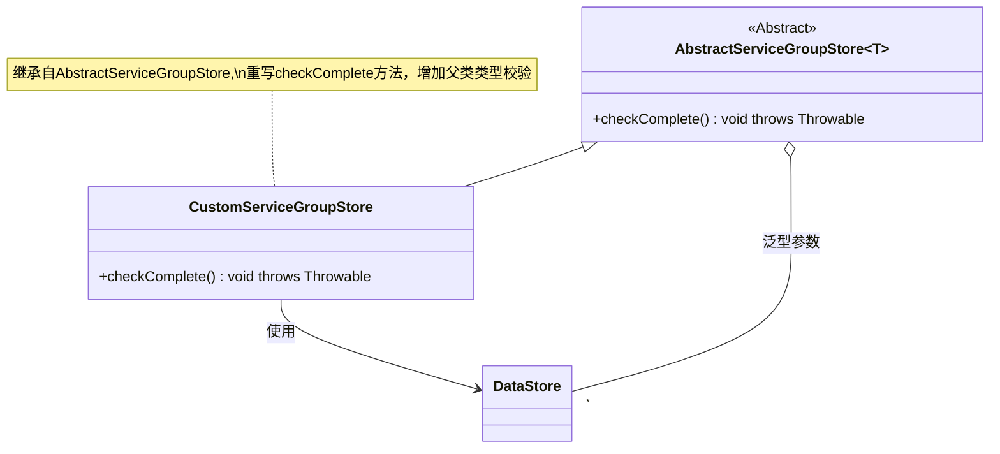
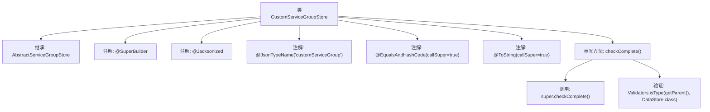

# 基础信息

|      |      |
|------|------|
| 名称 | CustomServiceGroupStore |
| 编码语言 | .java |
| 代码路径 | xpipe/ext/base/src/main/java/io/xpipe/ext/base/service/CustomServiceGroupStore.java |
| 包名 | io.xpipe.ext.base.service |
| 依赖项 | ['io.xpipe.app.util.Validators', 'io.xpipe.core.store.DataStore', 'com.fasterxml.jackson.annotation.JsonTypeName', None, 'lombok.experimental.SuperBuilder', 'lombok.extern.jackson.Jacksonized'] |
| 概述说明 | 自定义服务组存储类，继承抽象服务组存储，检查父类类型为DataStore。 |

# 说明

该内容描述了一个名为`CustomServiceGroupStore`的Java类，继承自`AbstractServiceGroupStore<DataStore>`。类上使用了多个注解：`@SuperBuilder`用于生成构建器模式代码，`@Jacksonized`支持Jackson反序列化，`@JsonTypeName("customServiceGroup")`指定JSON类型名称，`@EqualsAndHashCode`和`@ToString`分别生成equals、hashCode和toString方法，且都调用父类方法。类中重写了`checkComplete`方法，先调用父类方法，再验证父对象类型是否为`DataStore`。

# 类列表 Class Summary

| 名称   | 类型  | 说明 |
|-------|------|-------------|
| CustomServiceGroupStore | class | 自定义服务组存储类，继承抽象服务组存储，检查父类类型为DataStore。 |

## 类 CustomServiceGroupStore

|      |      |
|------|------|
| 访问范围 | @SuperBuilder;@Jacksonized;@JsonTypeName("customServiceGroup");@EqualsAndHashCode(callSuper = true);@ToString(callSuper = true);public |
| 类型 | class |
| 名称 | CustomServiceGroupStore |
| 说明 | 自定义服务组存储类，继承抽象服务组存储，检查父类类型为DataStore。 |

### UML类图

这段类图展示了CustomServiceGroupStore继承自泛型类AbstractServiceGroupStore<DataStore>的层级关系。CustomServiceGroupStore通过@SuperBuilder等注解增强功能，并重写了checkComplete()方法，在调用父类检查后额外验证父对象类型是否为DataStore。图中明确显示了泛型参数绑定关系（DataStore作为类型参数）和方法的覆盖关系，同时通过注释说明该类的主要增强点。整个结构体现了模板方法模式的应用，父类定义检查框架，子类补充具体校验逻辑。

### 内部方法调用关系图

这段代码展示了一个继承自AbstractServiceGroupStore的CustomServiceGroupStore类，使用了Lombok的@SuperBuilder和@Jacksonized注解简化构建和JSON序列化，同时通过@EqualsAndHashCode和@ToString包含父类字段。重写的checkComplete()方法先调用父类检查，再验证parent对象类型为DataStore。流程图清晰呈现了类结构、注解关系和方法调用链。

### 字段列表 Field List

| 名称  | 类型  | 说明 |
|-------|-------|------|

### 方法列表 Method List

| 名称  | 类型  | 说明 |
|-------|-------|------|
| checkComplete | void | 重写checkComplete方法，调用父类并验证父类类型为DataStore。 |

