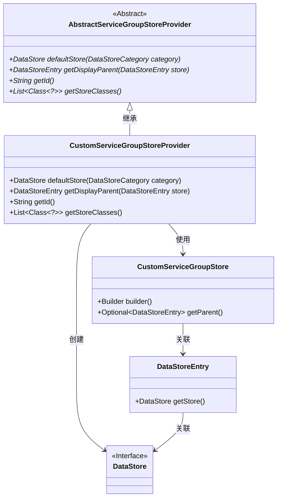
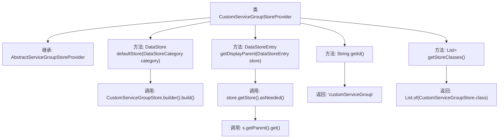

# 基础信息

|      |      |
|------|------|
| 名称 | CustomServiceGroupStoreProvider |
| 编码语言 | .java |
| 代码路径 | xpipe/ext/base/src/main/java/io/xpipe/ext/base/service/CustomServiceGroupStoreProvider.java |
| 包名 | io.xpipe.ext.base.service |
| 依赖项 | ['io.xpipe.app.storage.DataStoreCategory', 'io.xpipe.app.storage.DataStoreEntry', 'io.xpipe.core.store.DataStore', 'java.util.List'] |
| 概述说明 | 自定义服务组存储提供类，继承抽象类，实现默认存储、显示父项、ID及存储类列表方法。 |

# 说明

该内容描述了一个名为CustomServiceGroupStoreProvider的Java类，继承自AbstractServiceGroupStoreProvider。主要功能包括：通过defaultStore方法返回CustomServiceGroupStore实例；getDisplayParent方法获取存储条目的父级；getId方法返回标识符"customServiceGroup"；getStoreClasses方法返回包含CustomServiceGroupStore类的列表。该类用于管理自定义服务组存储的提供和操作。

# 类列表 Class Summary

| 名称   | 类型  | 说明 |
|-------|------|-------------|
| CustomServiceGroupStoreProvider | class | 自定义服务组存储提供类，实现默认存储、显示父项、ID及存储类列表功能。 |

## 类 CustomServiceGroupStoreProvider

|      |      |
|------|------|
| 访问范围 | public |
| 类型 | class |
| 名称 | CustomServiceGroupStoreProvider |
| 说明 | 自定义服务组存储提供类，实现默认存储、显示父项、ID及存储类列表功能。 |

### UML类图

这段类图展示了自定义服务组存储提供者的实现架构。CustomServiceGroupStoreProvider继承自抽象类AbstractServiceGroupStoreProvider，实现了四个核心方法：创建默认存储、获取显示父节点、返回标识符和存储类列表。它与DataStore接口、DataStoreEntry实体以及CustomServiceGroupStore实现类交互，后者提供了构建器和父节点访问功能。整体设计体现了模板方法模式，通过抽象基类定义框架，子类负责具体存储逻辑的实现。

### 内部方法调用关系图

该流程图展示了CustomServiceGroupStoreProvider类的结构及其方法调用关系。该类继承自AbstractServiceGroupStoreProvider，实现了四个核心方法：defaultStore()创建自定义存储实例，getDisplayParent()通过两级调用获取父级条目，getId()返回固定标识符，getStoreClasses()返回存储类列表。每个方法调用路径清晰呈现，体现了从数据存储构建到层级关系处理的完整逻辑链。

### 字段列表 Field List

| 名称  | 类型  | 说明 |
|-------|-------|------|

### 方法列表 Method List

| 名称  | 类型  | 说明 |
|-------|-------|------|
| defaultStore | DataStore | 重写方法，返回指定类别的默认数据存储实例。 |
| getId | String | 重写getId方法，返回固定字符串"customServiceGroup"。 |
| getStoreClasses | List<Class<?>> | 重写方法返回包含CustomServiceGroupStore的列表。 |
| getDisplayParent | DataStoreEntry | 重写方法，获取数据存储条目的父级显示项。 |

