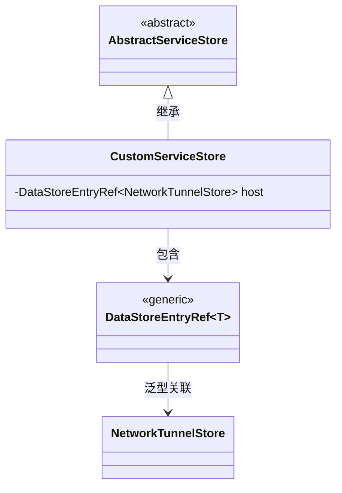
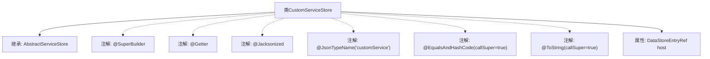

# 基础信息

|      |      |
|------|------|
| 名称 | CustomServiceStore |
| 编码语言 | .java |
| 代码路径 | xpipe/ext/base/src/main/java/io/xpipe/ext/base/service/CustomServiceStore.java |
| 包名 | io.xpipe.ext.base.service |
| 依赖项 | ['io.xpipe.app.storage.DataStoreEntryRef', 'io.xpipe.core.store.NetworkTunnelStore', 'com.fasterxml.jackson.annotation.JsonTypeName', 'lombok.EqualsAndHashCode', 'lombok.Getter', 'lombok.ToString', 'lombok.experimental.SuperBuilder', 'lombok.extern.jackson.Jacksonized'] |
| 概述说明 | Java类CustomServiceStore继承AbstractServiceStore，包含host字段，使用多个注解配置。 |

# 说明

这段内容描述了一个名为CustomServiceStore的Java类，该类继承自AbstractServiceStore。该类使用了多个注解：SuperBuilder用于生成构建器模式代码，Getter自动生成getter方法，Jacksonized支持Jackson库的序列化与反序列化，JsonTypeName指定JSON类型名称为"customService"，EqualsAndHashCode和ToString都设置为包含父类属性。类中定义了一个final类型的host字段，其类型为DataStoreEntryRef<NetworkTunnelStore>。该类被声明为final，表示不可被继承。

# 类列表 Class Summary

| 名称   | 类型  | 说明 |
|-------|------|-------------|
| CustomServiceStore | class | 自定义服务存储类，继承抽象服务存储，包含主机网络隧道引用。 |

## 类 CustomServiceStore

|      |      |
|------|------|
| 访问范围 | @SuperBuilder;@Getter;@Jacksonized;@JsonTypeName("customService");@EqualsAndHashCode(callSuper = true);@ToString(callSuper = true);public final |
| 类型 | class |
| 名称 | CustomServiceStore |
| 说明 | 自定义服务存储类，继承抽象服务存储，包含主机网络隧道引用。 |

### UML类图

该类图展示了CustomServiceStore继承自抽象类AbstractServiceStore，并包含一个泛型成员host，其类型为DataStoreEntryRef<NetworkTunnelStore>。DataStoreEntryRef是一个泛型类，与NetworkTunnelStore形成关联关系。CustomServiceStore使用了Lombok注解实现建造者模式、Getter方法、JSON序列化等功能，同时重写了equals、hashCode和toString方法。整个设计体现了服务存储结构的层次化和类型安全的数据引用机制。

### 内部方法调用关系图

这段代码描述了一个名为CustomServiceStore的final类，它继承自AbstractServiceStore。该类使用了多个Lombok和Jackson注解，包括@SuperBuilder用于生成构建器模式代码，@Getter生成getter方法，@Jacksonized支持Jackson反序列化，@JsonTypeName指定JSON类型名称，@EqualsAndHashCode和@ToString都设置了callSuper=true以包含父类字段。类中包含一个final属性host，类型为DataStoreEntryRef<NetworkTunnelStore>。这些注解和继承关系共同构成了一个用于存储自定义服务的不可变数据存储类。

### 字段列表 Field List

| 名称  | 类型  | 说明 |
|-------|-------|------|
| host | DataStoreEntryRef<NetworkTunnelStore> | 私有网络隧道存储的主机数据引用。 |

### 方法列表 Method List

| 名称  | 类型  | 说明 |
|-------|-------|------|

