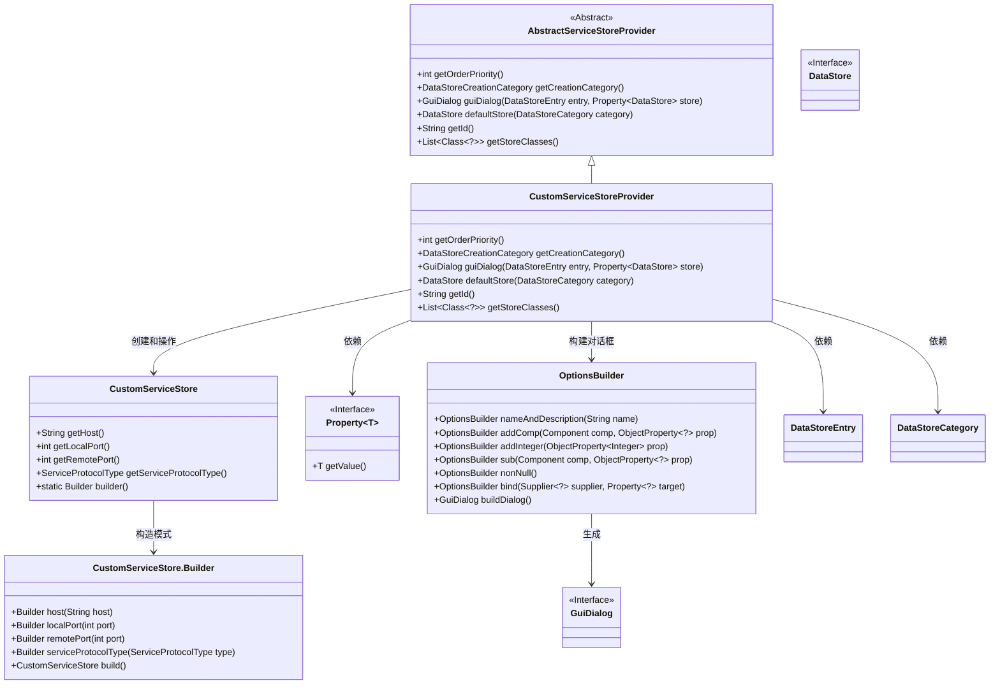
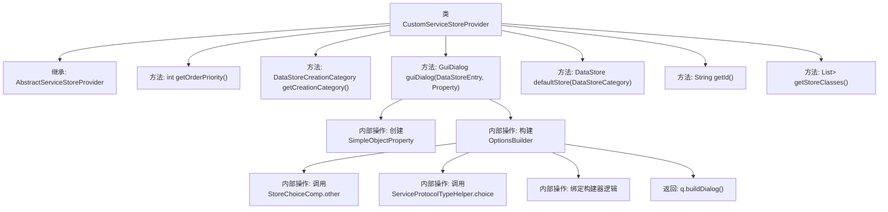

# 基础信息

|      |      |
|------|------|
| 名称 | CustomServiceStoreProvider |
| 编码语言 | .java |
| 代码路径 | xpipe/ext/base/src/main/java/io/xpipe/ext/base/service/CustomServiceStoreProvider.java |
| 包名 | io.xpipe.ext.base.service |
| 依赖项 | ['io.xpipe.app.comp.store.StoreChoiceComp', 'io.xpipe.app.comp.store.StoreViewState', 'io.xpipe.app.ext.DataStoreCreationCategory', 'io.xpipe.app.ext.GuiDialog', 'io.xpipe.app.storage.DataStoreCategory', 'io.xpipe.app.storage.DataStoreEntry', 'io.xpipe.app.util.OptionsBuilder', 'io.xpipe.core.store.DataStore', 'io.xpipe.core.store.NetworkTunnelStore', 'javafx.beans.property.Property', 'javafx.beans.property.SimpleObjectProperty', 'java.util.List'] |
| 概述说明 | 自定义服务存储提供类，实现服务配置、端口绑定及协议选择功能。 |

# 说明

CustomServiceStoreProvider是一个继承AbstractServiceStoreProvider的服务存储提供类，主要用于管理自定义服务存储配置。它定义了优先级为-1，创建类别为SERVICE。通过guiDialog方法构建包含主机、本地端口、远程端口和服务协议类型的GUI对话框，各字段均非空且可绑定生成CustomServiceStore实例。默认存储返回空构建器，ID为"customService"，支持的存储类仅限CustomServiceStore。

# 类列表 Class Summary

| 名称   | 类型  | 说明 |
|-------|------|-------------|
| CustomServiceStoreProvider | class | 自定义服务存储提供类，实现配置对话框、默认存储及ID等功能。 |

## 类 CustomServiceStoreProvider

|      |      |
|------|------|
| 访问范围 | public |
| 类型 | class |
| 名称 | CustomServiceStoreProvider |
| 说明 | 自定义服务存储提供类，实现配置对话框、默认存储及ID等功能。 |

### UML类图

该类图展示了CustomServiceStoreProvider继承自AbstractServiceStoreProvider，实现了服务存储配置的核心功能。主要包含GUI对话框构建（通过OptionsBuilder）、默认存储创建、以及存储类元数据管理。CustomServiceStore作为数据模型，采用Builder模式构造实例，与属性绑定机制交互。整体设计体现了分层抽象和建造者模式的应用，适用于动态服务配置场景。

### 内部方法调用关系图

该流程图展示了CustomServiceStoreProvider类的完整结构，重点描述了guiDialog方法的复杂构建过程。该类继承自AbstractServiceStoreProvider，实现了服务存储配置的核心功能，包括优先级设置、创建类别定义、GUI对话框生成（涉及多个属性绑定和组件构建）、默认存储实例创建以及元数据标识。guiDialog方法通过OptionsBuilder逐步构建对话框组件，最终返回完整的配置界面，体现了服务协议类型选择、端口设置等关键交互逻辑。

### 字段列表 Field List

| 名称  | 类型  | 说明 |
|-------|-------|------|

### 方法列表 Method List

| 名称  | 类型  | 说明 |
|-------|-------|------|
| defaultStore | DataStore | 重写方法，返回自定义服务存储实例。 |
| getOrderPriority | int | 重写方法，返回优先级为-1。 |
| getId | String | 重写getId方法，返回"customService"。 |
| getStoreClasses | List<Class<?>> | 重写方法返回包含CustomServiceStore的列表。 |
| getCreationCategory | DataStoreCreationCategory | 重写方法返回数据存储创建类别为服务。 |
| guiDialog | GuiDialog | 创建自定义服务对话框，设置主机、端口和协议类型，绑定数据存储。 |

