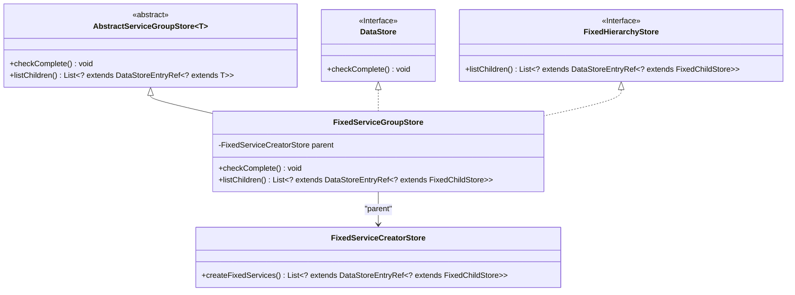
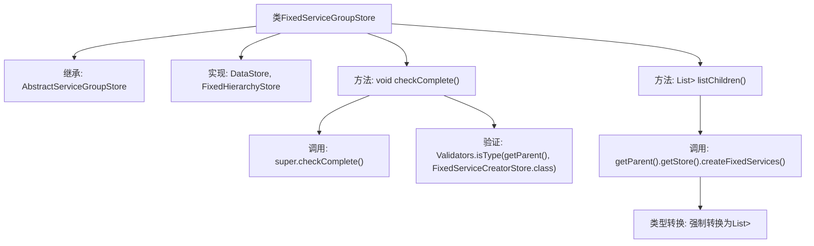

# 基础信息

|      |      |
|------|------|
| 名称 | FixedServiceGroupStore |
| 编码语言 | .java |
| 代码路径 | xpipe/ext/base/src/main/java/io/xpipe/ext/base/service/FixedServiceGroupStore.java |
| 包名 | io.xpipe.ext.base.service |
| 依赖项 | ['io.xpipe.app.storage.DataStoreEntryRef', 'io.xpipe.app.util.FixedHierarchyStore', 'io.xpipe.app.util.Validators', 'io.xpipe.core.store.DataStore', 'io.xpipe.core.store.FixedChildStore', 'com.fasterxml.jackson.annotation.JsonTypeName', 'lombok.AccessLevel', 'lombok.EqualsAndHashCode', 'lombok.Getter', 'lombok.ToString', 'lombok.experimental.FieldDefaults', 'lombok.experimental.SuperBuilder', 'lombok.extern.jackson.Jacksonized', 'java.util.List'] |
| 概述说明 | FixedServiceGroupStore类继承AbstractServiceGroupStore，实现DataStore和FixedHierarchyStore接口，包含完整性检查和子项列表方法。 |

# 说明

这是一个名为FixedServiceGroupStore的Java类，继承自AbstractServiceGroupStore并实现DataStore和FixedHierarchyStore接口。类上使用了多个注解：@Getter生成getter方法，@FieldDefaults设置字段默认final和private，@SuperBuilder支持构建器模式，@Jacksonized用于JSON序列化，@JsonTypeName定义JSON类型名，@EqualsAndHashCode和@ToString生成相关方法。类包含两个方法：checkComplete()验证父类类型，listChildren()返回父类创建的固定服务列表。

# 类列表 Class Summary

| 名称   | 类型  | 说明 |
|-------|------|-------------|
| FixedServiceGroupStore | class | Java类FixedServiceGroupStore继承AbstractServiceGroupStore，实现DataStore和FixedHierarchyStore接口，包含完整性检查和子项列表方法。 |

## 类 FixedServiceGroupStore

|      |      |
|------|------|
| 访问范围 | @Getter;@FieldDefaults(makeFinal = true, level = AccessLevel.PRIVATE);@SuperBuilder;@Jacksonized;@JsonTypeName("fixedServiceGroup");@EqualsAndHashCode(callSuper = true);@ToString(callSuper = true);public |
| 类型 | class |
| 名称 | FixedServiceGroupStore |
| 说明 | Java类FixedServiceGroupStore继承AbstractServiceGroupStore，实现DataStore和FixedHierarchyStore接口，包含完整性检查和子项列表方法。 |

### UML类图

这段代码展示了一个继承体系，其中`FixedServiceGroupStore`继承自泛型抽象类`AbstractServiceGroupStore`，并实现了`DataStore`和`FixedHierarchyStore`两个接口。该类通过Lombok注解实现了建造者模式、JSON序列化等功能，核心功能包括完整性检查（`checkComplete`）和获取子节点列表（`listChildren`）。`FixedServiceGroupStore`依赖于`FixedServiceCreatorStore`来创建固定服务，体现了组合关系。整体设计遵循了SOLID原则，通过泛型和接口实现了良好的扩展性。

### 内部方法调用关系图

这段代码展示了一个名为FixedServiceGroupStore的类，它继承自AbstractServiceGroupStore并实现了DataStore和FixedHierarchyStore接口。类中包含两个主要方法：checkComplete()用于验证父存储类型，listChildren()通过父存储创建固定服务列表并进行类型转换。流程图清晰地呈现了类的继承关系、接口实现以及方法间的调用链，特别是类型验证和强制转换这两个关键操作步骤。注解部分表明这是一个使用Lombok和Jackson进行序列化的不可变类。

### 字段列表 Field List

| 名称  | 类型  | 说明 |
|-------|-------|------|

### 方法列表 Method List

| 名称  | 类型  | 说明 |
|-------|-------|------|
| checkComplete | void | 重写checkComplete方法，调用父类并验证父类类型为FixedServiceCreatorStore。 |
| listChildren | List<? extends DataStoreEntryRef<? extends FixedChildStore>> | 重写方法，返回父存储创建的子服务列表。 |

