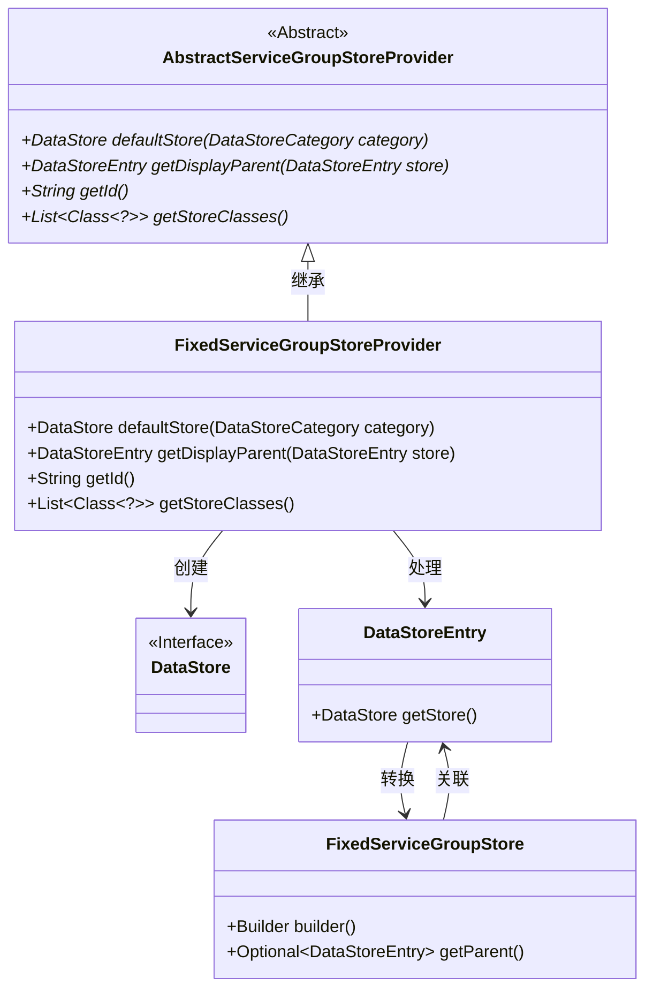
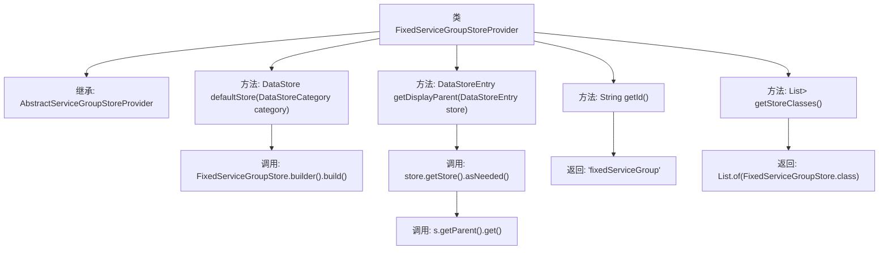

# 基础信息

|      |      |
|------|------|
| 名称 | FixedServiceGroupStoreProvider |
| 编码语言 | .java |
| 代码路径 | xpipe/ext/base/src/main/java/io/xpipe/ext/base/service/FixedServiceGroupStoreProvider.java |
| 包名 | io.xpipe.ext.base.service |
| 依赖项 | ['io.xpipe.app.storage.DataStoreCategory', 'io.xpipe.app.storage.DataStoreEntry', 'io.xpipe.core.store.DataStore', 'java.util.List'] |
| 概述说明 | 固定服务组存储提供类，实现默认存储、获取父项、ID及存储类列表功能。 |

# 说明

FixedServiceGroupStoreProvider是AbstractServiceGroupStoreProvider的子类，实现了默认存储、显示父级获取、ID返回和存储类列表功能。其defaultStore方法返回FixedServiceGroupStore实例，getDisplayParent方法通过存储条目获取父级条目，getId返回固定标识符"fixedServiceGroup"，getStoreClasses返回包含FixedServiceGroupStore类的列表。

# 类列表 Class Summary

| 名称   | 类型  | 说明 |
|-------|------|-------------|
| FixedServiceGroupStoreProvider | class | 固定服务组存储提供类，实现默认存储、获取父项、ID及存储类列表功能。 |

## 类 FixedServiceGroupStoreProvider

|      |      |
|------|------|
| 访问范围 | public |
| 类型 | class |
| 名称 | FixedServiceGroupStoreProvider |
| 说明 | 固定服务组存储提供类，实现默认存储、获取父项、ID及存储类列表功能。 |

### UML类图

这段类图展示了FixedServiceGroupStoreProvider继承自AbstractServiceGroupStoreProvider抽象类，实现了数据存储的核心功能。该类通过FixedServiceGroupStore构建默认存储，处理DataStoreEntry对象的父子关系，并返回支持的存储类型。图中清晰呈现了类之间的继承关系、依赖关系以及接口实现关系，FixedServiceGroupStore作为核心数据模型与DataStoreEntry形成双向关联。

### 内部方法调用关系图

该流程图展示了FixedServiceGroupStoreProvider类的继承关系和方法调用链。该类继承自AbstractServiceGroupStoreProvider，实现了四个核心方法：defaultStore()通过建造者模式创建固定服务组存储，getDisplayParent()通过两级方法调用获取父级条目，getId()返回固定标识符字符串，getStoreClasses()返回包含存储类的不可变列表。每个方法调用路径清晰呈现，体现了数据存储提供者的核心功能。

### 字段列表 Field List

| 名称  | 类型  | 说明 |
|-------|-------|------|

### 方法列表 Method List

| 名称  | 类型  | 说明 |
|-------|-------|------|
| getDisplayParent | DataStoreEntry | 重写方法，获取数据存储条目的父级显示项。 |
| defaultStore | DataStore | 重写方法返回FixedServiceGroupStore实例作为默认数据存储。 |
| getId | String | 重写getId方法，返回固定字符串"fixedServiceGroup"。 |
| getStoreClasses | List<Class<?>> | 重写方法返回FixedServiceGroupStore类列表。 |

